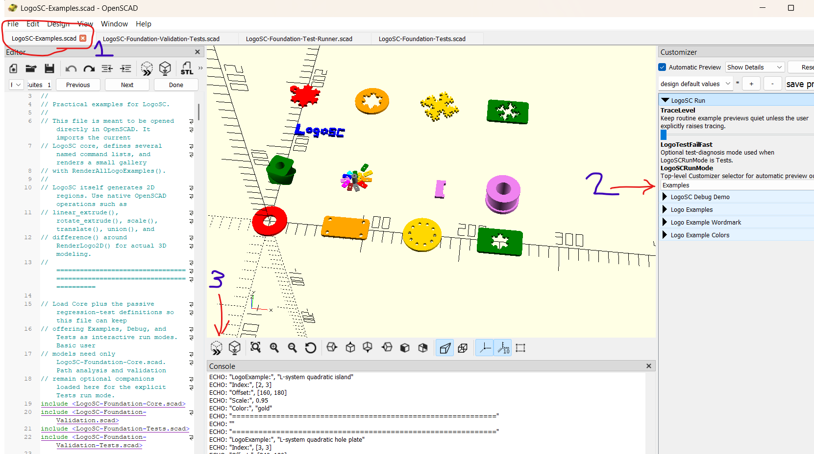

# LogoSC

## Short description

LogoSC gives OpenSCAD a Logo-inspired turtle-geometry language for creating reusable 2D
profiles, then demonstrates how Codex, Git, extensive tests, and persistent engineering
documentation can turn an experimental interpreter into a maintainable project.

## The problem

OpenSCAD is a programmatic 3D-modeling system commonly used to design parts for 3D printing.
One of its strengths is taking a 2D profile and extruding it into three dimensions. A profile
can be extruded linearly to create plates, enclosures, nuts, and other prismatic parts, or
rotated around an axis to create objects such as knobs, lamp bodies, and screw-like components.

The difficult part is often creating the original 2D profile.

At its lowest level, OpenSCAD represents a custom 2D polygon as an ordered list of coordinate
points. Writing one point list by hand is manageable. Creating and maintaining many related
profiles—with different dimensions, angles, repeated features, holes, and variations—quickly
becomes tedious and error-prone. A coordinate list also describes where the points are, but not
the geometric intent behind them.

Logo and other turtle-graphics languages offer a simpler model:

```text
move
turn
move
turn
repeat
```

Instead of calculating every coordinate manually, the designer describes how a virtual turtle
travels around the shape. Distances, angles, repetitions, and nested shapes can be adjusted
parametrically.

OpenSCAD does not natively provide this kind of turtle-geometry input. LogoSC was created to
fill that gap.

## What LogoSC does

LogoSC is a Logo-inspired geometry interpreter written entirely in OpenSCAD.

A model is expressed as a compact command list using operations such as:

- `MOVE`
- `TURN`
- `ARC`
- `RUN`
- `REPEAT`
- `PENUP` and `PENDOWN`
- `PUSH` and `POP`
- `CIRCLE`, `RECT`, `ROUNDEDRECT`, and `REGPOLY`
- `HOLE`

LogoSC evaluates those commands into structured 2D polygonal regions. Native OpenSCAD
operations can then extrude, rotate, subtract, combine, or transform those regions into
ordinary 3D models.

The original motivation was practical: I wanted a faster way to construct reusable profiles
for families of screws, nuts, and related printed parts without manually recalculating large
point lists for every variation.

The project now also includes:

- Reusable relative command lists.
- Recursive and repeated patterns.
- Filled regions with holes.
- A visual debug renderer that displays turtle movement, points, pen-up travel, and command
  order.
- Optional path validation.
- Example and diagnostic galleries.
- A command-line verification workflow.
- 151 named automated test results across Foundation and Validation suites.
- Aggregate failure reporting and optional fail-fast diagnosis.
- Extensive user, contributor, architectural, and historical documentation.

The Examples run displays basic shapes, holes, native OpenSCAD linear and rotational
extrusions, and recursive L-system-inspired models together:


The Debug run makes the underlying command paths visible. Its indexed gallery shows start and
end points, open and closed contours, a crossing path, pen-up motion, arcs, and the difference
between turtle-built and primitive-generated geometry:


## Project scale and pace

The entire LogoSC project is only about two and a half weeks old. The first Git commit was
made on July 3, 2026, and the Build Week deadline is July 21. The most concentrated period of
development covered roughly eight calendar days—just one day longer than a literal week.

It was built by one person, primarily during a few evening hours each day. LogoSC is not a
large commercial project or the product of a full-time team, but the amount of implementation,
testing, visual verification, documentation, and design history produced in that short period
is substantial. That pace is itself part of what this project demonstrates about working with
ChatGPT and Codex.

## About the developer

I have been involved with artificial intelligence for roughly 45 years. I earned a degree at
MIT in the late 1970s with a focus on AI and had the opportunity to work with Marvin Minsky.
My work and interests have included early AI approaches, evolutionary systems, production
software, and the practical demands of building systems that businesses can actually use.

Minsky made a point that I remember approximately this way: as soon as an AI technique starts
working reliably, people stop calling it AI. Capabilities that once looked remarkable become
ordinary parts of software engineering, and the boundary of “AI” moves on to the next unsolved
problem.

Seeing ideas from the early history of AI reappear, evolve, and suddenly become useful at this
scale has been astonishing. During the past few years, ChatGPT has repeatedly surprised me with
what it can produce or reason through in a few seconds. Codex goes further by connecting that
reasoning directly to a real repository, tools, tests, command-line programs, images, and Git
history.

My professional background also affects how I evaluate it. Writing the first version of an
algorithm is only a small part of professional programming. Requirements, design decisions,
testing, diagnosis, documentation, compatibility, review, maintenance, and explaining the
system to the next person consume most of the work.

On LogoSC, I estimate that I spent roughly ten times as much time framing and revising tasks,
explaining intent, learning how to communicate effectively with the AI, and evaluating and
testing its results as I spent personally writing code. I increasingly delegated the direct
implementation work to ChatGPT and Codex while retaining responsibility for the problem
definition, constraints, architecture, verification, and final decisions. My goal is to
delegate even more of the literal code writing so I can concentrate on that deeper work.

That work is not overhead surrounding the "real" code. It determines what the code should
mean and how it should fit into a larger system. The working, tested LogoSC implementation is
the proof that this framework works. It was built in OpenSCAD, an unusual programming language
that ChatGPT did not initially understand well, yet the process produced a functioning system
with extensive tests, examples, and documentation. That concrete result is the important part.
Codex made this level of iteration practical for one person working limited evening hours.

I do wonder how beginning programmers will learn in a world where an AI system can produce
useful code almost immediately. I am also cautiously optimistic. A new programmer may be able
to build useful systems earlier while AI helps teach decomposition, logic, experimentation,
testing, evaluation, and documentation. Those activities are not peripheral chores; they are
most of what turns code into dependable software. The essential skill will be learning how to
direct the system, question it, verify it, and preserve the reasoning behind the result.

LogoSC is my practical experiment with that future. It combines decades of perspective on AI
with a very current question: what does responsible, durable software development look like
when a human and an AI agent build the project together?

## Target audience

LogoSC has two primary audiences.

The first is OpenSCAD users who want to create reusable 2D profiles for extrusion without
hand-authoring coordinate lists. This includes makers, parametric-model designers, and
3D-printing enthusiasts who find relative turtle commands easier to understand and maintain
than raw polygon points.

The second—and in many ways the more important experimental audience—is developers interested
in how Codex can participate in a sustained engineering project without losing the project's
memory every time an AI conversation or task restarts.

The repository records not only the resulting code, but also:

- Design decisions and their rationale.
- Coding and documentation conventions.
- Regression risks.
- Test architecture.
- Handoff procedures.
- Project boundaries and deferred ideas.
- Instructions that allow a fresh Codex task to reconstruct the project state from Git.

LogoSC is therefore both a usable geometry library and a case study in repository-centered
development with Codex. I am using it to learn and refine a process that I expect to apply to
a larger graphics project later.

A third audience is educators and learners interested in connecting turtle geometry,
functional programming, parametric design, and physical fabrication.

## How the project evolved

I began LogoSC before I knew about Codex. My early workflow used ordinary ChatGPT
conversations to discuss designs, write code, revise documentation, and explore ideas.

That worked surprisingly well, but long development conversations eventually accumulated too
much obsolete context. To continue reliably, I began asking ChatGPT to write detailed handoff
notes describing:

- The current implementation.
- Important design decisions.
- What had already been tried.
- Known risks.
- Future plans.
- The likely next task.

I would then start a fresh conversation and load those materials back in. This became a
primitive form of persistent engineering memory.

Preserving that memory was not an afterthought or simply an effort to produce good
documentation. It became the primary process problem that ChatGPT and I discussed: how can an
AI collaborator restart with a clean context while still remembering what the project is,
which decisions are settled, which experiments failed, what must remain compatible, and what
should happen next?

The workflow improved dramatically when I began using Git and then discovered Codex. Instead
of repeatedly copying files into and out of conversations, Codex could work directly in the
repository, inspect the current working tree, run tools, evaluate changes, and leave the
project in a state that Git could precisely describe.

The repository became our shared memory.

## Durable AI engineering: preserving project memory

AI assistants can produce excellent work, but when project state is incomplete they can also
confidently reconstruct details incorrectly, follow obsolete assumptions, or forget an earlier
constraint. The solution in LogoSC was not to ask the model to remember harder. It was to move
the important memory into durable, reviewable repository artifacts.

The resulting memory system has several layers:

- Git records the authoritative source, exact changes, stable checkpoints, and recoverable
  history.
- [`AGENTS.md`](AGENTS.md) provides a compact entry point and tells a new Codex task what to
  read and in which order. It deliberately points to deeper documentation instead of trying
  to contain the entire project itself.
- The [Developer Notebook](LogoSC-Developer-Notebook.md) preserves architectural decisions,
  rejected alternatives, deferred work, and the reasons behind the current design.
- The README, User Manual, Cheat Sheet, changelog, and contributor guide preserve the public
  contract and the different views needed by users and maintainers.
- The automated and visual tests act as executable memory. They do not merely say what the
  project should do; they detect when a later change forgets or violates it.
- Handoff notes and the
  [AI Engineering Kit](docs/ai-engineering-kit/AI-Engineering-Kit-Handoff.md) preserve the
  collaboration method so it can be used again on a larger project.

Together, these artifacts let a fresh task reconstruct the project's state from evidence
rather than from conversational recollection. Instructions such as “remember this,” “do not
forget this constraint,” and “keep doing this in future tasks” became written rules, regression
tests, restart order, and versioned rationale.

This durability process is the most important reusable result of the project. It is the basis
of my next graphics project, and I hope the repository can also help other people learn how to
structure long-running work with Codex.

## How Codex and GPT-5.6 contributed

Codex was not used merely to generate isolated snippets. It participated throughout the
engineering process.

It helped:

- Interpret OpenSCAD's unusual functional evaluation model.
- Design and implement new features.
- Run OpenSCAD from PowerShell.
- Capture and analyze diagnostic output.
- Render visual galleries and inspect the results.
- Identify regressions that were difficult to notice from console output alone.
- Maintain documentation alongside implementation changes.
- Preserve compatibility while separating Core functionality from optional companions.
- Design a test system appropriate for a language without conventional mutable test state.
- Propose and organize future features beyond the immediate implementation plan.

Most of the directions collected in [LogoSC Future Ideas](LogoSC-Future-Ideas.md) were
suggested by ChatGPT during our design discussions. They include stroke rendering, SVG export,
additional primitives such as stars, gears, spirals, and elliptical arcs, a transformation
stack, an L-system companion library, deeper contour validation, and expanded visual galleries.

Those ideas did not appear in a vacuum: they grew out of extensive conversations about the
project's goals and limitations, and I decided which ones fit. Even so, ChatGPT repeatedly
identified useful directions that I would not have taken the time to explore or document on my
own. The future-ideas file is a concrete record of that creative contribution.

One particularly interesting example was the automated test architecture.

A traditional assertion stops on the first failure. That is useful for isolating one defect,
but it makes it difficult to see whether a regression is local or affects the entire system.
OpenSCAD also does not make it practical to append failures to a mutable global list.

Codex helped redesign the tests around immutable result values:

```text
Test result:  [name, passed, detail]
Suite result: [suite name, test results]
Global run:   [Foundation suite, Validation suite]
```

This allows the normal test run to report every failure, suite totals, and a final
machine-readable result. An optional fail-fast mode uses OpenSCAD assertions when a maintainer
wants the first failure's file, line, test name, details, and caller trace.

The process was collaborative. I supplied the goals, constraints, preferences, and final
decisions. Codex contributed implementation ideas, noticed inconsistencies, suggested missing
tests and documentation, and frequently proposed useful follow-up work that I had not
explicitly requested.

At times it felt less like operating a code generator and more like working with an energetic
junior programmer who was unusually eager to add one more useful test before declaring the
task finished.

## What was added during Build Week

LogoSC existed before the Build Week submission period, so the repository provides a clear
baseline.

The `v2026.2` tag points to commit `3f883f4`, created on July 13 at 2:18 AM PDT, before the
official submission period began at 9:00 AM PDT.

Git history after that baseline documents thousands of lines of Build Week work across more
than 20 files.

The Build Week work includes:

- A standalone Core library that does not require test or validation companions.
- A dedicated test runner.
- Optional path evaluation and validation.
- A 151-result automated test hierarchy.
- Foundation and Validation suite summaries.
- Complete aggregate failure reporting.
- Optional assertion-based fail-fast diagnosis.
- Human-readable final failure banners.
- Command-line OpenSCAD execution and `.echo` analysis.
- An indexed visual debug gallery.
- Regression fixes discovered through command-line rendering.
- Repository-specific Codex instructions in `AGENTS.md`.
- A Git and Codex quick-start workflow.
- Expanded contributor, user, maintenance, and architectural documentation.

The Tests run provides a color-coded visual gallery alongside the 151 named Foundation and
Validation results. The gallery helps reveal broad geometry regressions, while the final
structured test record supplies the automated pass/fail result.


The original turtle evaluator supplied the seed of the project. Most of the infrastructure
that makes LogoSC testable, understandable, maintainable, and suitable for continued
development was created during Build Week with Codex.

## Challenges

OpenSCAD is unlike most languages commonly used for application development.

It is declarative and functional, variables are not conventionally mutable, expressions may
be reevaluated, and modules do not behave like imperative procedures. Error reporting,
recursion, list processing, polygon construction, and test aggregation therefore require
different design patterns.

Visual output also creates a second testing problem. A command can run successfully and still
generate an incorrect or confusing shape. LogoSC addresses this with both automated invariant
checks and visual galleries for examples, debug output, and regression cases.

Another challenge was controlling scope. LogoSC currently produces closed polygonal regions
suitable for extrusion. General open-path and stroke rendering remain future work. Codex
helped keep those future capabilities from destabilizing the current filled-region API.

## What I am proud of

I am proud that the project has become more than a working interpreter.

It was produced by one person working limited evening hours over only two and a half weeks.
The resulting repository contains far more implementation, testing, examples, documentation,
and preserved reasoning than I could realistically have produced alone in the same time.

It is:

- Documented well enough for a new user to begin.
- Structured well enough for a new Codex task to resume development.
- Tested well enough to make substantial refactoring practical.
- Small enough to study as a complete example.
- Honest about its limitations and deferred work.
- Built around a real modeling problem rather than an artificial demonstration.

The most valuable result may be the development process itself: a practical example of using
Git as persistent project memory and Codex as a collaborator that can repeatedly reconstruct
context from the repository.

## What I learned

The most important lesson was not about turtle geometry. It was that durable AI-assisted
development depends on durable project state.

Conversation history is useful, but it is not a substitute for:

- Source control.
- Tests.
- Architectural notes.
- Explicit conventions.
- Clear public interfaces.
- Written rationale.
- Reproducible commands.

When those elements are present, Codex can enter a project with a relatively clean context,
understand what already exists, make focused changes, run verification, and leave behind both
working code and the reasoning needed by the next task.

The goal is not to eliminate every mistaken assumption. It is to make the authoritative answer
easy to rediscover and to make regressions visible when either the human or AI forgets
something. Documentation supplies context, Git supplies history, and tests supply enforcement.

That process should scale better than relying on one indefinitely growing conversation. It is
also the part of LogoSC that I most want to remember, repeat, and share.

## What comes next

The most immediate next demonstration is to return to LogoSC's original practical goal: use it
to model and present a small family of actual nuts and bolts. LogoSC can define reusable 2D nut,
head, hole, recess, and rotational side profiles, while native OpenSCAD handles the final 3D
extrusion, composition, and thread geometry. Showing several parameterized variations would
close the loop between the problem that started the project and the library built to solve it.

The next major LogoSC feature is support for open paths and manufacturable strokes, including
width, joins, caps, and related validation.

Other future directions include:

- Additional path-quality checks.
- More reusable parametric shapes.
- Expanded extrusion examples.
- A Codex-native design workflow that turns natural-language shape descriptions into validated
  LogoSC programs and rendered previews.
- Applying the documented Codex workflow to a larger graphics project.

### Try the AI handoff yourself

There is another experiment you can run immediately: resurrect the project state in a fresh
Codex task and continue modifying LogoSC yourself.

1. Install Git if needed and clone the
   [LogoSC repository](https://github.com/jbrad8254/LogoSC). A downloaded snapshot can restore
   the current files, but a clone also preserves the project history.
2. Open the repository folder as a project or workspace in Codex.
3. Ask Codex to read `AGENTS.md` and follow its project-document reading order.
4. Try prompts such as:
   - “What should we do next?”
   - “What is the strongest or most interesting part of this project?”
   - “Choose a small next feature, explain the tradeoffs, and show me how you would verify it.”

The repository contains nearly all of the durable state I used while building LogoSC: source,
tests, design decisions, rejected alternatives, future ideas, working preferences, restart
instructions, and Git history. A fresh Codex task can reconstruct that context in a few minutes
without receiving this conversation. That is the persistence framework in action, not merely a
description of it.

The short [Codex Git project quick start](docs/ai-engineering-kit/Codex-Git-Project-Quick-Start.md)
explains the setup. Install OpenSCAD 2021.01 as described below if you also want Codex to run the
tests or render and inspect the examples.

This is the practical persistence workflow I came up with, not a claim that it is the formal
industry method. Large teams almost certainly have more systematic ways to preserve agent
context, coordinate many contributors, and govern AI-assisted changes. If you know a better
approach, please contact me through the
[LogoSC repository](https://github.com/jbrad8254/LogoSC). I would genuinely like to learn what
other teams are doing and incorporate the strongest ideas into my next project.

## Two-minute installation and test

### Requirements

For this submission, LogoSC has been developed and verified on Windows using OpenSCAD 2021.01.

Download OpenSCAD from the [official OpenSCAD download page](https://openscad.org/downloads.html).
On Windows it can also be installed with:

```powershell
winget install --id=OpenSCAD.OpenSCAD -e
```

The standard Windows installation normally places the command-line wrapper at:

```text
C:\Program Files\OpenSCAD\openscad.com
```

The OpenSCAD documentation recommends using `openscad.com` for Windows command-line execution.
See the [official command-line documentation][openscad-cli].

### Run the visual examples

1. Clone or download the [LogoSC repository](https://github.com/jbrad8254/LogoSC).
2. Open `LogoSC-Examples.scad` in OpenSCAD.
3. Leave `LogoSCRunMode` set to `Examples`.
4. Press F5 to preview the example gallery.
5. Change `LogoSCRunMode` to `Debug` to inspect turtle paths.
6. Change it to `Tests` to render the regression gallery and run the complete test suite.

The annotated OpenSCAD window below shows the three important controls for the first run:

1. Make sure the `LogoSC-Examples.scad` tab is open and selected.
2. In the Customizer's `LogoSC Run` section, set `LogoSCRunMode` to `Examples`.
3. Select the Preview button indicated by annotation 3, or press F5.



A successful run ends with:

```text
LOGOSC_AUTOMATED_TEST_RESULT, PASS,
suites, 2, failedSuites, 0,
tests, 151, passed, 151, failed, 0
```

### Run the automated suite from PowerShell

From the repository directory:

```powershell
$openScad = 'C:\Program Files\OpenSCAD\openscad.com'
$results = Join-Path $env:TEMP 'LogoSC-tests.echo'

& $openScad `
    -D 'TraceLevel=0' `
    -o $results `
    'LogoSC-Foundation-Test-Runner.scad'

Get-Content $results |
    Select-String 'LOGOSC_AUTOMATED_TEST_RESULT|Test Suite Failed'
```

The complete tested workflow is in the
[LogoSC OpenSCAD command-line guide](LogoSC-OpenSCAD-Command-Line.md).

## Supported platforms

The contest build is tested and supported on:

- Windows.
- OpenSCAD 2021.01.
- Both the OpenSCAD GUI and its `openscad.com` command-line wrapper.

LogoSC itself is pure OpenSCAD code, and OpenSCAD is also available for macOS and Linux. Those
platforms are expected to be compatible but have not been fully verified for this submission.
See the [OpenSCAD platform information](https://openscad.org/).

No compilation or package installation is required beyond installing OpenSCAD and downloading
the repository.

[openscad-cli]: https://en.wikibooks.org/wiki/OpenSCAD_User_Manual/Using_OpenSCAD_in_a_command_line_environment
