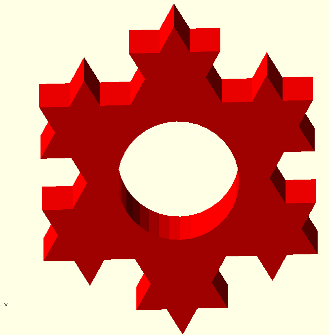

# LogoSC Cheat Sheet

Compact LogoSC `2026.1` reference. Full docs: [`LogoSC-User-Manual.md`](LogoSC-User-Manual.md). Inspired by the compact section style of the [OpenSCAD cheat sheet](https://openscad.org/cheatsheet/index.html?version=2021.01).

## Setup

[`include <LogoSC-Foundation-Core.scad>`](LogoSC-User-Manual.md#setup)  [`TraceLevel = 0;`](LogoSC-User-Manual.md#setup)  optional [`LogoSCRunMode`](LogoSC-User-Manual.md#setup) for examples/debug/tests

## Version

[`LogoSCVersionMajor`](LogoSC-User-Manual.md#library-version)  [`LogoSCVersionMinor`](LogoSC-User-Manual.md#library-version)  [`LogoSCVersion`](LogoSC-User-Manual.md#library-version)  [`LogoSCVersionAtLeast(major, minor)`](LogoSC-User-Manual.md#library-version)

## Command vector syntax

[`cmds = [[OP, arg...], ...];`](LogoSC-User-Manual.md#10-command-reference)  optional trailing fields: `[OP, required[, optional]]`

## Motion / state

[`[MOVE, len]`](LogoSC-User-Manual.md#move)  [`[TURN, deltaHeading]`](LogoSC-User-Manual.md#turn)  [`[DIR, absoluteHeading]`](LogoSC-User-Manual.md#dir)  [`[SCALE, scaleMultiplier]`](LogoSC-User-Manual.md#scale)  [`[GOTO, x, y, heading]`](LogoSC-User-Manual.md#goto)

## Closed geometry

[`[ARC, radius, degrees[, segments]]`](LogoSC-User-Manual.md#arc)  [`[CIRCLE, radius[, segments]]`](LogoSC-User-Manual.md#circle)  [`[REGPOLY, sides, radius[, rotation]]`](LogoSC-User-Manual.md#regpoly)  [`[RECT, width, height]`](LogoSC-User-Manual.md#rect)  [`[ROUNDEDRECT, width, height, radius[, segments]]`](LogoSC-User-Manual.md#roundedrect)  [`[HOLE, cmds]`](LogoSC-User-Manual.md#hole)

## Control / structure

[`[RUN, cmds[, scale[, maxRec]]]`](LogoSC-User-Manual.md#run)  [`[REPEAT, count, cmds]`](LogoSC-User-Manual.md#repeat)  [`[PUSH]`](LogoSC-User-Manual.md#push-and-pop)  [`[POP]`](LogoSC-User-Manual.md#push-and-pop)  [`[PENUP]`](LogoSC-User-Manual.md#penup-and-pendown)  [`[PENDOWN]`](LogoSC-User-Manual.md#penup-and-pendown)

## Rendering / evaluation API

[`RenderLogo2D(cmds, convexity = 10)`](LogoSC-User-Manual.md#73-renderlogo2d)  [`RenderLogoDebug(cmds, ...)`](LogoSC-User-Manual.md#710-debug-visualization)  [`evalLogo(cmds)`](LogoSC-User-Manual.md#74-evallogo)  [`ResultState(result)`](LogoSC-User-Manual.md#75-evaluator-result-accessors)  [`ResultContours(result)`](LogoSC-User-Manual.md#75-evaluator-result-accessors)  [`ResultStack(result)`](LogoSC-User-Manual.md#75-evaluator-result-accessors)  [`ResultPen(result)`](LogoSC-User-Manual.md#75-evaluator-result-accessors)  [`RenderContours2D(regions, convexity = 10)`](LogoSC-User-Manual.md#77-rendercontours2d)  [`RenderRegion2D(region, convexity = 10)`](LogoSC-User-Manual.md#78-renderregion2d)

## Debug visualization

[`LogoSCRunMode = "Debug"`](LogoSC-User-Manual.md#710-debug-visualization)  [`DebugDemoOverlay`](LogoSC-User-Manual.md#710-debug-visualization)  [`DebugDemoFilled`](LogoSC-User-Manual.md#710-debug-visualization)  [`DebugDemoExample`](LogoSC-User-Manual.md#710-debug-visualization)  crossing lines  unclosed contours  pen-up moves  primitive placement

## Region data

[`region = [outerContour, holeContour0, ...]`](LogoSC-User-Manual.md#6-rendering-model)  [`regions = [region0, region1, ...]`](LogoSC-User-Manual.md#6-rendering-model)

## Segment controls

[`$fn`](LogoSC-User-Manual.md#9-segment-count-controls)  [`$fa`](LogoSC-User-Manual.md#9-segment-count-controls)  [`$fs`](LogoSC-User-Manual.md#9-segment-count-controls)  [`segments`](LogoSC-User-Manual.md#9-segment-count-controls)

## Core controls

[`LogoSCRunMode`](LogoSC-User-Manual.md#setup)  [`HardErrors`](LogoSC-User-Manual.md#13-error-handling-and-tracing)  [`TraceLevel`](LogoSC-User-Manual.md#13-error-handling-and-tracing)  [`maxRunRecursions`](LogoSC-User-Manual.md#run)

## Test helpers

[`LogoSCest(testName, vtCmds, testIndex, height, testColor)`](LogoSC-User-Manual.md#13-error-handling-and-tracing)

## Common OpenSCAD wrappers

[`linear_extrude(height, center, convexity, twist, slices)`](LogoSC-User-Manual.md#linear-extrusion)  [`rotate_extrude(angle, convexity)`](LogoSC-User-Manual.md#rotate-extrusion)  [`offset(r)`](LogoSC-User-Manual.md#8-3d-printing-workflow)  [`offset(delta, chamfer)`](LogoSC-User-Manual.md#8-3d-printing-workflow)  [`translate([x, y, z])`](LogoSC-User-Manual.md#8-3d-printing-workflow)  [`rotate([x, y, z])`](LogoSC-User-Manual.md#8-3d-printing-workflow)  [`scale([x, y, z])`](LogoSC-User-Manual.md#8-3d-printing-workflow)  [`color(name)`](LogoSC-User-Manual.md#13-error-handling-and-tracing)  [`union()`](LogoSC-User-Manual.md#8-3d-printing-workflow)  [`difference()`](LogoSC-User-Manual.md#8-3d-printing-workflow)  [`intersection()`](LogoSC-User-Manual.md#8-3d-printing-workflow)

## More

[`README`](LogoSC-README.md)  [`User Manual`](LogoSC-User-Manual.md)  [`Examples`](LogoSC-Examples.scad)  [`ARC note`](LogoSC-ARC-Implementation.md)  [`Holes note`](LogoSC-Holes-Implementation.md)  [`Changelog`](CHANGELOG.md)
