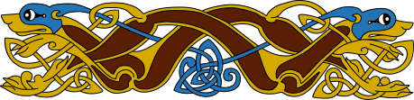

# LogoSC Knots Design and Roadmap

## Table of Contents

- [Status and purpose](#status-and-purpose)
- [How LogoSC is used](#how-logosc-is-used)
- [Further reading and example collections](#further-reading-and-example-collections)
- [Visual reference](#visual-reference)
- [Goals](#goals)
- [Shared representation](#shared-representation)
- [Required feature: adjacent multi-cord bundles](#required-feature-adjacent-multi-cord-bundles)
- [Generator 1: torus knots](#generator-1-torus-knots)
- [Generator 2: braid words](#generator-2-braid-words)
- [Generator 3: Celtic tile grids](#generator-3-celtic-tile-grids)
- [Generator 4: harmonic and Lissajous curves](#generator-4-harmonic-and-lissajous-curves)
- [Generator 5: polar rosettes](#generator-5-polar-rosettes)
- [Generator 6: medial planar graphs](#generator-6-medial-planar-graphs)
- [Over/under assignment](#overunder-assignment)
- [2D ribbon generation](#2d-ribbon-generation)
- [Bas-relief](#bas-relief)
- [Export-quality presets](#export-quality-presets)
- [Rounded cords](#rounded-cords)
- [AI-assisted image-to-knot import](#ai-assisted-image-to-knot-import)
- [Companion files](#companion-files)
- [Verification requirements](#verification-requirements)
- [Implementation sequence](#implementation-sequence)
- [Open questions](#open-questions)

## Status and purpose

This is the authoritative design plan for generative knot work in LogoSC. It covers organic or
Gordian-style parametric knots and traditional Celtic interlace. The torus, circular-braid, and
explicit Celtic tile-grid generators, single-cord manufacturing, and controlled integer
half-turn bundle twists are implemented. Planar ribbon footprints and underpass masks are also
implemented; printable beveled bas-relief plaques are implemented from those regions; later
milestones remain proposals until their APIs are reviewed.

LogoSC remains a 2D filled-region evaluator. A future optional companion may use LogoSC for
planar routes, ribbon footprints, masks, local transforms, and repeated motifs. Native OpenSCAD
remains responsible for extrusion, hulls, Minkowski operations, booleans, and 3D construction.

### Implemented first vertical slice

`LogoSC-Knots.scad` currently provides:

- documented knot, strand, crossing, validation-result, and validation-issue constructors and
  accessors;
- structural validation for sampled strands, closure, crossings, encounter indexes, and bundle
  lane-closure permutations;
- `ReportKnotValidation()` diagnostics and `RenderKnotDebug()` centerline, sample, and crossing
  markers;
- `MakeTorusKnot()`, producing one component for coprime `p` and `q` or
  `gcd(p,q)` independently closed components for a torus link;
- `RenderKnotCords()`, producing manufacturable round cords from sphere-hulled capsules with
  explicit radius and fragment controls;
- `MakeKnotBundle()` and `RenderKnotCordBundle()`, expanding each master route into stable,
  symmetric adjacent lanes with explicit or width-fitted cord radius, crossing remapping,
  collective lift, lane-pair clearance checks, integer half-turn twist, and permutation-cycle
  closure tracing;
- `MakeCircularBraidKnot()`, compiling signed adjacent-lane crossings into standard circular
  closures with permutation-cycle components and explicit crossing topology;
- `MakeCelticTileGridKnot()`, validating three four-port tiles plus canonical blank cells,
  closing independent exterior and void boundaries, tracing components, removing reverse
  duplicates, and enforcing alternating crossings;
- `KnotRibbonRegions()` and `RenderKnotRibbons2D()`, compiling planar samples into Core region
  capsules with crossing-local masks and restored overpass footprints;
- `RenderKnotBasRelief()` and `RenderKnotBasReliefPlaque()`, extruding corrected ribbon
  footprints, raising crossing overpasses, and adding optional beveled backing plates;
- selectable planar-projection and spatial views across diagnostics, cords, bundles, and
  presentation galleries;
- a dedicated 88-result automated suite plus topology, bundle, twisted-bundle, braid,
  braided-bundle, Celtic tile-grid, ribbon, relief, and plaque presentation galleries.

This slice deliberately does not implement general collision discovery, tight-curve rejection,
or AI image import. Callers must select dimensions and sampling appropriate for the route.
Reserved strand fields and metadata allow later milestones to extend the representation without
changing its established leading fields.

The remaining knot milestone is scheduled immediately after the optional L-system companion and
before the next release. “Finish” means completing the agreed remaining generators and making an
explicit implement-or-defer decision for every residual item below; it does not require pulling
knot-specific behavior into Core.

## How LogoSC is used

The knot companion belongs to the LogoSC project, follows its record-oriented and deterministic
design style, and interoperates with Core for planar ribbon regions. Generators and 3D cord
rendering do not call the LogoSC evaluator behind the scenes.

The present execution path is:

```text
MakeTorusKnot(), MakeCircularBraidKnot(), or MakeCelticTileGridKnot()
  -> pure OpenSCAD functions calculate sampled strand and crossing records
  -> ValidateKnot() checks those records without producing geometry
  -> RenderKnotDebug() uses native color(), translate(), sphere(), and hull()
  -> RenderKnotCords() uses native sphere(), hull(), and union() to make 3D solids

KnotForView(knot, "Planar")
  -> KnotRibbonRegions() constructs closed MakeRegion() capsules
  -> crossing helpers construct expanded mask and normal overpass regions
  -> RenderRegion2D() renders every footprint through LogoSC Core
  -> native difference() and union() compose the final flat interlace
```

`LogoSC-Knots.scad` imports Core's public region constructor and renderer with `use`. It does not
call `evalLogo()` or emit LogoSC command lists. Generator, validation, diagnostic, bundle, and
cord paths remain pure-function or native-geometry paths; only ribbon footprints and masks use
Core regions.

`LogoSC-Knots-Test-Runner.scad` does include Core and `LogoSC-Foundation-Tests.scad`, but only to
reuse the established `LogoTestResult()`, suite aggregation, and automated PASS/FAIL reporting.
The ribbon compiler's Core use is a production dependency, not an accidental test-harness
dependency.

LogoSC Core now participates where its actual strengths apply:

- sampled ribbon segments and crossing masks are closed `MakeRegion()` contours;
- `RenderRegion2D()` renders each region through the stable Core polygon contract;
- Core transforms, `RUN`, `REPEAT`, and `PUSH`/`POP` can place, rotate, reflect, and repeat those
  regions in future motif stages;
- native OpenSCAD remains responsible for sampled 3D cords, hulls, extrusion, and mesh output.

Native OpenSCAD also performs the ribbon union/difference composition because Core deliberately
renders regions independently and does not implement a polygon Boolean engine.

`KnotForView()` supplies the current display boundary. It returns a copy whose samples are either
unchanged for Spatial or projected to `z = 0` for Planar. Cord rendering consumes that copy
directly, while bundle rendering expands the projected master route before constructing lanes.
The source knot remains unchanged. Planar capsule output may merge at projected crossings and
does not substitute for the later ribbon, mask, or crossing-lift compiler.

## Further reading and example collections

The ideas in this plan have substantial precedent. These sources are useful both as design
references and as evidence that systematic or computer-generated knotwork is practical.

### Construction books

- George Bain, *Celtic Art: The Methods of Construction* (originally 1951; Dover reprint).
  Bain reconstructs rules for knotwork, spirals, key patterns, lettering, zoomorphic forms,
  plants, and human figures. The [Google Books record][book-george-bain] includes a summary and
  bibliographic details.
- Iain Bain, *Celtic Knotwork* (1986). This presents a more directly engineered grid,
  centerline, diagonal, break, continuity, and finishing method. See the
  [Google Books record][book-iain-bain] and the
  [International Guild of Knot Tyers review][book-iain-bain-review].
- Aidan Meehan, *Celtic Design: Knotwork — The Secret Method of the Scribes* (1991) and
  *Celtic Knots: Mastering the Traditional Patterns* (2003), both practical treatments of
  grid-based and more organic construction.

These books explain how artists generate families of designs from construction rules; they are
not merely catalogues of finished motifs.

### Algorithmic and generative articles

- Matthew Kaplan and Elaine Cohen, ["Computer Generated Celtic Design"][paper-kaplan-cohen]
  (Eurographics Symposium on Rendering, 2003). This is the closest published precedent for the
  companion: it constructs knots from planar graphs, smooths and orients strands, interweaves
  images with knotwork, and demonstrates 3D models for fabrication.
- Frank Drewes and Renate Klempien-Hinrichs,
  ["Picking Knots from Trees: The Syntactic Structure of Celtic Knotwork"][paper-drewes]
  (Diagrams 2000). It treats knotwork as a visual language generated by collage grammars and
  adds regulation mechanisms so generated designs remain consistent. It also demonstrates
  splitting one ribbon into two, three, or more ribbons.
- Jonathan L. Gross and Thomas W. Tucker, ["A Celtic Knot"][paper-gross-tucker]
  (*Discrete & Computational Geometry*, 2011). It formalizes grid construction, alternating
  crossings, and barriers, then analyzes the resulting knots and links.
- Peter Eades and collaborators,
  ["CelticGraph: Drawing Graphs as Celtic Knots and Links"][paper-celticgraph] (2023).
  It converts planar graphs into threaded circuits and smooths them with curvature-aware Bézier
  curves, a useful modern comparison for the proposed shared knot representation.
- Andrew Glassner's three-part *Celtic Knotwork* series in
  *IEEE Computer Graphics and Applications* (1999–2000) develops computer-graphics construction
  and extends the discussion to 3D. The [DBLP bibliography][paper-glassner] provides stable
  publication records.

Together these works support route generation, crossing constraints, graph and grammar
intermediates, ribbon expansion, multiple adjacent cords, image-guided ornament, and 3D output.
LogoSC can borrow those architectural lessons without copying any particular implementation.

### Places to study more examples

- [The Book of Kells Online][examples-kells], maintained by Trinity College Dublin, provides the
  complete manuscript in high-resolution digital form. Its initials, carpet pages, animals, and
  region-filling interlace are especially relevant to image-guided generation.
- The [British Library digitised manuscripts collection][examples-british-library] identifies
  the Lindisfarne Gospels as Cotton MS Nero D IV. Availability of individual scans may vary while
  the Library restores services.
- [Pictish and Early Medieval carved stones][examples-pictish-stones] surveys geometric,
  figurative, spiral, and interlace carving and points toward surviving Scottish monuments.
- Wikimedia Commons has broad browsable collections for
  [Celtic knots][examples-commons-knots] and
  [interlace in art][examples-commons-interlace]. Check each file's description page because
  licensing differs by item.
- The public-domain references stored in `images/knot-references/` provide small, stable
  examples suitable for future importer fixtures.

### Contemporary inspiration and experimental sites

These less formal sites are useful for seeing what artists and programmers have tried. They are
inspiration and comparison points, not normative specifications:

- [dmackinnon1/celtic][inspiration-dmackinnon] includes a live editable generator, random
  patterns, SVG rendering, crossing and region calculations, and source code. Its trefoil and
  figure-eight examples make it especially useful for comparing topology with rendered style.
- [Jared Sylvester's generated knotwork][inspiration-sylvester] shows output from a Processing
  program with adjustable grid, curvature, ribbon thickness, crossing gaps, corners, and color.
- [Steve Abbott's Computer Drawn Celtic Knotwork][inspiration-abbott] explores 2D design,
  conversion to rotatable 3D knots, bracelets and rings, height maps, and 3D export.
- The [Knotwork graph editor][inspiration-sourceforge] automatically recomputes interlace from
  an editable geometric graph, supports explicit edge behaviors, and can place a background
  image behind the graph. That background-guided workflow is directly relevant to the proposed
  AI blueprint importer.
- [Design and Construction of Celtic Knotwork][inspiration-zuggsoft] is an illustrated
  grid-and-break tutorial showing both centerline construction and an interlacing-without-erasing
  approach.
- [Neil Fyffe's carved-knotwork gallery][inspiration-fyffe] shows how generated or drafted
  patterns become physical panels, columns, crosses, and sculpture in wood.
- The [Gaelic Matters knot gallery][inspiration-gaelic] collects drawn patterns and photographs
  of knotwork in use, providing examples of both single- and multi-strand decorative layouts.

Prompt-driven image generators can also provide composition ideas, but their output must be
treated as unverified raster inspiration. Apparent symmetry and plausible crossing gaps do not
prove closure, alternation, clearance, or originality. LogoSC's value is converting inspiration
into inspectable routes and validated topology.

Copyright and reuse terms vary across these sites and may also vary by individual image. A link
in this section is not permission to copy an image; only assets with a verified compatible
license should enter the repository or an example input set.

## Visual reference

These reusable diagrams show three related but distinct targets for the companion:

| Mathematical knot | Linear Celtic interlace | Region-filling Celtic interlace |
|---|---|---|
|  |  |  |
| One closed curve with explicit crossing topology | A repeating interlaced border | Interlace deliberately fitted to a bounded region |

All three diagrams were released into the public domain by their Wikimedia Commons uploaders:
[trefoil by Marnanel][commons-trefoil], [linear knot by AnonMoos][commons-linear], and
[square-filling knot by AnonMoos][commons-square]. They are references, not proposed LogoSC
output or claims that every decorative interlace is a nontrivial mathematical knot.

## Goals

- Generate knots algorithmically rather than hard-coding finished contours.
- Support one or more closed strands with explicit crossing topology.
- Produce debug centerlines, flat ribbons, printable bas-relief, and rounded cords from shared
  topology.
- Expand one nominal wide strand into two or more adjacent thinner cord lanes before rendering,
  with shared over/under motion and bundle-aware clearance.
- Keep over/under assignments deterministic and testable.
- Detect open routes, ambiguous crossings, clearance failures, and inconsistent alternation.
- Reuse LogoSC transforms, `RUN`, `REPEAT`, and `PUSH`/`POP` without adding knot opcodes to Core.
- Keep generator-specific logic in an optional companion.

Initial non-goals include physical rope simulation, arbitrary mesh input, automatic repair of
every invalid graph, and a general manufacturable stroke API in Core.

## Shared representation

All generators should compile to a common intermediate result:

```text
Knot = [strands, crossings, metadata]

Strand =
[
    closed,
    centerlineSamples,
    crossingEncounters,
    laneClosurePermutation,
    metadata
]

Crossing =
[
    point2D,
    strandA,
    parameterA,
    strandB,
    parameterB,
    overStrand,
    overBranch
]
```

The implemented `overBranch` field is additive and optional for compatibility. Distinct-strand
crossings infer `"A"` or `"B"` from `overStrand`. Self-crossings have the same strand index on
both branches at different normalized parameters, so they must record the over branch
explicitly. The established first six crossing fields retain their original indexes.

The important separation is:

- generators decide routes;
- crossing analysis records encounters;
- over/under policy assigns topology;
- renderers consume the shared result.

Samples used for 3D output receive a Z coordinate after crossing assignment. The original 2D
centerline remains available for ribbons, masks, diagnostics, and validation.

The implemented first slice uses explicit 3D samples throughout; planar generators can use
`z = 0`. Closed strands repeat the first sample at the end. Crossing parameters are normalized
to `[0, 1]`, and encounter lists contain indexes into the knot's crossing list. The initial
single-lane closure permutation is `[0]`.

## Required feature: adjacent multi-cord bundles

Every generator should be able to describe one nominal wide strand and defer subdivision into
adjacent cords until after route and crossing topology are known. This keeps torus, braid,
Celtic, harmonic, polar, and graph generators independent of the requested cord count.

Candidate bundle parameters are:

```text
cordCount
bundleWidth
cordGap
cordRadius, or an automatic radius fitted to bundleWidth
bundleTwist
```

For `N` equal circular cords of radius `r` and gap `g`, the occupied width is:

```text
2*N*r + (N - 1)*g
```

When width and gap are supplied, an automatic fitted radius is:

```text
r = (bundleWidth - (N - 1)*g) / (2*N)
```

Lane centers are symmetric around the master centerline:

```text
offset(i) = (i - (N - 1)/2) * (2*r + g)
```

For planar ribbons and relief, offset along the local 2D normal. For 3D cords, derive a stable
frame along the sampled master route and offset along its lateral axis. A parallel-transport
frame is preferable to a raw Frenet frame because it remains stable near straight segments and
low curvature.

Crossing lift belongs to the master strand. All lanes inherit the same over/under event and
master Z-bump profile, so the bundle rises and falls as a unit. Any optional twist rotates lane
offsets around the master tangent after that collective lift is established. Crossing clearance,
ramp length, and collision tests must use the complete bundle envelope rather than one cord.

Tight curves require additional checks:

- the innermost lane radius must remain positive;
- adjacent offset routes must not cross or reverse order unexpectedly;
- sampling must be sufficient for the outermost lane;
- nearby crossings must accommodate the full bundle width;
- ribbon masks and 3D clearance cutters must cover every lane.

Subdivision should occur before final ribbon-region or capsule construction, but after topology
and crossing assignment:

```text
generator
  -> master strands and crossings
  -> crossing assignment and master Z profiles
  -> bundle lane expansion
  -> ribbon, relief, or rounded-cord rendering
```

### Implemented crossing-aware untwisted bundle boundary

`MakeKnotBundle()` expands sampled 3D master routes after crossing assignment.
`RenderKnotCordBundle()` renders the result through the existing capsule renderer.

The implementation provides:

- positive integer cord counts and nonnegative surface gaps;
- either an explicit `cordRadius` or equal-radius fitting from `bundleWidth`;
- the occupied-width and symmetric lane-offset equations above;
- one unit tangent per unique master sample;
- an initial perpendicular lateral selected from a stable reference axis;
- parallel transport by projecting the prior lateral into each new tangent plane;
- a distributed signed closure correction for closed routes;
- exact repetition of each expanded lane's first sample at its endpoint;
- expansion of every master component in a knot or link;
- lane metadata recording its master index, lane index, and signed offset;
- `N*N` lane-pair records for each master crossing;
- preserved branch parameters and over/under ownership;
- rebuilt encounter indexes for every expanded strand;
- collective lift inherited from the master braid route;
- clearance analysis against every remapped cord pair.

An odd cord count preserves one lane exactly on the master centerline. Even bundles remain
symmetric without inventing a center lane. The expanded result exposes lanes as individual
strand records, which keeps them directly renderable and testable during this untwisted stage.

Torus routes remain supported because their 3D separation is already present in the sample
coordinates. For recorded crossings, each master event expands to the Cartesian product of
branch-A and branch-B lanes. The required center distance is
`2*cordRadius + minimumClearance`; construction fails by default when any mapped pair is too
close. This checks the complete recorded crossing envelope, but it is not general collision
discovery for unrecorded near approaches or tight offset curves.

### Implemented Möbius-like bundle twists

A half-twist is geometrically possible by rotating the bundle frame through 180 degrees over one
closed circuit. Circular cord cross-sections avoid individual orientation problems, but labeled
lane closure is not trivial: after one half-twist, lane `i` returns to lane `N-1-i`.

Consequences:

- an odd bundle has one center lane that maps to itself;
- paired off-center lanes exchange;
- two apparent lanes can form one closed component that requires two circuits to return to its
  original lane;
- requiring every lane to close independently would reject a single half-twist unless a closure
  transition or an even number of half-twists is used.

The shared representation now carries and traces the closure permutation for bundle lanes.
`twistHalfTurns` rotates the corrected transported frame by an integer multiple of 180 degrees
per master circuit. Even counts produce the identity permutation; odd counts reverse lane order.
Permutation cycles become actual closed output strands, so paired lanes take two circuits while
an odd bundle's center lane closes in one. Recorded crossing parameters are remapped into those
traced components rather than silently welded at mismatched endpoints.

## Generator 1: torus knots

A torus knot is the cheapest first proof of genuine closed 3D knot geometry:

```text
x(t) = (R + r*cos(q*t))*cos(p*t)
y(t) = (R + r*cos(q*t))*sin(p*t)
z(t) = r*sin(q*t)
```

`R` is the major radius, `r` is the minor path radius, and `p` and `q` are winding counts.
When `gcd(p,q) = 1`, the result is one strand; a larger greatest common divisor produces a link
with multiple components. The implementation divides `p` and `q` by the common divisor and
samples one full period of each reduced curve. A phase offset of `360/gcd(p,q)` around the minor
circle selects each component. This avoids retracing every component multiple times.

Example:

```scad
include <LogoSC-Knots.scad>

trefoil = MakeTorusKnot(2, 3, majorRadius = 20, minorRadius = 6);
ReportKnotValidation(trefoil, strict = true);
RenderKnotDebug(trefoil, viewMode = "Planar", showSamples = false);
```

Planar debug mode projects the stored samples to `z = 0`; it does not modify the knot record.
Until automatic crossing discovery is implemented, torus projections show overlaps without
inventing underpass gaps. Spatial mode displays the original sampled Z coordinates.

Advantages:

- guaranteed closure;
- inherent Z ordering without crossing discovery;
- compact deterministic implementation;
- known families suitable for verification.

Limitations:

- mainly toroidal forms;
- not traditional rectangular Celtic work;
- not a general crossing-assignment test.

This should be the first generator implemented.

## Generator 2: braid words

A braid word explicitly records topology:

```scad
strandCount = 4;
braidWord = [1, -2, 3, 1, -2];
```

`+i` means the strand in lane `i` crosses over lane `i+1`; `-i` reverses that relationship.
For every instruction, the generator:

1. advances all strands by one interval;
2. smoothly exchanges the selected adjacent lanes;
3. applies a Z bump to the over strand;
4. leaves or lowers the under strand;
5. exchanges logical strand-to-lane ownership;
6. records the crossing.

A cosine blend gives a smooth exchange:

```text
blend(u) = (1 - cos(180*u)) / 2
```

Output lanes must then close back to input lanes around a rectangular border or cyclic
medallion. Braids provide explicit topology and strong validation fixtures, so they should
precede automatic crossing discovery.

### Implemented circular braid boundary

`MakeCircularBraidKnot(laneCount, word, majorRadius, laneSpacing, crossingHeight,
samplesPerGenerator)` implements the cyclic-medallion choice:

- signed nonzero integer generators are validated against `laneCount`;
- lane state is recorded before and after every adjacent swap;
- a cosine blend exchanges the selected lane radii;
- positive generators lift branch A and lower branch B; negative generators reverse them;
- every instruction emits one crossing at its midpoint with normalized branch parameters;
- the final label-to-lane permutation is decomposed into disjoint cycles;
- each cycle traces one independently closed strand through all corresponding label paths;
- self-crossings record explicit branch ownership and duplicate encounter indexes for their two
  appearances on the same component;
- exact endpoint repetition closes every sampled component.

This is the standard closure expressed around a circular axis: each output lane reconnects to
the correspondingly numbered input lane. Two-lane word `[1,1]` produces two permutation cycles
and a Hopf link; `[1,1,1]` produces one cycle and a trefoil. Rectangular exterior closure remains
deferred because it adds return-path routing without changing the braid topology contract.

### Braid topology versus bundle geometry

The word *lane* appears in both features but has a different role:

- A braid lane is a logical position. Physical strand labels exchange lanes at signed crossings,
  and the final lane permutation determines component topology.
- A bundle lane is a geometric offset from one master strand. Untwisted bundle lanes preserve
  their relative order and do not create crossing topology.

`MakeCircularBraidKnot()` therefore runs before crossing-aware bundle expansion. It decides
master routes, components, crossing parameters, and over/under branches. `MakeKnotBundle()`
takes that already-decided topology, produces adjacent manufacturing cords, maps each master
crossing to every lane pair, and checks clearance against the full recorded crossing envelope.

The User Manual's **Braid versus bundle** section provides paired gallery images and a
user-facing comparison.

## Generator 3: Celtic tile grids

Traditional Celtic work can be generated from cells with north, east, south, and west ports.
Basic connection patterns include:

```text
N-S plus E-W crossing
N-E plus S-W corner pairing
N-W plus S-E corner pairing
```

The compiler:

1. validates matching ports between neighboring cells;
2. traces every connection until it closes or reaches an invalid open port;
3. records distinct strands;
4. emits tile-local straight and arc samples;
5. joins samples into complete routes;
6. assigns or verifies crossing parity.

Grid construction strategies may include:

- explicit user-authored tiles;
- seeded random tiles followed by validity rejection;
- mirror or break markers redirecting a regular interlace;
- substitution blocks preserving boundary-port compatibility.

LogoSC transforms should let one canonical corner or crossing motif produce rotated and
reflected variants. This is the principal traditional Celtic generator.

### Implemented explicit-grid boundary

`MakeCelticTileGridKnot()` implements the deterministic topology slice above with the canonical
tile symbols `"X"`, `">"`, and `"<"`, plus `"."` as a canonical blank cell. All are
one-character ASCII tokens, so grids can use compact aligned string rows. The blank contributes
no port states and allows the rectangular storage grid to describe irregular occupied regions,
internal holes, diagonal contacts, and disconnected islands. Interior exits connect to the
opposite port of an occupied neighboring cell. The original `"NE_SW"` and `"NW_ES"` names and
intermediate slash forms remain compatibility aliases, but metadata is canonicalized to
one-character string rows.

Any occupied edge facing the exterior or a blank cell becomes exposed. Directed exposed cell
edges are traced into independent boundary loops with a right-turn rule at diagonal contacts,
keeping point-touching islands topologically separate. Each loop has even length and pairs
consecutive ports with sampled curves. Outer boundaries, internal voids, and disconnected
islands therefore close independently without creating open strands. The policy remains
recorded in metadata as `"clockwisePairs"`. Future APIs may add explicit user-authored boundary
pairings, but they must not silently change this established default.

Tracing treats the grid as a permutation of directed port states. Each cycle becomes one closed
strand; the internally paired reverse states are marked visited so the same physical route is
not emitted twice. Straight `"X"` branches and quadratic corner branches are sampled directly.
Every `"X"` cell creates a crossing record with normalized parameters. Checkerboard parity
assigns equal/opposite Z bumps, and the complete result is rejected unless sorted encounters
alternate cyclically on every component.

`LogoSC-Celtic-Large-Grids.scad` provides deliberate 8-, 16-, 24-, and 32-cell scaling examples
plus a sparse 37-by-9 CELTIC word mask. The tracer resumes its search after the previous
lowest-numbered visited state rather than rescanning from zero for every component. This
preserves deterministic results while materially reducing large-grid calculation time. Boundary
length, separate loops, route components, crossings, sampling, and output geometry still make
24-by-24 and 32-by-32 grids batch-oriented work. Measured timings and controls are documented in
`LogoSC-Celtic-Large-Grids.md`.

Development-machine measurements with OpenSCAD 2021.01 and the showcase's minimum route
sampling were:

| Grid and mask | Calculation only | Low-resolution cord CSG | Cord segments |
|---|---:|---:|---:|
| 8-by-8 diamond | about 0.7 s | about 0.6 s | 352 |
| 16-by-16 diamond | about 3.4 s | about 5.9 s | 1,216 |
| 24-by-24 diamond | about 17.8 s | about 24.5 s | 2,944 |
| 32-by-32 diamond | about 49.7 s | about 63.6 s | 4,960 |
| 16-by-16 ring | about 4.4 s | not separately measured | 1,464 |
| 24-by-24 ring | about 29.5 s | not separately measured | 3,112 |
| 32-by-32 ring | about 75.5 s | not separately measured | 5,368 |
| CELTIC word, 37 by 9 | about 46 s | about 37–52 s for preview PNG | 838 |

These timings are illustrative, not guarantees. Results will vary with processor speed,
OpenSCAD version, occupied-cell and boundary topology, component and crossing counts, sampling,
fragment settings, output mode, and whether the run benefits from operating-system file caches.
Use `Topology` for the quickest iteration on a large mask and measure representative final
outputs on the target machine.

This boundary deliberately excludes random filling and substitution systems.

## Generator 4: harmonic and Lissajous curves

Organic closed routes can use multiple harmonic terms:

```text
x(t) = sum(Ax[i] * sin(Fx[i]*t + Px[i]))
y(t) = sum(Ay[i] * sin(Fy[i]*t + Py[i]))
```

A candidate input form is:

```scad
xTerms = [[amplitude, frequency, phase], ...];
yTerms = [[amplitude, frequency, phase], ...];
```

Integer frequencies over a complete period produce closed curves. The sampled route then needs
crossing discovery:

1. compare nonadjacent segment pairs;
2. reject disjoint bounding boxes;
3. classify proper intersections;
4. interpolate both route parameters;
5. merge duplicate detections near vertices;
6. reject tangencies and ambiguous multi-way crossings initially.

To request an alternating diagram:

1. sort crossing encounters by strand and route parameter;
2. constrain successive encounters to alternate over and under;
3. constrain both encounters of one crossing to be opposite;
4. solve the parity relationships;
5. report inconsistency when the projection cannot alternate.

This family offers a broad organic design space, but arbitrary parameters can create tangencies,
clustered crossings, tiny loops, and abrupt topology changes. Implement it after crossing
records and braid validation are stable.

## Generator 5: polar rosettes

Circular medallions can use:

```text
radius(t) = R + A*cos(k*t) + B*cos(m*t + phase)
angle(t) = n*t
x(t) = radius(t)*cos(angle(t))
y(t) = radius(t)*sin(angle(t))
```

Polar rosettes reuse harmonic crossing discovery and parity solving while naturally producing
circular motifs.

## Generator 6: medial planar graphs

A general Celtic construction can begin with a planar graph:

1. duplicate every edge into two parallel tracks;
2. connect neighboring tracks cyclically around vertices;
3. trace the resulting medial routes;
4. assign alternating crossings;
5. smooth routes into line and arc samples.

This can turn grids, trees, or user-authored networks into knotwork. It is more general than
tiles but requires robust graph embedding and validation, so it is deliberately later work.

## Over/under assignment

Generators have three sources of crossing order:

- torus and other 3D curves already have Z ordering;
- braid words explicitly encode order;
- planar harmonic, polar, tile, and graph generators require assignment or verification.

For planar routes, crossing assignment is a parity-constraint problem. The solver should support
alternating traversal, explicit overrides, multiple strands, contradictory-cycle detection, and
deterministic choice between equivalent assignments. It must never silently label both
encounters of one crossing as over or both as under.

## 2D ribbon generation

Centerlines must become closed regions before normal LogoSC rendering. The knot companion should
construct:

- left offset boundary;
- reversed right offset boundary;
- rounded joins as the first join policy;
- crossing-local underpass masks;
- overpass footprints.

This is a specialized knot ribbon compiler, not a general Core stroke API. Flat output can
subtract an overpass clearance mask from the under ribbon and then add the overpass footprint.

### Implemented planar ribbon boundary

`KnotRibbonRegions()` converts each planar sampled segment into one rounded capsule contour and
wraps it with Core's `MakeRegion()`. The union of segment regions gives continuous width and
rounded sampled joins without forcing a self-crossing route into one invalid polygon contour.

For each crossing, the compiler interpolates the recorded over branch and its planar tangent.
`KnotRibbonCrossingMaskRegions()` creates an expanded flat-ended band along that tangent;
`KnotRibbonOverpassRegions()` creates a slightly longer normal-width flat-ended band.
`RenderKnotRibbons2D()` subtracts the expanded masks from the union of continuous ribbon regions
and then restores every overpass. All footprints and masks are rendered by
`RenderRegion2D()` before native OpenSCAD performs the Boolean composition.

The boundary requires structurally valid planar samples, positive width, nonnegative clearance,
and a nondegenerate tangent at every crossing. It deliberately does not expose this as a general
Core stroke renderer, calculate a unified polygon result, or implement printable relief.

## Bas-relief

The first 3D crossing style should be a printable relief:

1. extrude ordinary and underpass footprints to a base height;
2. subtract crossing-local clearance where required;
3. extrude overpass footprints at an additional height;
4. union the result when one printable object is desired.

This is robust and visually explicit, though it does not create a truly separated cord.

### Implemented bas-relief boundary

`RenderKnotBasRelief()` extrudes the complete masked-and-restored ribbon footprint to
`baseHeight`, then raises every overpass region by `overpassHeight`.
`KnotBasReliefTotalHeight()` reports their sum. Raised regions overlap the base internally by at
most `0.01` to avoid relying on exactly coplanar shell contact without changing external height.

Before extrusion, the restored overpass span is extended beyond the expanded subtraction mask.
Its flat ends overlap the source ribbon inside the straight crossing segment. This eliminates
isolated capsule halos and curve-to-overpass gaps while preserving clearance along the underpass
sides.

The bare result is positive printable geometry with no backing plate. Separate link components
remain separate solids unless a caller supplies support or uses the plaque renderer.

### Implemented backing-plate boundary

`KnotPlanarBounds()` scans every planar strand sample. `KnotReliefPlaqueBounds()` expands those
bounds by half the ribbon width plus a caller-controlled margin, so the margin is measured from
the visible ribbon edge.

`RenderKnotBasReliefPlaque()` extrudes a rounded rectangle from those bounds and places the
existing bas-relief above it. The ribbon base sinks into the plate by at most `0.01`; its base
extrusion grows by the same amount, preserving the exact external dimension reported by
`KnotReliefPlaqueTotalHeight()`. The backing joins otherwise separate link components into one
printable object.

`RenderKnotReliefPlate()` optionally builds a top-edge bevel by hulling a thin copy of the outer
rounded rectangle to a second rectangle inset at `plateBevelHeight`, then continuing the inset
profile vertically to the requested plate thickness. `KnotReliefPlaqueTopBounds()` and
`KnotReliefPlaqueTopCornerRadius()` expose the deterministic inset. The outer footprint and
height remain exact, and requiring the bevel width not to exceed the plate margin keeps the
ribbon on the top face.

This milestone deliberately provides only an axis-aligned rounded rectangle with an optional
linear top bevel. It does not derive a tight contour, round the bottom edge, add hanging holes,
or calculate a unified output polygon.

## Export-quality presets

The example layer provides `Draft`, `Standard`, `Fine`, and `Custom` print presets. Resolver
functions map those names to route-sample scale, cord fragments, and ribbon arc fragments before
calling the existing generators and renderers. `Standard` retains the established example
values; `Draft` halves route sampling and lowers radial facets; `Fine` doubles route sampling and
raises radial facets; `Custom` uses the three explicit Customizer values.

The resolver functions live in the knot companion so their mappings can be tested, but they do
not alter generator or renderer defaults. Direct API callers remain free to choose every sample
and fragment count independently.

## Rounded cords

For sampled 3D centerline points, construct every segment as a capsule:

```scad
module KnotCordSegment(a, b, radius, segments = 16)
{
    hull()
    {
        translate(a) sphere(r = radius, $fn = segments);
        translate(b) sphere(r = radius, $fn = segments);
    }
}
```

The hull of equal spheres is the Minkowski sum of a line segment and a sphere. It is normally
cheaper than applying general `minkowski()` to an entire route. Literal Minkowski construction
may remain an optional high-cost mode.

For radius `r` and clearance `c`, crossing centerlines should be separated by at least:

```text
overHeight >= 2*r + c
```

An overpass should rise and descend smoothly. One compact bump is:

```text
bump(u) = (1 + cos(180*u)) / 2, when abs(u) <= 1
bump(u) = 0, otherwise
```

If needed, an expanded crossing-local overpass cord can cut clearance from the under cord:

```text
final = difference(underCord, expandedOverpassEnvelope) + overCord
```

Difference is collision insurance, not a substitute for adequate Z separation. Excessive
subtraction can sever the under strand.

### Implemented single-cord boundary

`RenderKnotCords(knot, cordRadius, fragments, validationTolerance)` now implements the basic
capsule construction above. It validates the complete knot before emitting geometry, renders
each adjacent sample pair, and relies on OpenSCAD's union semantics to join the capsules and
components. `KnotStrandSegmentCount()` and `KnotCordSegmentCount()` expose deterministic route
accounting for tests and downstream estimation.

This boundary intentionally has no automatic radius-to-clearance analysis, crossing lift,
bundle expansion, or mesh-quality guarantee. Those policies require topology and manufacturing
decisions beyond simply converting an already-spaced 3D route into a solid.

## AI-assisted image-to-knot import

Figurative knotwork, such as an animal or character whose body regions are filled with
interlace, should be supported through an external preprocessing tool. AI should interpret the
image, but it should not emit unchecked LogoSC commands or finished knot pixels. Its output
should be a small vector blueprint that the knot companion can validate and compile.

### Reusable figurative references

The photographed shirt designs are useful inspiration but are not import assets because their
copyright and individual artists are unknown. These explicitly reusable vectors demonstrate
similar ideas:

| Intertwined figures | Zoomorphic interlace ornament |
|---|---|
|  |  |
| Three dogs derived from a Book of Kells design | Animal forms whose bodies become interlace |

The [intertwined dogs vector][commons-dogs] was released into the public domain by Ch1902.
The [animal ornament][commons-animal] is attributed to Jakub T. Jankiewicz and is available
under CC0; its Commons page also records a CC BY 3.0 attribution option. Local copies are
preserved under `images/knot-references/` so the design note remains useful offline.

### How artists commonly construct this work

Traditional geometric knotwork is usually designed rather than improvised as an arbitrary
scribble:

1. Lay out a square or diagonal dot grid inside the border.
2. Add barriers or "breaks" that strands may not cross. The outside boundary is itself a break.
3. Run diagonal strand centerlines through the remaining cells and turn them around breaks.
4. Trace every component and adjust breaks until the desired closure and symmetry are obtained.
5. Expand centerlines into ribbons, then alternate visible overpasses and underpasses.
6. Ink, paint, carve, or otherwise finish the ribbon edges and crossing gaps; erase or cover the
   construction grid where appropriate.

This method is documented in modern hand-construction instructions and is supported by research
that identifies grids, pinpricks, and short break guides in early medieval work. Figurative or
zoomorphic designs add another layer: an artist first blocks out the recognizable silhouette and
protected details, divides the remaining body into workable regions, and bends or terminates the
interlace to follow anatomy. Heads, feet, feathers, fur, and clothing can remain ordinary
linework while torsos and limbs carry the interlace.

The "space-filling curve" intuition is therefore close, but it omits important structure. A
traditional grid method fills space with constrained routes and then widens those routes into
ribbons. A modern digital artist may instead draw Bézier centerlines, duplicate or outline them,
and mask selected crossing segments.

Not every convincing decorative design is one "real knot":

- it may contain several legitimate closed components rather than one strand;
- some strands may end deliberately in heads, paws, feathers, or the region boundary;
- crossings may be graphic masks that do not alternate consistently along a strand;
- disconnected ornaments can be arranged to look like one dense interlace;
- even a consistent closed planar diagram may represent the topological unknot.

Those are not necessarily artistic defects. LogoSC should report these distinctions rather than
silently reject decorative work. Strict mode can require closed components and consistent
crossing topology; decorative mode can allow open or non-alternating routes with explicit
diagnostics.

The preprocessor should extract:

- one or more closed silhouette and interior fill regions;
- protected semantic regions that should remain recognizable, such as eyes, face, hands, and
  costume details;
- optional entry/exit ports between adjacent fill regions;
- a preferred local flow field or a sparse set of guide curves;
- optional crossing hints and regions where knot density or cord width may vary.

A candidate interchange record is:

```text
KnotImageBlueprint =
[
    boundaryLoops,
    protectedRegions,
    guideCurves,
    regionPorts,
    crossingHints,
    styleParameters
]
```

The blueprint should use normalized coordinates and ordinary polygonal paths so a Python, SVG,
or AI-assisted tracing tool can write it as JSON, SVG metadata, or a generated `.scad` data
file. A deterministic importer then converts it to the shared knot representation.

The preferred synthesis pipeline is:

```text
source image or silhouette
  -> AI segmentation and semantic hints
  -> vector boundary cleanup
  -> medial graph, streamline, or Celtic-tile route synthesis
  -> route pairing and closed-component tracing
  -> crossing discovery and over/under assignment
  -> LogoSC validation and rendering
```

The AI is therefore responsible for aesthetic interpretation: deciding which regions belong to
the figure, where detail must be preserved, and what flow makes the form readable. Deterministic
geometry remains responsible for closure, minimum bend radius, spacing, crossings, alternation,
and manufacturability.

There are two useful fill strategies:

1. Build a medial graph inside each region, add enough loops and connectors to occupy the area,
   and solve its junction pairings into closed strands.
2. Generate streamlines from the supplied flow field, connect nearby ends at region ports, and
   regularize the result into closed, evenly spaced routes.

Celtic tile filling remains useful for broad regular areas. Medial-graph or streamline filling
is better for organic limbs, wings, tails, and faces. One design can mix strategies by region.
Decorative non-knot linework may remain as separate LogoSC regions rather than forcing every
visible mark into the knot graph.

Import must be inspectable and reproducible. Preserve the source blueprint, generator settings,
random seed, rejected-route diagnostics, and validation report alongside generated examples.
Importing a copyrighted finished design should not be presented as generating an original
design; the intended use is user-owned, licensed, or newly generated source imagery.

[commons-trefoil]: https://commons.wikimedia.org/wiki/File:TrefoilKnot_01.svg
[commons-linear]: https://commons.wikimedia.org/wiki/File:Celtic-knot-basic-linear.svg
[commons-square]: https://commons.wikimedia.org/wiki/File:Celtic-knot-insquare.svg
[commons-dogs]: https://commons.wikimedia.org/wiki/File:Celtic_round_dogs.svg
[commons-animal]: https://commons.wikimedia.org/wiki/File:Celtic_Animal_Ornament1.svg
[book-george-bain]: https://books.google.com/books/about/Celtic_Art.html?id=hkDAYZMirwwC
[book-iain-bain]: https://books.google.com/books/about/Celtic_Knotwork.html?id=-xfrAAAAMAAJ
[book-iain-bain-review]: https://igkt.net/km/book-reviews/239-celtic-knotwork-by-iain-bain-2
[paper-kaplan-cohen]: https://diglib.eg.org/server/api/core/bitstreams/281efea0-d74d-4444-8b60-1a4a2b0c7a98/content
[paper-drewes]: https://dblp.org/rec/conf/diagrams/DrewesK00
[paper-gross-tucker]: https://webhomes.maths.ed.ac.uk/~v1ranick/papers/grosstucker1.pdf
[paper-celticgraph]: https://arxiv.org/abs/2309.02852
[paper-glassner]: https://dblp.org/pid/43/3069.html
[examples-kells]: https://digitalcollections.tcd.ie/collections/ks65hc20t
[examples-british-library]: https://www.bl.uk/collection/digitised-manuscripts-archives
[examples-pictish-stones]: https://www.carvedstones.scot/pictish-early-medieval-html/
[examples-commons-knots]: https://commons.wikimedia.org/wiki/Category:Celtic_knots
[examples-commons-interlace]: https://commons.wikimedia.org/wiki/Category:Interlace_in_art
[inspiration-dmackinnon]: https://github.com/dmackinnon1/celtic
[inspiration-sylvester]: https://www.jsylvest.com/projects/knot/index.html
[inspiration-abbott]: https://www.stevenabbott.co.uk/Knots/knots.html
[inspiration-sourceforge]: https://knotwork.sourceforge.net/features.html
[inspiration-zuggsoft]: https://www.zuggsoft.com/sca/celtic/celtic.htm
[inspiration-fyffe]: https://www.neilfyffe.co.uk/celtic-knotwork/
[inspiration-gaelic]: https://www.gaelicmatters.com/celtic-knot-designs.html

## Companion files

```text
LogoSC-Knots.scad
LogoSC-Knots-Import.scad
LogoSC-Knots-Examples.scad
LogoSC-Knots-Tests.scad
LogoSC-Knots-Test-Runner.scad
LogoSC-Knots-Design.md
```

The first, examples, tests, runner, and design files are implemented.
`LogoSC-Knots-Import.scad` remains deferred. Core does not depend on this companion.

## Verification requirements

Tests should cover:

- torus closure, sample counts, and component count from `gcd(p,q)`;
- braid lane exchange, signed over/under, and closure permutation;
- Celtic tile port matching, strand tracing, and open-port rejection;
- deterministic harmonic samples;
- crossing records and duplicate suppression;
- alternating-parity success and contradiction detection;
- multiple strands and links;
- minimum 3D crossing clearance;
- fitted bundle radius, symmetric lane offsets, and full-width crossing clearance;
- synchronized master crossing lifts across every lane;
- stable 3D lane frames through straight and curved samples;
- image-blueprint polygon validity, normalized-coordinate conversion, and protected-region
  exclusion;
- deterministic route synthesis from a fixed blueprint and seed;
- rejection or clear diagnostics for open routes, unmatched region ports, and routes too narrow
  for the requested cord bundle;
- bundle closure permutations, including a Möbius half-twist;
- Z-bump continuity;
- ribbon closure and mask ownership;
- stable gallery and debug examples.

Known fixtures should include the unknot, trefoil, figure-eight knot, and simple two-component
links where supported by the selected generator.

## Implementation sequence

1. **Shared sampled-strand and knot-result records** — implemented
   - Define constructors, accessors, closure rules, lane permutations, and debug output.
2. **Torus knots, capsule cords, and twisted bundles** — implemented
   - Closed 3D routes, correct link-component handling, validated capsule rendering, stable
     transported lane frames, symmetric bundle expansion, and width fitting are complete.
   - Integer half-turn twist, Möbius-like closure permutations, component tracing, and crossing
     remapping are complete.
   - Tight-curve rejection and general collision discovery remain deferred.
3. **Circular braid words** — implemented
   - Signed crossings, lane tracking, Z bumps, crossing records, self-crossing branches,
     permutation-cycle closure, tests, and a presentation gallery are complete.
   - Rectangular exterior closure remains deferred.
4. **Celtic tile grids** — topology implemented
   - Explicit tiles, canonical blank cells, irregular occupied regions, deterministic
     per-boundary closure, component tracing, alternating crossings, tests, and a gallery are
     complete.
   - Random filling and explicit boundary maps remain deferred.
5. **2D ribbon compiler** — implemented
   - Rounded capsule regions, Core rendering, underpass masks, restored overpasses, tests, and a
     comparison gallery are complete.
   - Bas-relief extrusion and corrected overpass overlap are complete.
   - Bas-relief backing plates, top-edge bevels, and print-quality presets are complete.
   - Unified polygon export, decorative borders, and bundled planar ribbons remain deferred.
6. **Harmonic/Lissajous and polar generators**
   - Add automatic crossing discovery and parity solving.
7. **Medial planar graphs**
   - Generalize Celtic construction after tile topology is stable.
8. **Knot completion and release boundary**
   - Decide and record the disposition of tight-curve rejection, general collision discovery,
     rectangular braid closure, random Celtic filling, explicit boundary maps, unified polygon
     export, decorative borders, and bundled planar ribbons.
   - Resolve or deliberately defer the remaining open questions, update focused tests and visual
     galleries, run the independent knot suite and complete acceptance wall, and leave no
     ambiguous “planned for this release” items before release preparation begins.

Every milestone should include documentation, focused non-rendering tests, a small visual
gallery, and a clean optional-companion boundary.

## Open questions

- Is the organic family named Gordian knots, Gorgon knots, or generative knots?
- Centerlines initially use explicit samples. Analytic source descriptions may be preserved in
  metadata later without replacing the sampled rendering contract.
- Multi-component links are first-class results from the beginning.
- Implemented decision: untwisted bundle lanes are exposed as individual strand records with
  master/lane metadata.
- Implemented decision: integer half-turn twists rotate stable 3D offsets and deliberately trace
  the resulting identity or reversal closure permutation into output components.
- Implemented decision: braid closure is circular first. Rectangular exterior return routing
  remains a later presentation/manufacturing option over the same signed-word topology.
- What is the smallest useful Celtic tile vocabulary?
- Should flat ribbons cut a visible underpass gap or retain continuous color-coded layers?
- How should overlapping Z bumps combine when crossings are close?
- Which tolerances define duplicate crossings, tangencies, and printable clearance?

Record answers here before they become implementation assumptions.

## Index

- **AI-assisted import:** [image-to-knot import](#ai-assisted-image-to-knot-import),
  [figurative references](#reusable-figurative-references)
- **Bas-relief:** [design](#bas-relief), [implemented boundary](#implemented-bas-relief-boundary),
  [backing plates](#implemented-backing-plate-boundary)
- **Braids:** [braid-word generator](#generator-2-braid-words),
  [circular closure](#implemented-circular-braid-boundary),
  [braids versus bundles](#braid-topology-versus-bundle-geometry)
- **Bundles:** [adjacent multi-cord bundles](#required-feature-adjacent-multi-cord-bundles),
  [crossing-aware boundary](#implemented-crossing-aware-untwisted-bundle-boundary),
  [half-turn twists](#implemented-möbius-like-bundle-twists)
- **Celtic grids:** [tile-grid generator](#generator-3-celtic-tile-grids),
  [explicit-grid boundary](#implemented-explicit-grid-boundary)
- **Companion architecture:** [LogoSC boundary](#how-logosc-is-used),
  [shared representation](#shared-representation), [companion files](#companion-files)
- **Crossings:** [over/under assignment](#overunder-assignment),
  [printable clearance](#required-feature-adjacent-multi-cord-bundles)
- **Generators:** [torus knots](#generator-1-torus-knots), [braid words](#generator-2-braid-words),
  [Celtic grids](#generator-3-celtic-tile-grids),
  [harmonic curves](#generator-4-harmonic-and-lissajous-curves),
  [polar rosettes](#generator-5-polar-rosettes),
  [medial planar graphs](#generator-6-medial-planar-graphs)
- **Manufacturing output:** [2D ribbons](#2d-ribbon-generation), [bas-relief](#bas-relief),
  [rounded cords](#rounded-cords), [quality presets](#export-quality-presets)
- **References:** [further reading](#further-reading-and-example-collections),
  [visual references](#visual-reference)
- **Roadmap:** [goals](#goals), [implementation sequence](#implementation-sequence),
  [open questions](#open-questions)
- **Verification:** [requirements](#verification-requirements)
