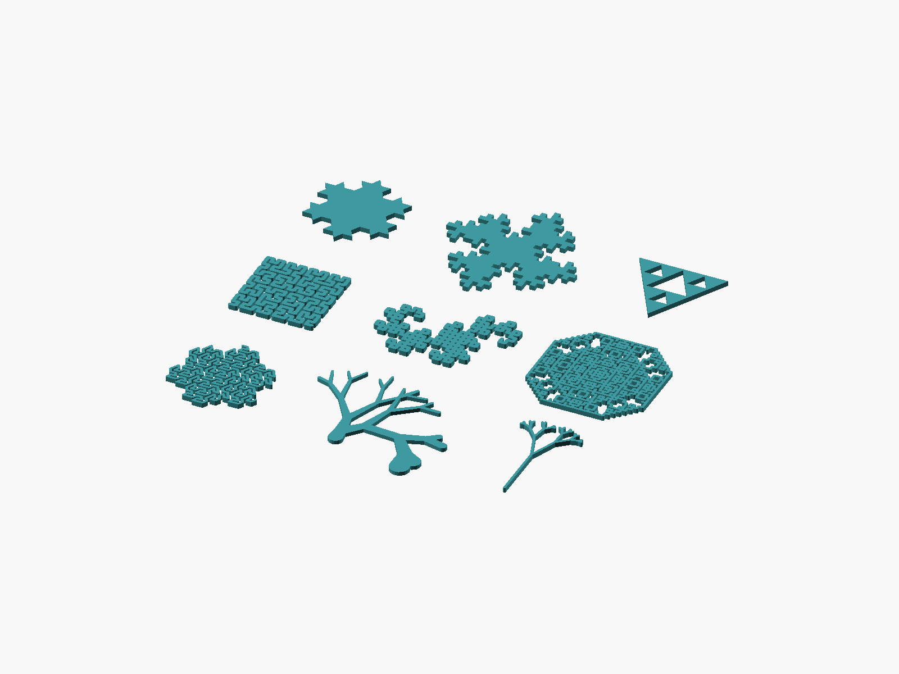

# LogoSC L-Systems Guide

`LogoSC-LSystems.scad` is an optional companion that expands deterministic L-system grammars and
translates their symbols into ordinary LogoSC command lists. It does not add opcodes to Core and
does not change `RenderLogo2D()`.

L-systems are more than recursion demonstrations. They are useful for designs whose structure
repeats at several scales: branching trees, roots, coral, leaf veins, lightning-like traces,
space-filling paths, decorative borders, fractal cutouts, ornaments, and texture or infill paths.
Changing a rule or expansion depth creates a coherent family of related parts without drawing
each branch or edge separately. For regular grids, fixed hole patterns, and other simple
repetition, an OpenSCAD loop or ordinary LogoSC command list is usually clearer.

## Table of contents

- [Quick start](#quick-start)
- [Built-in systems](#built-in-systems)
- [Data model](#data-model)
- [Expansion and interpretation](#expansion-and-interpretation)
- [Worked expansion: one Koch level](#worked-expansion-one-koch-level)
- [Closed and open output](#closed-and-open-output)
- [Seeded angle variation](#seeded-angle-variation)
- [Performance](#performance)
- [Scope boundary](#scope-boundary)

## Quick start

Keep `LogoSC-Foundation-Core.scad` and `LogoSC-LSystems.scad` together:

```scad
include <LogoSC-Foundation-Core.scad>
include <LogoSC-LSystems.scad>

// Construct the Koch preset record: triangular axiom, F rewrite rule,
// 60-degree turns, and the per-depth step divisor.
koch = MakeKochLSystem();
commands = LSystemCommands(koch, depth = 2, size = 45);

linear_extrude(height = 3)
{
    RenderLogo2D(commands);
}
```

Open `LogoSC-LSystems-Examples.scad` for the nine-model, 3-by-3 Customizer gallery. Its Koch,
quadratic Koch, and Sierpiński scenes render as filled boundaries. Hilbert, Dragon, Lévy C,
Gosper, plant, and canopy scenes are naturally open paths, so the examples convert their segments
into explicit round-ended printable outlines and extrude those outlines. This renderer belongs
to the example file rather than Core.



*The centered 3-by-3 gallery: Koch, Quadratic Koch, Sierpiński; Hilbert, Dragon, Lévy C; Gosper,
Plant, and Canopy.*

## Built-in systems

There are two equivalent ways to select a built-in system:

```scad
kochByName = LSystemPreset("Koch");
kochByConstructor = MakeKochLSystem();

levyByName = LSystemPreset("Levy C");
levyByConstructor = MakeLevyCLSystem();
```

`LSystemPreset(name)` expects one of the exact strings in the **Preset name** column below. The
direct constructor follows the convention `Make` + preset name with spaces removed + `LSystem`.
Thus `Quadratic Koch` becomes `MakeQuadraticKochLSystem()`, and the deliberately ASCII-only
`Levy C` becomes `MakeLevyCLSystem()`. These are named OpenSCAD functions, not constructor names
assembled dynamically at runtime.

The angle shown in each preset row is the **turn angle** used by `+` and `-`; it is not an angle
attached to `F`. For example, `turn = 60°` means `+` changes the current heading by positive 60
degrees and `-` changes it by negative 60 degrees. Thus `--` turns by negative 120 degrees before
the next movement. All turns are relative to the turtle's current heading.

The companion's compact symbols mean:

| Symbol | Meaning during expansion and interpretation |
|---|---|
| `F`, `G` | Drawing symbols. A rule may replace them during expansion; interpretation moves forward one calculated step while drawing. |
| `f` | Non-drawing movement. It advances one calculated step with the pen up. |
| `+` | Turn left/positive by the preset's turn angle; it does not move the turtle. |
| `-` | Turn right/negative by the preset's turn angle; it does not move the turtle. |
| `[` | Push the complete turtle state so a branch can start from the current point and heading. |
| `]` | Pop the most recently saved state, returning to that branch point and heading. |
| `A`, `B`, `X`, `Y` | Grammar variables. They can expand through rules but do not draw or move unless a custom interpretation assigns an action. |
| `->` | Rewrite notation: replace the symbol on the left with the sequence on the right during each parallel expansion pass. |

An **axiom** is the depth-zero starting sequence. Adjacent symbols execute from left to right after
expansion, while every rewrite within one expansion pass happens in parallel. Repeated letters
mean repeated forward steps, and repeated signs mean repeated turns.

| Preset name | Compact axiom, rules, and turn angle | What it illustrates |
|---|---|---|
| `Koch` | `F--F--F`; `F -> F+F--F+F`; `turn = 60°` | A triangular rule producing a closed snowflake boundary; the clearest introduction to substitution. |
| `Quadratic Koch` | `F+F+F+F`; `F -> F-F+F+FF-F-F+F`; `turn = 90°` | A closed, square-grid island contrasting with Koch's triangular geometry. |
| `Sierpinski` | `F-G-G`; `F -> F-G+F+G-F`; `G -> GG`; `turn = 120°` | Two drawing symbols cooperate to form a triangular recursive region; the printable example adds 10% overlap. |
| `Hilbert` | `A`; `A -> +BF-AFA-FB+`; `B -> -AF+BFB+FA-`; `turn = 90°` | A grid-aligned space-filling path whose variables organize motion without drawing. |
| `Dragon` | `FX`; `X -> X+YF+`; `Y -> -FX-Y`; `turn = 90°` | A folding curve generated mainly by non-drawing variables; orientation changes emerge from substitution. |
| `Levy C` | `F++F++F++F`; `F -> +F--F+`; `turn = 45°` | The C-fold applied to all four sides of a square, creating a dense framed pattern rather than one wandering strand. |
| `Gosper` | `F`; `F -> F-G--G+F++FF+G-`; `G -> +F-GG--G-F++F+G`; `turn = 60°` | A hexagonal space-filling curve with two mutually recursive drawing symbols and strong planar coverage. |
| `Plant` | `X`; `X -> F[++FX][---FGX]`; `F -> FF`; `turn = 10°` | An asymmetric recursive Y tree demonstrating saved turtle states, path-distance taper, and print-oriented length compensation. |
| `Canopy` | `X`; `X -> F[+X][-X]`; `F -> FF`; `turn = 28°` | A symmetric binary tree that isolates classic branching behavior and contrasts with the asymmetric Plant. |

The listed turn is the preset's base angle. The example renderer can optionally add seeded
variation to that base angle as described in [Seeded angle variation](#seeded-angle-variation).

The gallery orders these rows as closed regions, space-filling and folding curves, then branching
systems. Every open example is centered from its actual generated stroke bounds rather than from
an assumed formula.

`LSystemPresetNames()` returns the stable list used by the examples.

The Sierpiński curve's filled triangles normally meet only at points, which is unsuitable for a
single printed part. `LogoSC-LSystems-Examples.scad` therefore defaults
`SierpinskiOverlapPercent` to `10`. It offsets the filled regions by the amount that increases the
smallest triangle side by approximately 10%, producing deliberate overlap. The grammar and the
commands returned by `LSystemCommands()` remain mathematically unchanged.

## Data model

A rule record has the general form `[symbol, replacementSymbols]`. Construct one with:

```scad
rule = MakeLSystemRule(symbol, replacementSymbols);
```

`symbol` is the single symbol to match during expansion. `replacementSymbols` is the list that
replaces every matching occurrence during one parallel rewrite pass.

For example, this concrete rule represents `F -> F+F`:

```scad
rule = MakeLSystemRule(LSYS_F, [LSYS_F, LSYS_PLUS, LSYS_F]);
```

An interpretation record has the general form `[symbol, action, multiplier]` and is constructed
with:

```scad
interpretation = MakeLSystemInterpretation(symbol, action, multiplier);
```

For example, these concrete interpretations make `F` draw forward and `+` turn by one positive
multiple of the system's turn angle:

```scad
draw = MakeLSystemInterpretation(LSYS_F, LSYS_ACTION_DRAW);
turn = MakeLSystemInterpretation(LSYS_PLUS, LSYS_ACTION_TURN, 1);
```

The standard interpretations map `F` and `G` to drawing movement, lowercase `f` to pen-up
movement, `+` and `-` to turns, and bracket symbols to `PUSH` and `POP`. Grammar variables such as
`A`, `B`, `X`, and `Y` have no geometry unless an interpretation explicitly gives them an action.

A system record contains its name, axiom, rules, turn angle, per-depth step divisor, and
interpretations. Construct custom systems with `MakeLSystem()` and inspect them with
`LSystemName()`, `LSystemAxiom()`, `LSystemRules()`, `LSystemAngle()`,
`LSystemStepDivisor()`, and `LSystemInterpretations()`.

## Expansion and interpretation

`LSystemExpand(system, depth)` returns the rewritten symbols. Depth zero returns the axiom.
Symbols without a matching rule reproduce themselves, which is the conventional deterministic
L-system behavior.

`LSystemInterpret(symbols, step, angle, interpretations)` converts symbols into a LogoSC command
list. `LSystemCommands(system, depth, size)` performs both stages and calculates:

```text
step = size / stepDivisor^depth
```

The divisor is grammar-specific. It keeps the examples near a consistent physical scale while
their segment counts grow.

For a custom grammar:

```scad
custom = MakeLSystem(
    "Right Angle Walk",
    [LSYS_F],
    [MakeLSystemRule(LSYS_F, [LSYS_F, LSYS_PLUS, LSYS_F])],
    angle = 90,
    stepDivisor = 2
);

commands = LSystemCommands(custom, 3, 40);
```

## Worked expansion: one Koch level

The Koch preset is a useful small example because it has one drawing symbol and one rewrite rule.
In compact notation its starting axiom and rule are:

```text
axiom: F--F--F
rule:  F -> F+F--F+F
angle: 60 degrees
```

At depth zero, nothing has been rewritten, so the symbol sequence is simply the triangular axiom:

```text
F--F--F
```

For depth one, the expander examines every symbol in that sequence at the same time. Each `F` is
replaced by `F+F--F+F`. The `+` and `-` symbols have no rewrite rules, so they copy themselves.
Writing `K = F+F--F+F` temporarily makes the result easier to see:

```text
K--K--K
```

Expanding that abbreviation gives:

```text
F+F--F+F--F+F--F+F--F+F--F+F
```

The axiom contained three drawing symbols; depth one contains 12 because the rule replaces every
`F` with four new `F` symbols. Depth two repeats the same parallel operation on all 12 and
contains 48 drawing symbols. In general, this preset has `3 * 4^depth` drawing segments.

Expansion still produces symbols, not geometry. Interpretation is the separate next stage:

- `F` becomes a forward LogoSC `MOVE` that draws one segment;
- `+` becomes `TURN 60`; and
- `-` becomes `TURN -60`.

For `size = 45` at depth one, Koch's step divisor of `3` makes every forward step
`45 / 3^1 = 15` units. The turn sequence walks all three rewritten sides and returns to the
starting point, producing a closed region suitable for `RenderLogo2D()`.

The corresponding calls are:

```scad
koch = MakeKochLSystem();
depth0Symbols = LSystemExpand(koch, 0);
depth1Symbols = LSystemExpand(koch, 1);
depth1Commands = LSystemCommands(koch, depth = 1, size = 45);

echo("depth 0 symbols", depth0Symbols);
echo("depth 1 symbols", depth1Symbols);
echo("depth 1 LogoSC commands", depth1Commands);
```

OpenSCAD prints the integer symbol constants used internally rather than the compact letters shown
above, but the rewriting order and resulting command sequence are the same.

## Closed and open output

LogoSC Core produces filled regions. A closed L-system boundary is therefore a normal LogoSC
model and can use `evalLogo()`, `RenderLogo2D()`, extrusion, holes, and native OpenSCAD booleans.

Open curves are different: OpenSCAD will implicitly close a polygon if they are sent through the
filled-region renderer. The examples therefore hull circles along each generated segment to make
an explicit round-ended outline, then extrude it. `LSystemStrokeWidth` controls the base width.
Hilbert and Dragon default to `1.5` times that width.

The plant defaults to ten times the base width at its trunk and tapers continuously according to
accumulated travel distance from the root. Every pushed branch saves and restores that distance
along with turtle position and heading. A sideways or downward-growing tip therefore continues
to become thinner as its path grows; its absolute Y coordinate has no effect on width. The longest
root-to-tip path reaches the original base stroke width. Each segment is a hull between
independently sized endpoint circles, and the starting thickness is controlled by
`PlantTrunkWidthScale`.

This is intentionally example-owned printable geometry for these known systems, not a stable
general-purpose stroke-width, cap, or join API in Core.

The Plant preset recursively grows a trunk into asymmetric Y-shaped forks. At every level, the
left branch turns 20 degrees and advances one base step before repeating, while the slightly
longer right branch turns 30 degrees and advances one and a half. The printable stroke evaluator
uses `G` for the final half-step on that arm. The grammar's `F -> FF` expansion would
make each successive level one half the preceding length, so the printable example applies a
`1.5` branch-step compensation for an exact net scale of three quarters. The example adds one
level to the requested depth, up to four levels, producing 16 terminal tips at its default depth.
`PUSH` and `POP` return both branches to the same fork point. The lengths and angles are fixed.
Each recursive trunk section uses one base step, keeping the crown compact relative to its
branches.

To keep the Plant close in size to the other gallery models, the printable example halves the
lengths at branch depths zero and one—the original trunk and first Y arms. This changes only
their geometry; the 10-times trunk width and the rest of the continuous width taper are not
scaled down. It also applies a `0.7` overall movement-length factor, reducing both planar
dimensions by 30 percent without scaling any stroke widths.

## Seeded angle variation

`LogoSC-LSystems-Examples.scad` can vary individual turn magnitudes while keeping the result
repeatable. For a base turn of 90 degrees and a variation of 10 degrees, every `+` uses a seeded
value from positive 80 through 100 degrees, and every `-` uses the corresponding negative range.
Each turn receives its own value, so two `+` symbols do not necessarily turn by the same amount.

The Customizer controls are:

| Control | Default | Meaning |
|---|---:|---|
| `LSystemAngleVariationScope` | `Branching Only` | `Off`, only `Plant` and `Canopy`, or `All Open Curves`. |
| `LSystemAngleVariation` | `10` | Maximum plus-or-minus variation in degrees. Zero also disables variation. |
| `LSystemRandomSeed` | `1` | Reproduces the same per-turn values; changing it produces another deterministic variant. |

The default gives Plant and Canopy organic variation while leaving Hilbert, Dragon, Levy C, and
Gosper exact. Select `All Open Curves` to experiment with those other open examples. Closed
examples remain exact even in that mode because independently perturbed turns can prevent their
last point from meeting their first point, invalidate a filled polygon, or defeat Sierpinski's
deliberate printable overlap.

This feature randomizes interpretation, not rewriting: the axiom, rules, expanded symbols, and
segment count remain deterministic. Only the angle used when interpreting each `+` or `-` varies.
For useful results, keep the variation smaller than the preset's base turn angle.

Length variation would use the same general idea: multiply each forward step by a seeded factor,
such as a value from `0.9` through `1.1` for plus-or-minus 10 percent. It is intentionally deferred
for now. Independent step-length changes can distort closed endpoints, weaken intended overlaps,
open gaps between features, and make minimum printable widths or clearances harder to predict.
In a closed grammar, every substituted section is designed to have a precise net displacement and
heading. Randomizing its individual segment lengths changes that displacement, so the next
section will probably not begin where expected and the final endpoint may miss the starting point.
Angle variation creates the same closure risk. A future closure-safe system would need correlated
variation that perturbs a section's interior while constraining or solving its final endpoint and
heading. For open branching models, branch-aware correlated length variation may eventually be
more useful than unrelated jitter on every `F`.

## Performance

L-system growth is usually exponential. Keep interactive depths modest and inspect symbol or
command counts before attempting a dense render. The Customizer caps its plant and general depth
choices, but custom callers remain responsible for practical limits.

Useful checks include:

```scad
symbols = LSystemExpand(system, depth);
commands = LSystemCommands(system, depth, size);
echo("symbols", len(symbols), "commands", len(commands));
```

Run `LogoSC-LSystems-Test-Runner.scad` after companion changes. Its independent deterministic
suite covers record validity, rewriting, interpretation, scaling, closed endpoints, and balanced
branch stacks.

## Scope boundary

The companion owns grammar symbols, rules, expansion, and interpretation. Core continues to own
LogoSC command evaluation and filled regions. Native OpenSCAD continues to own 3D composition.
Distribution packaging is intentionally deferred until the companion API, examples, tests, and
documentation are accepted.
