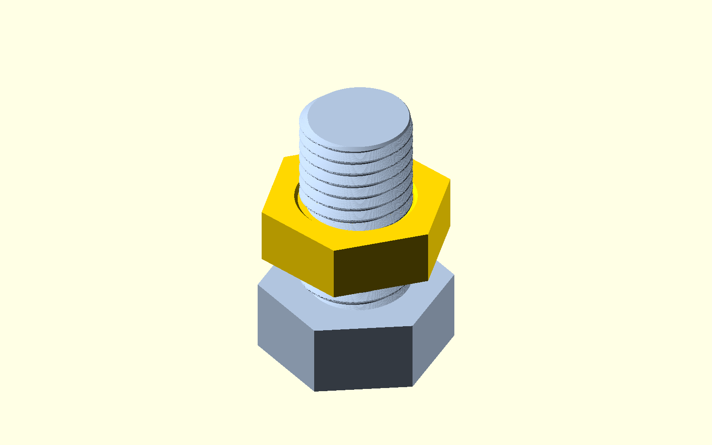
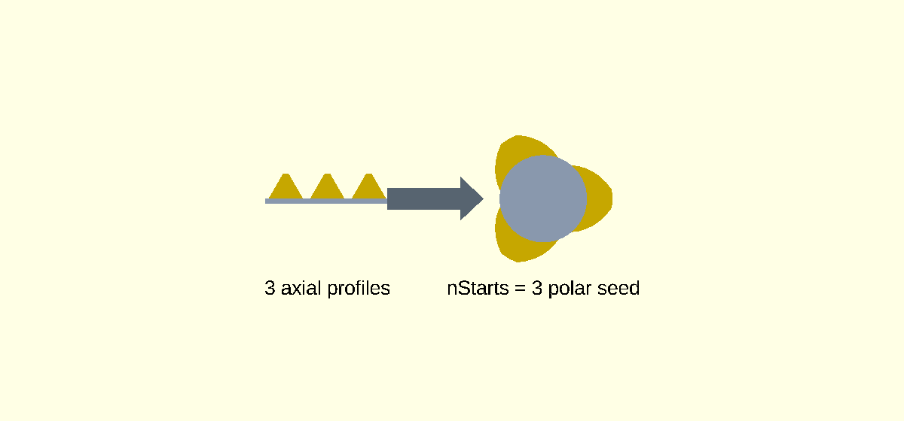
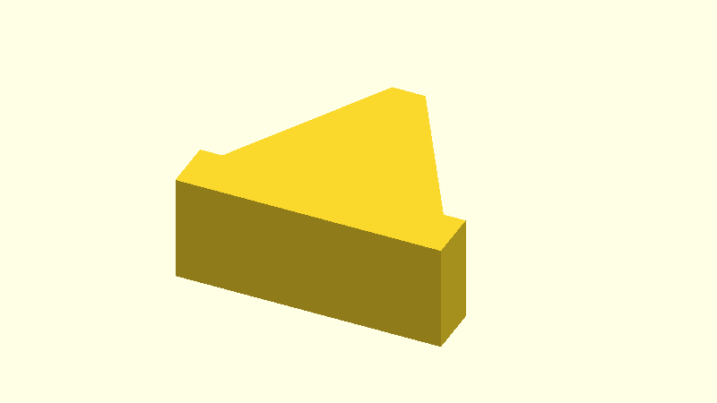
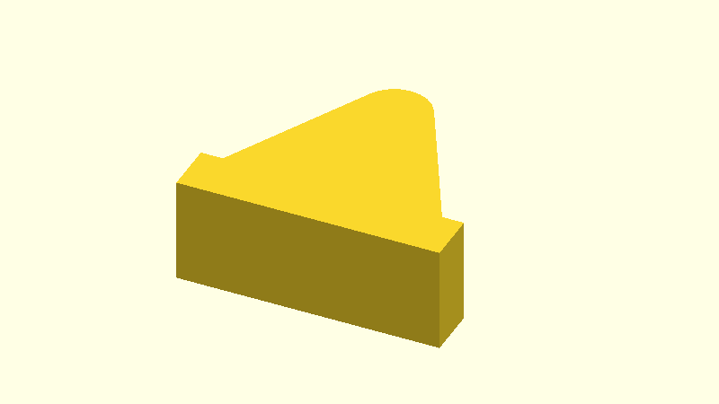
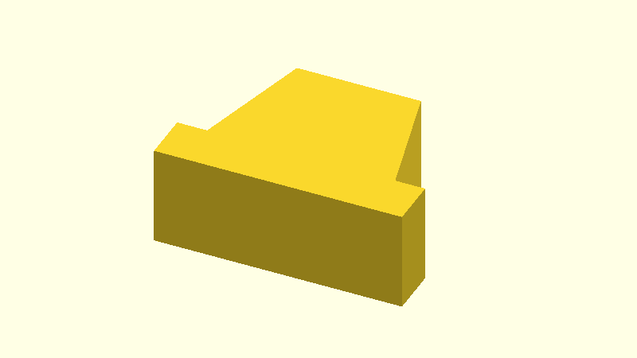
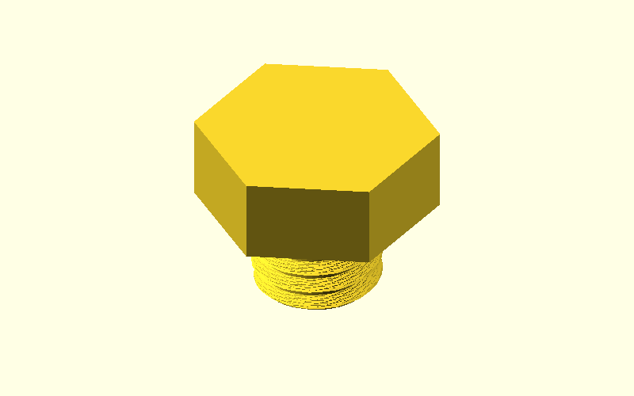
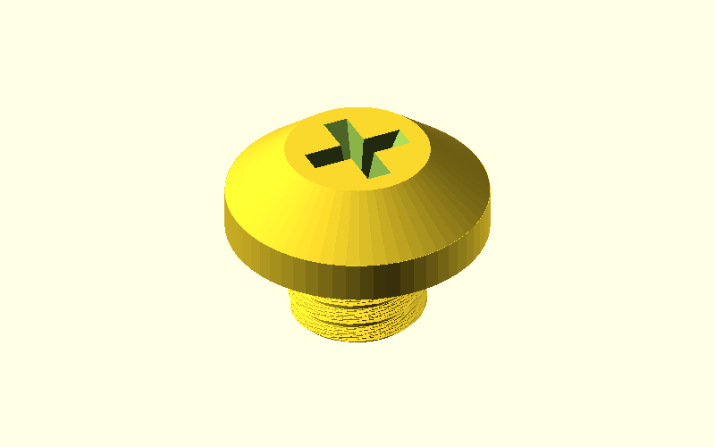
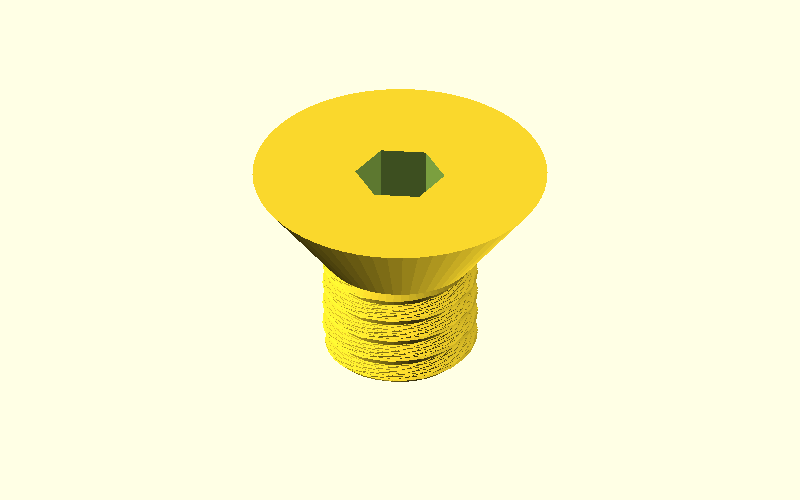
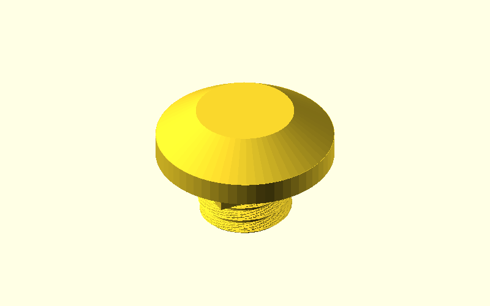

# LogoSC Nuts and Bolts Customizer Guide

`LogoSC-Nuts-And-Bolts.scad` creates printable fastener demonstrations from LogoSC-defined
2D profiles and native OpenSCAD 3D operations. The dimensions are useful modeling defaults,
not certified fastener dimensions or tolerance classes. Calibrate clearance and strength for
the printer, material, orientation, and load before relying on a printed part.

## Table of Contents

- [Quick start](#quick-start)
- [Quickly verify the fastener calculations](#quickly-verify-the-fastener-calculations)
- [Why head, drive, and drive size are separate](#why-head-drive-and-drive-size-are-separate)
- [Model parameters](#model-parameters)
- [Thread parameters](#thread-parameters)
- [How the thread algorithm works](#how-the-thread-algorithm-works)
- [Head and drive parameters](#head-and-drive-parameters)
- [Gallery output](#gallery-output)
- [Nut and assembly parameters](#nut-and-assembly-parameters)
- [Resolution parameters](#resolution-parameters)
- [Boolean and printing details](#boolean-and-printing-details)
- [⚠ WARNING: PRINTED FASTENER STRENGTH IS UNKNOWN](#-warning-printed-fastener-strength-is-unknown)

## Quick start

1. Open `LogoSC-Nuts-And-Bolts.scad` in OpenSCAD and show the Customizer.
2. Select `Bolt`, `Nut`, `Assembly`, `Profile`, `Algorithm Figure`, or `Gallery (Slow!)`
   with `Part`.
3. Choose a `ScrewSize` and `ThreadProfile`.
4. For a bolt, choose `HeadType`, `DriveType`, and `DriveSize` independently.
5. Set `PrintSlop` for the printer, preview with F5, and render with F6 before export.

`Assembly` is useful for a visual fit check. It does not perform collision analysis and cannot
replace a short printed calibration pair.



The assembly above was generated at 1600 by 1000 pixels with `RadialSegments = 240`,
`ThreadSlicesPerTurn = 60`, and `ProfileSamplesPerTurn = 100`—exactly four times the three
default geometry resolutions. It uses OpenSCAD's preview renderer; on the maintainer's machine,
the preview took about 21 seconds. A full F6/CGAL render at these settings can take many minutes.
The exact PowerShell command is in
[Example 3 of the OpenSCAD
command-line guide](LogoSC-OpenSCAD-Command-Line.md#example-3-generate-a-fastener-documentation-image).

## Quickly verify the fastener calculations

Before spending time on a threaded preview or full render, you can run the separate fastener
parameter suite. It creates no geometry, so it normally completes much faster than even the
gallery preview:

```powershell
$openScadCli = 'C:\Program Files\OpenSCAD\openscad.com'
$fastenerTestLogPath = Join-Path $env:TEMP 'LogoSC-fastener-tests.echo'

& $openScadCli `
    -o $fastenerTestLogPath `
    'LogoSC-Nuts-And-Bolts-Test-Runner.scad'

Select-String `
    -LiteralPath $fastenerTestLogPath `
    -SimpleMatch '"LOGOSC_AUTOMATED_TEST_RESULT", "PASS"'
```

One matching `PASS` record confirms that the complete non-rendering run succeeded. The suite
checks every bundled metric and Unified size preset, basic head/nut/drive dimensions, all six
profile families, generated LogoSC commands and contours, sampling counts, handed wrapping, and
multi-start phase offsets.

This is especially useful after changing the fastener source, adding a preset, or adjusting a
profile calculation. It validates the bundled fixtures and calculation paths; it does not prove
that one arbitrary Customizer selection will produce robust boolean geometry, a printable mesh,
proper fit, or sufficient strength. Preview and render the selected part and print a calibration
pair where fit matters.

For a command that also rejects missing or failed result records, plus guidance on fail-fast
diagnosis and the separate CSG/CGAL release checks, see
[Run the non-rendering fastener suite](LogoSC-OpenSCAD-Command-Line.md#run-the-non-rendering-fastener-suite).

## Why head, drive, and drive size are separate

A head is the external shape, such as hex, pan, round, countersunk, carriage, or headless. A
drive is the tool-engagement feature, such as a slot, Phillips cross, or hex socket. The recess
or slot dimensions are a third choice. Standards likewise publish head dimensions and recess
dimensions separately; the contents of [ASME B18.6.3][asme-b18-6-3] show that separation for
inch machine screws.

There is no common hole size in millimeters shared by slotted, Phillips, and hex socket drives.
Phillips numbers designate cross-recess and driver families. Slots are characterized by width
and depth, while hex sockets use an across-flats dimension. [ISO 4757][iso-4757] defines H and
Z cross recesses and gauge numbers No. 0 through No. 4; it does not turn those
numbers into universal slot or hex dimensions. This model therefore treats `#0` through `#5`
as convenient, type-specific printable presets. `#5` extends the model's large-print range and
is not an ISO 4757 gauge size.

## Model parameters

- **`Part`** selects the output. `Bolt` creates an external thread and selected head/drive. `Nut`
  subtracts a matching enlarged thread from a hex blank. `Assembly` places both together.
  `Profile` shows one axial/radial bump and a flat, full-pitch reference pad behind it.
  `Algorithm Figure` places the flat profiles beside the polar seed used for twisted extrusion.
  `Gallery (Slow!)` displays eight representative bolts, screws, and nuts in a four-by-two grid.
- **`ScrewSize`** selects a nominal major diameter, pitch, and useful hex across-flats default.
  Metric entries use common coarse pitches. Inch entries use the threads per inch shown after
  the dash. `Custom` enables `CustomDiameter` and `CustomPitch`.
- **`CustomDiameter`** is the nominal major diameter in millimeters when `ScrewSize` is
  `Custom`. It also drives automatic head, nut, and drive proportions.
- **`CustomPitch`** is the axial distance in millimeters between adjacent turns of a
  single-start custom thread.
- **`Length`** is the threaded shaft length in millimeters, measured from the head bearing plane
  at Z=0 to the tip. A countersunk head is still modeled below that plane.

The built-in size list covers M3, M4, M5, M6, M8, then every even common size through M24,
followed by M27, M30, M33, and M36. Inch choices are #8-32, 1/4-20, 5/16-18, 3/8-16,
1/2-13, 5/8-11, 3/4-10, and 1-8. Metric selections follow the family described by
[ISO 261][iso-261]; inch selections follow familiar UNC diameter/TPI designations described by
[ASME B1.1][asme-b1-1].

## Thread parameters

- **`ThreadProfile`** selects the LogoSC axial/radial bump that is wrapped into a helix. See the
  profile notes below.
- **`Handedness`** selects the helix direction. `Right` advances conventionally; `Left` reverses
  the helix.
- **`ThreadStarts`** is the number of intertwined helices. Pitch remains the space between
  neighboring profile bumps; in the equations below, `nStarts = ThreadStarts` and lead becomes
  `pitch * nStarts`.
- **`PrintSlop`** is radial clearance per side in millimeters. It enlarges the female thread
  cutter, so the approximate diametral clearance added to the nut is twice this value. Start
  around 0.20-0.30 mm per side for a trial print, then calibrate.
- **`TipChamfer`** controls the taper at both ends of an external thread, reducing thin fragments
  where the helix is clipped. The same value controls both entry chamfers in the nut. Nut
  chamfers are additionally limited by pitch and nut thickness.

## How the thread algorithm works

The main subroutine is `RenderFastenerThreadRidge()`. It turns one conventional thread profile
into the helical ridge later joined to a cylindrical core. `RenderFastenerThreadedRod()` adds
that core, clips the ridge to the requested length and chamfers, and is also reused as the
slightly enlarged cutter subtracted from a nut.

### Where LogoSC is actually used

LogoSC is used, but only for the 2D contour stage. The division of work is:

- Native OpenSCAD functions calculate the profile's axial/radial point coordinates from the
  selected pitch and profile ratios.
- `FastenerLogoPath()` expands those points into a LogoSC command list. `evalLogo()` evaluates
  that list into a LogoSC region, and `RenderLogo2D()` renders it in `Profile` and
  `Algorithm Figure` modes.
- Native OpenSCAD code then resamples the evaluated LogoSC contour, maps it into polar XY
  coordinates, applies `linear_extrude(twist)`, and performs the cylinders and booleans.

Thus LogoSC supplies the authoritative closed 2D ridge contour, but it does not calculate the
thread proportions or perform the helical or 3D work. The generated profile uses absolute
`GOTO` commands rather than relative `MOVE` and `TURN` commands because its coordinates come
from the selected pitch and profile equations.

For the three-start figure below (`CustomPitch = 3`, V60),
`FastenerProfilePoints()` first returns:

```scad
[
    [-1.24999, 0],
    [-0.1875, 1.84029],
    [ 0.1875, 1.84029],
    [ 1.24999, 0]
]
```

`FastenerLogoPath()` expands those four points into this actual LogoSC command list:

```scad
profileCommands =
[
    [PENUP],
    [GOTO, -1.24999, 0, 0],
    [PENDOWN],
    [GOTO, -0.1875, 1.84029, 0],
    [GOTO,  0.1875, 1.84029, 0],
    [GOTO,  1.24999, 0, 0],
    [GOTO, -1.24999, 0, 0]
];
```

The final `GOTO` closes the ridge explicitly. LogoSC's opcodes are integer constants, so the
OpenSCAD console prints the same list as `[[9], [4, ...], [10], ...]`; symbolically these are
`PENUP = 9`, `GOTO = 4`, and `PENDOWN = 10`.

The transformation proceeds as follows:

1. `FastenerProfilePoints()` constructs one ridge in conventional axial/radial coordinates.
   A point `[x, y]` means axial position `x` within the profile and radial height `y` above the
   cylindrical core. `FastenerLogoPath()` converts those points into an explicitly closed
   LogoSC command list.
2. `RenderFastenerThreadSeed()` evaluates that command list with `evalLogo()`, takes the outer
   contour, and calls `FastenerResampleContour()`. Resampling matters because the next mapping
   is nonlinear: a long straight profile edge would otherwise become one incorrect straight
   chord in the polar seed.
3. `FastenerWrapPoint()` maps every resampled point to the XY plane used by OpenSCAD's twisted
   extrusion. For core radius `R`, lead `L`, and handedness sign `h`, the mapping is:

   ```text
   r     = R + y
   theta = h * 360 degrees * x / L
   XY    = [r * cos(theta), r * sin(theta)]
   ```

   This phase encodes the original axial coordinate as an angle. As `linear_extrude(twist)`
   rotates successive Z slices, an axial section through the finished helix recovers the
   intended profile instead of only a tangential approximation.
4. For a multi-start thread, the seed is copied `nStarts` times and copy `i` is rotated by
   `i * 360 / nStarts`. In the Customizer this value is named `ThreadStarts`; it arrives at
   `RenderFastenerThreadRidge()` as `starts`. The algorithmic name `nStarts` is useful in the
   equations because the lead is `L = pitch * nStarts`. Thus three starts use three copies
   spaced 120 degrees apart and each individual helix advances three pitches per revolution,
   while adjacent axial crests remain one pitch apart.
5. `linear_extrude()` twists the complete multi-start seed. The result is unioned with the
   cylindrical core for a bolt. A nut subtracts the same threaded solid with
   `radialOffset = PrintSlop`, then cuts its two entry chamfers.

Important variables in `RenderFastenerThreadRidge()` are `profileDepth`, `coreRadius`, `lead`,
`twistDirection`, `overrun`, `targetHeight`, `slices`, `extrusionHeight`, and `turns`.
In particular:

```text
coreRadius      = diameter / 2 - profileDepth + radialOffset
lead            = pitch * nStarts
slices          = max(4, ceil(targetHeight * ThreadSlicesPerTurn / lead))
extrusionHeight = slices * lead / ThreadSlicesPerTurn
turns           = slices / ThreadSlicesPerTurn
```

The ridge is generated one pitch beyond both ends, then clipped. Rounding `extrusionHeight` to
an exact slice height ensures the requested resolution and twist remain phase-consistent.



The left panel shows three V60 profiles at pitch spacing. The right panel is the actual polar
seed for `nStarts = 3`, viewed straight down the thread axis. It is effectively the unextruded
slice passed to `linear_extrude(twist)`; the light-blue circle is the core, the three gold lobes
are the ridge seeds, and the black dots are the resampled contour points.

### How expansion and sampling work

The four profile points become seven LogoSC commands because setup needs `PENUP`, the first
`GOTO`, and `PENDOWN`, while explicit closure adds the last `GOTO`. Evaluating that list produces
one usable contour with five points: the four corners plus the repeated closing point. The
evaluation result also retains the empty initial region that precedes `PENDOWN`;
`RenderFastenerThreadSeed()` ignores regions whose outer contour has fewer than three points.

`FastenerResampleContour()` visits the four unique contour edges. For endpoints `a` and `b`,
`FastenerProfileSegmentSamples()` selects:

```text
edgeSamples = max(
    1,
    ceil(abs(b[0] - a[0]) * ProfileSamplesPerTurn / lead),
    ceil(abs(b[1] - a[1]) * ProfileSamplesPerTurn / (2 * lead))
)
```

For the displayed values, `ProfileSamplesPerTurn = 48`, `pitch = 3`, and `nStarts = 3`, so
`lead = 9`. The two sloping flanks receive 6 samples each, the crest receives 2, and the closing
base receives 14. That produces `6 + 2 + 6 + 14 = 28` points per start. Each edge emits its
starting point and intermediate samples but not its endpoint; the next edge emits that endpoint,
so adjacent edges do not duplicate points.

Axial distance gets the stronger sampling weight because it becomes angular travel in the polar
map; radial distance uses the `2 * lead` denominator. The long closing base therefore receives
the most samples: after wrapping, it is the inner circular boundary of the ridge seed. Without
those intermediate points it would become one straight chord cutting across the core.

`FastenerWrapPoint()` maps all 28 points into the first polar seed. Rotating that seed for three
starts produces `3 * 28 = 84` seed points in each extrusion slice. The figure is generated from
those exact arrays, and its console diagnostic reports `evaluatedContourPoints = 5`,
`samplesPerStart = 28`, `nStarts = 3`, and `totalSeedSamples = 84`.

### Sampling cost

Let `m` be the number of edges in the evaluated LogoSC contour, `n` the number of points after
resampling, `s = nStarts`, and `k = slices`. Profile evaluation, resampling, and wrapping are
`O(m + n)` for one seed. Copying the seed for every start is `O(s * n)`. Before OpenSCAD's
boolean operations, the twisted ridge has mesh size and construction work on the order of
`O(s * n * k)`; its stored mesh is the same order, while the transient resampled contour is
`O(n)`.

This explains the two most useful resolution rules: doubling `ProfileSamplesPerTurn` roughly
doubles `n`, and doubling `ThreadSlicesPerTurn` roughly doubles `k`; doubling both can therefore
produce about four times as much ridge mesh. Increasing `nStarts` is not a pure `s` multiplier
because it also increases `lead`, which can reduce both the samples per profile edge and the
number of axial slices. Final CGAL union, intersection, and subtraction time is
implementation- and geometry-dependent and does not have a useful simple `O(n)` bound here; in
practice those booleans dominate full renders.

### Echo the LogoSC commands and generate the images

`Profile` mode echoes both the calculated point list and expanded LogoSC command list. This
tested PowerShell command captures them without exporting a mesh or image:

```powershell
$openScadCli = 'C:\Program Files\OpenSCAD\openscad.com'
$profileEchoPath = Join-Path $env:TEMP 'LogoSC-fastener-profile.echo'

& $openScadCli `
    -D 'Part=\"Profile\"' `
    -D 'ScrewSize=\"Custom\"' `
    -D 'CustomDiameter=10' `
    -D 'CustomPitch=3' `
    -D 'ThreadProfile=\"V60\"' `
    -o $profileEchoPath `
    'LogoSC-Nuts-And-Bolts.scad'

if ($LASTEXITCODE -ne 0)
{
    throw "OpenSCAD profile evaluation failed with exit code $LASTEXITCODE."
}

Get-Content -LiteralPath $profileEchoPath
```

This tested PowerShell command exports the ordinary M8 V60 profile to a temporary PNG:

```powershell
$profilePngPath = Join-Path $env:TEMP 'LogoSC-fastener-profile.png'

& $openScadCli `
    -D 'Part=\"Profile\"' `
    -D 'ScrewSize=\"M8\"' `
    -D 'ThreadProfile=\"V60\"' `
    --imgsize=800,450 `
    --autocenter `
    --viewall `
    --projection=o `
    -o $profilePngPath `
    'LogoSC-Nuts-And-Bolts.scad'

if ($LASTEXITCODE -ne 0)
{
    throw "OpenSCAD profile export failed with exit code $LASTEXITCODE."
}
```

The documentation figure uses the same source file and actual mapping routines. `Algorithm` is
a command-line alias for the Customizer's `Algorithm Figure` label; the alias avoids quoting a
`-D` value containing a space in older Windows OpenSCAD versions.

```powershell
$algorithmPngPath = Join-Path `
    (Get-Location) `
    'images\fastener-thread-wrapping-three-start.png'

& $openScadCli `
    -D 'Part=\"Algorithm\"' `
    -D 'ScrewSize=\"Custom\"' `
    -D 'CustomDiameter=10' `
    -D 'CustomPitch=3' `
    -D 'ThreadProfile=\"V60\"' `
    -D 'ThreadStarts=3' `
    -D 'RadialSegments=96' `
    -D 'ProfileSamplesPerTurn=48' `
    --imgsize=1200,560 `
    --autocenter `
    --viewall `
    --projection=o `
    --camera=0,0,0,0,0,0,50 `
    -o $algorithmPngPath `
    'LogoSC-Nuts-And-Bolts.scad'

if ($LASTEXITCODE -ne 0)
{
    throw "OpenSCAD algorithm-figure export failed with exit code $LASTEXITCODE."
}
```

### What “printable approximation” means

Each profile preserves the most recognizable geometry—flank angle, broad proportions, and
symmetry or asymmetry—but it is not a standards-compliant thread specification. The model uses
one simplified external ridge shape, wraps it helically, and enlarges a copy radially by
`PrintSlop` to cut the nut. It does not calculate standard pitch diameters, separate internal
and external truncations, allowance, tolerance class, fundamental deviation, gauge limits,
lead error, runout, surface finish, or process-specific crest and root relief.

The flat rectangle behind every picture is one pitch wide. It provides a scale reference and
is not part of the helical thread. Ratios below are relative to the selected pitch `P`.

#### V60

The V60 ridge has straight 60-degree flanks, depth `0.61343P`, and a flat crest `0.125P` wide.
The cylindrical core supplies a flat/cylindrical root. ISO metric and Unified threads use
specific basic-profile truncations, root forms, pitch diameters, and tolerance classes that are
not reproduced here; V60 therefore resembles those families but is not an ISO or UN fit.



#### Whitworth55

Whitworth55 uses 55-degree flanks, depth `0.640327P`, and a crest radius of `0.137329P`. The
crest arc is sampled with eight segments, while the cylindrical shaft approximates the rounded
root rather than constructing the exact continuous mating root curve. No Whitworth fit or gauge
tolerance is applied.



#### ACME29

ACME29 uses symmetric 29-degree flanks, depth `0.5P`, and a crest `0.5P` wide. It captures the
broad load-bearing shape of an ACME power thread but omits standard allowances, class-specific
clearances, minimum root width, corner radii, and internal/external dimensional differences.



#### Trapezoidal30

Trapezoidal30 uses the same simplified half-pitch depth and half-pitch crest as ACME29, but with
the 30-degree included angle associated with metric trapezoidal threads. It does not implement
standard Tr diameter series, lead-dependent dimensions, tolerance zones, or crest/root relief.


#### Buttress7/45

Buttress7/45 uses a 7-degree load flank, a 45-degree trailing flank, depth `0.6P`, and a crest
`0.1P` wide. The unequal flanks show the intended one-direction load concept, but standard
buttress root radii, truncations, pressure-flank tolerances, and strength calculations are not
included.


#### Square

Square uses vertical flanks, depth `0.5P`, and equal half-pitch ridge and gap widths. Its sharp
corners and zero flank clearance are an idealization: practical square threads need machining
or printing clearance, root relief, and suitable dimensional tolerances.


## Head and drive parameters

- **`HeadType`** selects the positive external shape: `Hex`, `Pan`, `Round`,
  `Countersunk Flat Head`, `Carriage`, or `Grub (Headless)`. Carriage adds a square neck.
  Headless cuts the selected drive inward from the free end of the shaft.
- **`DriveType`** independently selects `None`, `Slotted`, `Phillips`, or `Hex Socket`. The slot
  crosses the entire top. The Phillips cross tapers inward to model angled flanks.
- **`DriveSize`** selects `Auto`, a type-specific `#0`-`#5` preset, or `Custom`. The same label
  maps to different physical dimensions for each drive type; it is a convenience scale, not a
  shared standard.
- **`CustomDriveSize`** applies when `DriveSize` is `Custom`. It means slot width for `Slotted`,
  top cross span for `Phillips`, and across-flats width for `Hex Socket`, all in millimeters.
- **`HeadScale`** multiplies nominal head width and height without changing shaft diameter or
  pitch. Very small values may leave insufficient material around a large drive.

### Head shapes

The pictures pair each head with a representative drive where useful. `HeadType` and
`DriveType` remain independent Customizer choices.

#### Hex

The hex head uses the preset across-flats dimension for the selected screw size and a height of
approximately `0.65` times shaft diameter before `HeadScale` is applied.



#### Pan

The pan head combines a cylindrical lower section with a short tapered cap. This is a printable
faceted dome, not a standard head-radius or bearing-surface specification.


#### Round

The round head uses a stronger two-stage dome than the pan head. The pictured Phillips recess
tapers inward through its depth.



#### Countersunk Flat Head

The countersunk head is a conical frustum from the broad flat top to shaft diameter. Its angle
follows the model proportions and is not guaranteed to match a standard 82-, 90-, or 100-degree
countersink.



#### Carriage

The carriage head combines a round dome with a simplified square neck that resists rotation.
Neck dimensions and under-head transitions are printable proportions rather than a carriage-bolt
product standard.



#### Grub (Headless)

The headless option omits positive head geometry and cuts the selected drive inward from the
free shaft end. The example uses a hex socket.


### Drive preset dimensions

| Preset | Phillips top span | Slot width | Hex socket across flats |
| --- | ---: | ---: | ---: |
| `#0` | 2.0 mm | 0.6 mm | 1.5 mm |
| `#1` | 3.0 mm | 0.8 mm | 2.0 mm |
| `#2` | 4.5 mm | 1.0 mm | 2.5 mm |
| `#3` | 6.0 mm | 1.2 mm | 4.0 mm |
| `#4` | 8.0 mm | 1.6 mm | 5.0 mm |
| `#5` | 10.0 mm | 2.0 mm | 6.0 mm |

`Auto` chooses `#0` through `#5` at nominal diameters up to 2.5, 4, 7, 10, 14, and
greater than 14 mm respectively. Recesses are clamped to the available head diameter and
depth, so an oversized selection does not remove the whole head. These values favor visible,
printable geometry; use `Custom` when matching a particular tool or specification.

## Gallery output

`Part = Gallery (Slow!)` renders a stable four-column by two-row overview containing a hex bolt,
slotted pan screw, Phillips round screw, countersunk hex-socket screw, carriage bolt, headless
hex-socket screw, V-thread nut, and trapezoidal-thread nut. Gallery models use the current
`TipChamfer`, `PrintSlop`, and resolution controls while fixing their identifying head, drive,
size, and profile selections. Console `ECHO` records identify each grid position.

> [!CAUTION]
> The gallery constructs eight threaded models and can be very time consuming to render or
> export. On the maintainer's OpenSCAD 2021.01 workstation, creating the 1200 by 700 preview PNG
> took about 1 second, but a full default-resolution CGAL/STL gallery took about 3 minutes
> 22 seconds. Higher resolutions can take substantially longer; timings vary by computer.


## Nut and assembly parameters

- **`NutScale`** multiplies the nominal nut across-flats width without changing its threaded
  bore. Increase it for more wall material around large-clearance or coarse printed threads.
- **`NutThickness`** is nut height in millimeters. Zero uses the automatic value of
  approximately 0.8 times nominal diameter.
- **`AssemblyNutPosition`** requests the Z position of the nut's lower face along the bolt. The
  model clamps it to the shaft and snaps it to the slice grid so the visualized male and female
  meshes retain the same helical phase.

## Resolution parameters

- **`RadialSegments`** controls facets around cylinders and LogoSC circle profiles. Default 60;
  Customizer range 24-256.
- **`ThreadSlicesPerTurn`** controls axial layers in every complete helical turn. Default 15;
  range 8-128. It strongly affects diagonal thread smoothness.
- **`ProfileSamplesPerTurn`** controls target sampling density while converting the evaluated
  LogoSC contour into the polar thread seed. Default 25; range 12-128. It affects curved and
  sloped profile fidelity.

The defaults are intended for interactive modeling. Raise resolution for a final large print in
small steps: mesh size and CGAL render time can grow rapidly when all three controls increase.

## Boolean and printing details

OpenSCAD can show missing faces or unstable previews when a cutter ends exactly on the top or
bottom of a positive solid. Every difference cutter in this model overruns both faces by the
hidden `FastenerDifferenceTolerance = 0.01 + 0` value. This applies to drive recesses, the nut's
thread cutter, and both nut entry chamfers. The separate `FastenerEpsilon` and
`FastenerThreadOverlap` values join positive geometry; they are not print-clearance controls.

For a new printer/material combination, render a short coarse bolt and nut first. Print them in
the intended orientation, test several `PrintSlop` values, and save the successful value with
the slicer and material profile. Printed fasteners are demonstrations unless their load capacity
has been established independently.

[asme-b18-6-3]: https://www.asme.org/getmedia/c0cd5b72-b6a7-4cf2-871f-08f3ec78cbe3/35224.pdf
[iso-4757]: https://www.iso.org/standard/10742.html
[iso-261]: https://www.iso.org/standard/4165.html
[asme-b1-1]: https://www.asme.org/codes-standards/find-codes-standards/b1-1-unified-inch-screw-threads-un-unr-thread-form
[ultimaker-pla]: https://ultimaker.com/materials/pla/
[ultimaker-petg]: https://ultimaker.com/materials/petg/
[ultimaker-abs]: https://ultimaker.com/materials/abs/
[iso-898-1]: https://www.iso.org/standard/60610.html
[nasa-fastener-design-manual]: https://ntrs.nasa.gov/citations/19900009424

## ⚠ WARNING: PRINTED FASTENER STRENGTH IS UNKNOWN

> [!WARNING]
> Nuts, bolts, and screws generated by this model have unknown strength. Print orientation,
> layer adhesion, material, moisture, temperature, aging, slicer settings, dimensions, and
> defects can all cause sudden failure. Do **not** use these printed fasteners for structural,
> load-bearing, safety-critical, pressure-containing, vehicle, lifting, climbing, electrical,
> or other real-world applications unless the exact printed design and production process have
> undergone serious engineering review and representative destructive load testing with an
> appropriate safety factor. When failure could injure someone or damage property, use a
> properly specified and certified manufactured fastener instead.

### Illustrative failure-load comparison — not a rating

> [!CAUTION]
> The values below are order-of-magnitude calculations from printed material coupons. They are
> **not safe working loads, design allowables, test results for LogoSC fasteners, or evidence
> that any printed bolt is safe**. They estimate gross failure under one idealized load case;
> an actual bolt, nut, head, or engaged thread can fail much earlier.

The calculation uses two common coarse metric threads and assumes that the weakest section is
the threaded tensile-stress area:

`A_s = pi / 4 * (d - 0.9382P)^2`

This gives `36.61 mm^2` for M8×1.25 and `84.27 mm^2` for M12×1.75. The printed rows use the
manufacturer's mean Z-axis tensile stress at break for printed [PLA][ultimaker-pla],
[PETG][ultimaker-petg], and [ABS][ultimaker-abs] specimens: 33.1 ± 2.8, 19.0 ± 6.4, and
19.0 ± 0.6 MPa respectively. The matching PETG and ABS means are the published values, not a
copying error; their very different spreads reinforce that a mean is not a guaranteed minimum.
Using the means makes this comparison optimistic. Z-axis data approximate a bolt printed upright,
where axial tension pulls across layer interfaces. The steel baseline uses the 800 MPa minimum
ultimate tensile strength for M8 and M12 property-class 8.8 bolts under
[ISO 898-1][iso-898-1].

Pure single-shear failure through the threaded section is approximated as `0.6` times the
tensile value. The [NASA Fastener Design Manual][nasa-fastener-design-manual] gives that rough
ratio as an approximation for carbon and alloy steels when a specific shear allowable is
unavailable. Extending it to printed polymers here is only a screening assumption; it is **not
measured polymer shear data**. ISO 898-1 itself does not specify shear-strength requirements.

| Thread | Material basis | Stress used | Tension estimate | Single-shear estimate | Versus 8.8 steel |
| --- | --- | ---: | ---: | ---: | ---: |
| M8×1.25 | Printed PLA, Z axis | 33.1 MPa | 1.21 kN (272 lbf) | 0.73 kN (163 lbf) | 4.14% |
| M8×1.25 | Printed PETG, Z axis | 19.0 MPa | 0.70 kN (156 lbf) | 0.42 kN (94 lbf) | 2.38% |
| M8×1.25 | Printed ABS, Z axis | 19.0 MPa | 0.70 kN (156 lbf) | 0.42 kN (94 lbf) | 2.38% |
| M8×1.25 | Steel property class 8.8 | 800 MPa | 29.29 kN (6,584 lbf) | 17.57 kN (3,950 lbf) | 100% |
| M12×1.75 | Printed PLA, Z axis | 33.1 MPa | 2.79 kN (627 lbf) | 1.67 kN (376 lbf) | 4.14% |
| M12×1.75 | Printed PETG, Z axis | 19.0 MPa | 1.60 kN (360 lbf) | 0.96 kN (216 lbf) | 2.38% |
| M12×1.75 | Printed ABS, Z axis | 19.0 MPa | 1.60 kN (360 lbf) | 0.96 kN (216 lbf) | 2.38% |
| M12×1.75 | Steel property class 8.8 | 800 MPa | 67.41 kN (15,155 lbf) | 40.45 kN (9,093 lbf) | 100% |

Because the same stress area and `0.6` shear ratio are used within each size, the final column
applies to both load estimates.

Even in this idealized calculation, the upright printed M8 PLA bolt reaches only about one
twenty-fourth of the class 8.8 steel value; the PETG and ABS examples reach about one
forty-second. Printing horizontally may align axial tension with stronger XY material data, but
the cited XY values still provide only about 4.2% to 5.7% of the steel stress basis. Orientation
also changes which layers cross the shear plane and head-to-shank junction, so it does not turn
the estimate into a rating.

The table applies no safety factor and ignores tightening preload, combined tension and shear,
stress concentration at thread roots, head separation, nut or thread stripping, partial infill,
perimeters, seams, layer defects, creep, fatigue, impact, temperature, moisture, aging, and
variation among printers and filament batches. A real printed fastener can therefore fail below
the listed value, relax after tightening, or break suddenly. **Do not choose a service load by
dividing these numbers by an informal safety factor. Test the exact production process, or use a
properly specified manufactured fastener.**
