# Running LogoSC from the OpenSCAD Command Line

OpenSCAD can run as a command-line compiler as well as an interactive GUI. This makes it
possible to evaluate LogoSC programs, run the regression suite, capture `echo()` diagnostics,
export geometry, and render PNG previews from PowerShell or an automated build.

This guide is a concise LogoSC-oriented introduction. The official OpenSCAD references at the
end describe every supported option in detail.

## Why this works

An OpenSCAD file is a program that evaluates to geometry. The GUI normally performs that
evaluation when you preview or render, but the command-line interface can perform the same work
when given an input `.scad` file and an output selected with `-o`.

On Windows, a normal installation provides two launchers:

- `openscad.exe` starts the graphical application.
- `openscad.com` is the console wrapper that exposes messages and exit status to a shell.

LogoSC's tested Windows installation is currently OpenSCAD `2021.01` at:

```text
C:\Program Files\OpenSCAD\openscad.com
```

The installed program's `--help` output is the authority for that exact version. Newer
OpenSCAD releases may provide additional formats and options.

## Basic PowerShell setup

Run these commands from the LogoSC repository root:

```powershell
$openScadCli = 'C:\Program Files\OpenSCAD\openscad.com'

& $openScadCli --version
& $openScadCli --help
```

PowerShell's call operator, `&`, runs the quoted executable path. After OpenSCAD exits,
`$LASTEXITCODE` contains its process exit code.

The general command shape is:

```powershell
& $openScadCli [options] -o output-file input-file.scad
```

The output extension selects the export type. Useful examples include:

| Extension | Typical use |
|---|---|
| `.echo` | Capture `echo()`, warnings, and errors as text without exporting geometry. |
| `.csg` | Export OpenSCAD's evaluated CSG representation. |
| `.stl` | Fully render and export a 3D mesh. |
| `.svg` or `.dxf` | Export supported 2D geometry. |
| `.png` | Render a preview or full-render image for visual inspection. |

## Example 1: run the LogoSC regression suite

`LogoSC-Foundation-Test-Runner.scad` loads Core, optional Validation, and both passive test
definition files, then executes the complete suite. Core itself has no companion dependency.

The Tests run also renders a color-coded visual regression gallery. It provides a quick view
across the geometry cases, while the immutable result records provide the automated verdict.

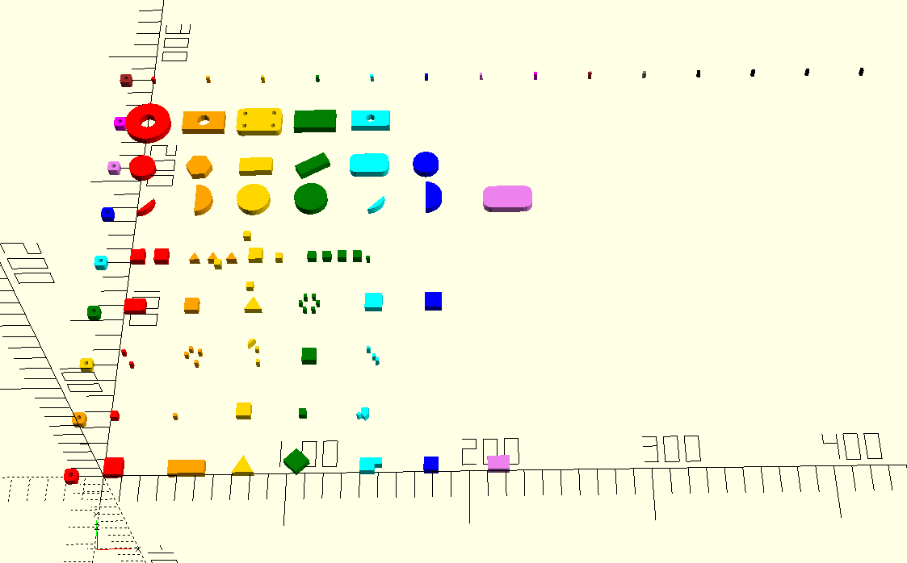

This tested PowerShell example evaluates the suite and captures its messages in an `.echo`
file:

```powershell
$openScadCli = 'C:\Program Files\OpenSCAD\openscad.com'
$testLogPath = Join-Path $env:TEMP 'LogoSC-tests.echo'

& $openScadCli `
    -D 'TraceLevel=0' `
    -o $testLogPath `
    'LogoSC-Foundation-Test-Runner.scad'

if ($LASTEXITCODE -ne 0)
{
    throw "OpenSCAD failed with exit code $LASTEXITCODE."
}

$globalPass = @(
    Select-String `
        -LiteralPath $testLogPath `
        -SimpleMatch '"LOGOSC_AUTOMATED_TEST_RESULT", "PASS"'
)

$globalFail = @(
    Select-String `
        -LiteralPath $testLogPath `
        -SimpleMatch '"LOGOSC_AUTOMATED_TEST_RESULT", "FAIL"'
)

$failedTests = @(
    Select-String `
        -LiteralPath $testLogPath `
        -Pattern '"LogoSC test result".*"FAIL"'
)

if ($globalPass.Count -ne 1 -or $globalFail.Count -ne 0)
{
    $failedTests
    throw 'LogoSC did not report exactly one successful complete test run.'
}

Write-Output 'LogoSC automated tests passed.'
```

The last summary includes per-suite and global test, pass, and failure totals. Set
`LogoTestReportLevel=2` with another `-D` option to include every named passing test; the
default level `1` prints all failures and their details.

When a complete run finds several failures, rerun in optional fail-fast mode to isolate the
first evaluated failed result:

```powershell
& $openScadCli `
    -D 'TraceLevel=0' `
    -D 'LogoTestFailFast=true' `
    -o $testLogPath `
    'LogoSC-Foundation-Test-Runner.scad'
```

`LogoTestFailFast` defaults to `false`; leave it there for acceptance runs so every failure and
the final totals are reported. With `true`, the assertion message identifies the test and its
detail record. OpenSCAD 2021.01 also prints the file and line containing the shared assertion
and a `TRACE` of caller locations. Cases constructed through common geometry helpers may not
trace directly to their data declaration, which is why the stable test name is included.
With `.echo` output, tested OpenSCAD 2021.01 can still return process exit code `0` after an
assertion failure. Inspect the `ERROR: Assertion` and `TRACE` lines; for complete acceptance
runs, continue to require the exact final `LOGOSC_AUTOMATED_TEST_RESULT`, `PASS` record rather
than treating exit status alone as success.

The failure-condition row deliberately emits `[ERROR]` messages while testing Core soft-error
behavior. These expected diagnostics appear between `LogoSC expected-error tests: BEGIN` and
`END`; do not count them as test-result failures. The exact final
`LOGOSC_AUTOMATED_TEST_RESULT` record is the authority for the automated suite.
When that record is `FAIL`, the aggregate reporter adds `*** Test Suite Failed ***` as its final
line for quick human recognition. Fail-fast assertions can stop before this banner is reached.

### Run the non-rendering fastener suite

`LogoSC-Nuts-And-Bolts-Test-Runner.scad` is a separate fast, deterministic suite for the
standalone fastener application. It imports the application without executing its top-level
model dispatch, creates no geometry, and checks preset resolution, dimensions, profile commands,
sampling, handed wrapping, and multi-start phase calculations.

```powershell
$fastenerTestLogPath = Join-Path $env:TEMP 'LogoSC-fastener-tests.echo'

& $openScadCli `
    -o $fastenerTestLogPath `
    'LogoSC-Nuts-And-Bolts-Test-Runner.scad'

if ($LASTEXITCODE -ne 0)
{
    throw "OpenSCAD fastener tests failed with exit code $LASTEXITCODE."
}

$fastenerPass = @(
    Select-String `
        -LiteralPath $fastenerTestLogPath `
        -SimpleMatch '"LOGOSC_AUTOMATED_TEST_RESULT", "PASS"'
)

$fastenerFail = @(
    Select-String `
        -LiteralPath $fastenerTestLogPath `
        -SimpleMatch '"LOGOSC_AUTOMATED_TEST_RESULT", "FAIL"'
)

if ($fastenerPass.Count -ne 1 -or $fastenerFail.Count -ne 0)
{
    throw 'LogoSC fastener tests did not report one successful complete run.'
}

Write-Output 'LogoSC fastener tests passed.'
```

Keep CSG smoke exports and the slower CGAL/STL, mesh, gallery, and high-resolution assembly
checks as separate release verification. Parameter tests cannot prove boolean robustness or
printable mesh quality.

### Run the optional knot-companion suite

`LogoSC-Knots-Test-Runner.scad` is the separate deterministic suite for knot records,
validation, debug inputs, torus and braid generators, cord-segment accounting, and bundle
mathematics:

```powershell
$knotTestLogPath = Join-Path $env:TEMP 'LogoSC-knot-tests.echo'

& $openScadCli `
    -o $knotTestLogPath `
    'LogoSC-Knots-Test-Runner.scad'

$knotPass = @(
    Select-String `
        -LiteralPath $knotTestLogPath `
        -SimpleMatch '"LOGOSC_AUTOMATED_TEST_RESULT", "PASS"'
)

if ($LASTEXITCODE -ne 0 -or $knotPass.Count -ne 1)
{
    throw 'LogoSC knot tests did not report one successful run.'
}
```

The knot suite remains independent of the Foundation/Validation and fastener suites so the
optional companion cannot become an accidental Core dependency.

A quick CSG smoke export exercises the manufacturable capsule module without requiring a slower
mesh render:

```powershell
$knotCsgPath = Join-Path $env:TEMP 'LogoSC-knot-cords.csg'

& $openScadCli `
    -D 'KnotExample=\"Trefoil\"' `
    -D 'KnotOutput=\"Cord\"' `
    -o $knotCsgPath `
    'LogoSC-Knots-Examples.scad'

if ($LASTEXITCODE -ne 0 -or !(Test-Path -LiteralPath $knotCsgPath))
{
    throw 'LogoSC knot cord CSG smoke export failed.'
}
```

This confirms that OpenSCAD can construct the capsule tree. It does not replace an STL/mesh
export and slicer inspection for a chosen radius, sampling density, and print process.

### Render the knot-cord presentation gallery

The `CordGallery` scene is generated from the real unknot, trefoil, and Hopf-link cord geometry:

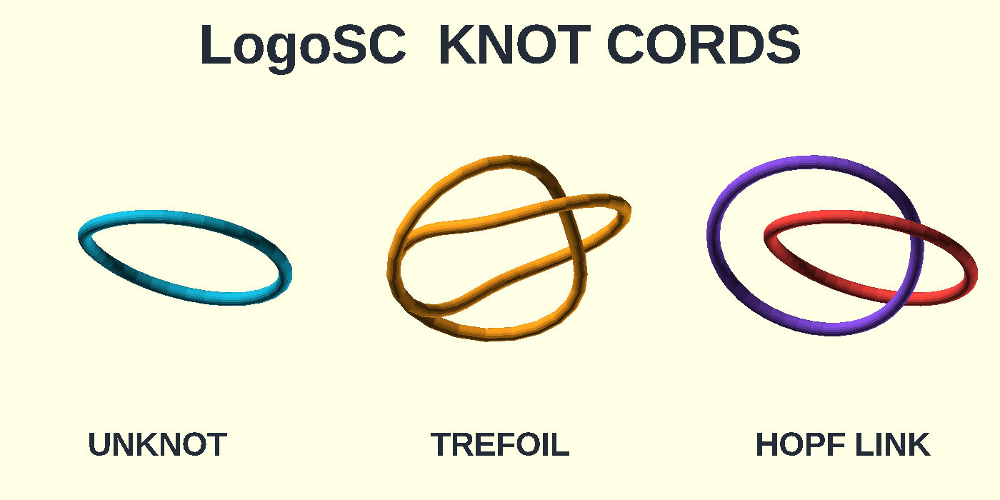

Regenerate the repository image with the tested top-down camera:

```powershell
$knotGalleryPath = Join-Path (Get-Location) 'images\knot-cord-gallery.png'

& $openScadCli `
    -D 'KnotExample=\"CordGallery\"' `
    -D 'KnotView=\"Spatial\"' `
    -D 'KnotCordFragments=18' `
    --imgsize '1400,700' `
    --camera '85,4,0,0,0,0,220' `
    --projection o `
    -o $knotGalleryPath `
    'LogoSC-Knots-Examples.scad'
```

The gallery uses a lower route-sampling density than the standalone examples to keep interactive
preview and PNG generation practical. It retains the same `MakeTorusKnot()` and
`RenderKnotCords()` execution path.

### Render the adjacent bundle gallery

The bundle gallery applies two, three, and four colored lanes to the same generated trefoil:

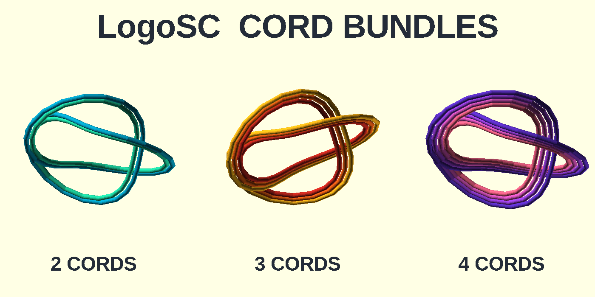

```powershell
$bundleGalleryPath = Join-Path (Get-Location) 'images\knot-bundle-gallery.png'

& $openScadCli `
    -D 'KnotExample=\"BundleGallery\"' `
    -D 'KnotView=\"Spatial\"' `
    -D 'KnotCordFragments=18' `
    --imgsize '1400,700' `
    --camera '85,4,0,0,0,0,220' `
    --projection o `
    -o $bundleGalleryPath `
    'LogoSC-Knots-Examples.scad'
```

The colors distinguish lanes but do not modify manufacturing geometry. Use
`KnotOutput = "Bundle"` with an individual example to exercise the uncolored
`RenderKnotCordBundle()` module and its Customizer parameters directly.

### Render the circular braid gallery

The braid gallery shows Hopf, trefoil, and three-lane standard circular closures:

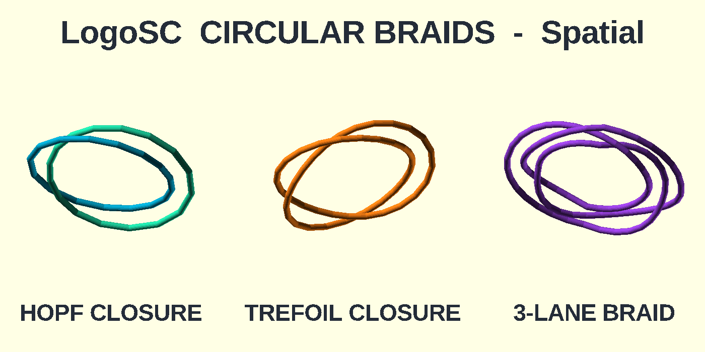

```powershell
$braidGalleryPath = Join-Path (Get-Location) 'images\knot-braid-gallery.png'

& $openScadCli `
    -D 'KnotExample=\"BraidGallery\"' `
    -D 'KnotView=\"Spatial\"' `
    -D 'KnotCordFragments=18' `
    --imgsize '1400,700' `
    --camera '85,4,0,0,0,0,220' `
    --projection o `
    -o $braidGalleryPath `
    'LogoSC-Knots-Examples.scad'
```

Every displayed route comes from `MakeCircularBraidKnot()` and the normal capsule renderer.
Colors distinguish components or examples and do not alter crossing topology.

### Render the crossing-aware braided-bundle gallery

The braided-bundle gallery applies two manufacturing cords to braid-generated Hopf, trefoil,
and three-lane routes:

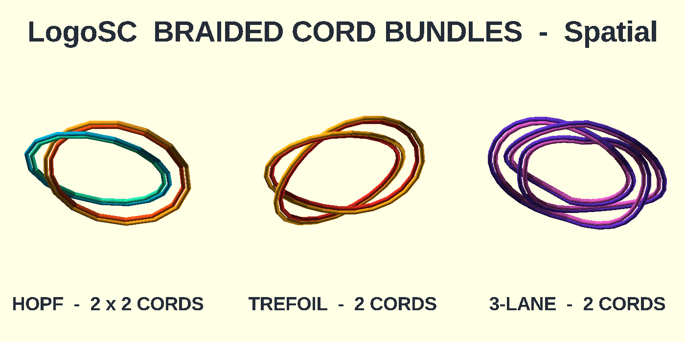

```powershell
$braidedBundleGalleryPath = Join-Path `
    (Get-Location) `
    'images\knot-braided-bundle-gallery.png'

& $openScadCli `
    -D 'KnotExample=\"BraidBundleGallery\"' `
    -D 'KnotView=\"Spatial\"' `
    -D 'KnotCordFragments=18' `
    --imgsize '1400,700' `
    --camera '85,4,0,0,0,0,220' `
    --projection o `
    -o $braidedBundleGalleryPath `
    'LogoSC-Knots-Examples.scad'
```

The scene uses the actual crossing remapper and capsule renderer. Each master crossing expands
to all cord-lane pairs and must pass the configured clearance check before geometry is emitted.

### Render the twisted cord-bundle gallery

The twist gallery compares an untwisted bundle with one-half-turn and full-turn closures:

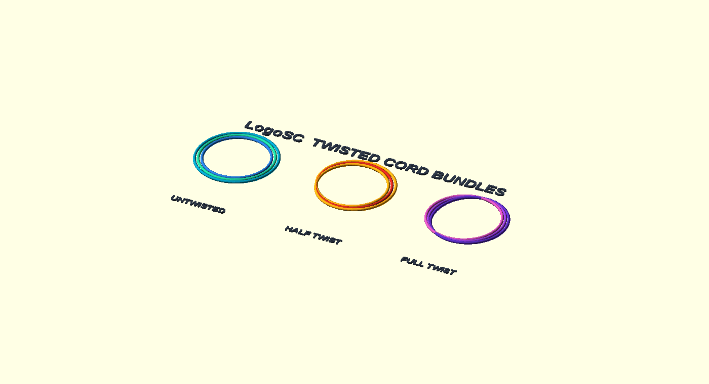

```powershell
$twistGalleryPath = Join-Path `
    (Get-Location) `
    'images\knot-twisted-bundle-gallery.png'

& $openScadCli `
    -D 'KnotExample=\"TwistGallery\"' `
    -D 'KnotView=\"Planar\"' `
    --imgsize '1400,760' `
    --viewall `
    --autocenter `
    --projection o `
    -o $twistGalleryPath `
    'LogoSC-Knots-Examples.scad'
```

The half-twist example traces the lane-reversal permutation into closed output components.
Colors identify those complete traced components rather than the apparent lane at one point on
the master route.

### Render the Celtic tile-grid gallery

The Celtic gallery traces three explicit tile grids, including an irregular occupied region
marked out with `"."` blank cells, into closed alternating knot records:

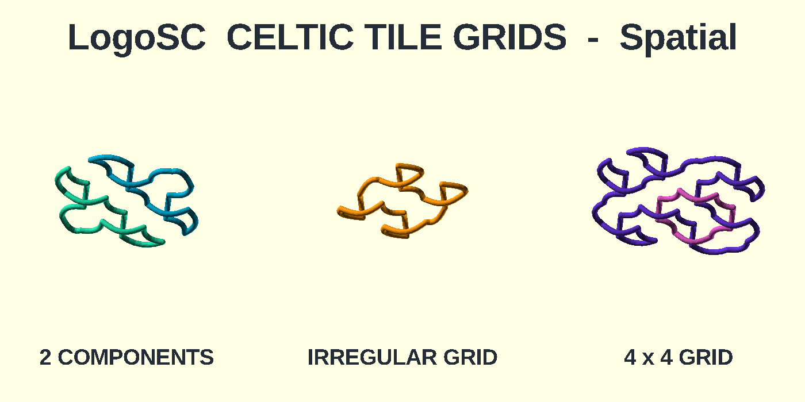

```powershell
$celticGalleryPath = Join-Path `
    (Get-Location) `
    'images\knot-celtic-grid-gallery.png'

& $openScadCli `
    -D 'KnotExample=\"CelticGallery\"' `
    -D 'KnotView=\"Spatial\"' `
    -D 'KnotCordFragments=18' `
    --imgsize '1400,700' `
    --camera '85,4,0,0,0,0,220' `
    --projection o `
    -o $celticGalleryPath `
    'LogoSC-Knots-Examples.scad'
```

The examples use the real tile validator, boundary closure, route tracer, crossing assignment,
alternation check, and capsule renderer. Colors distinguish complete components only.

### Render the planar ribbon gallery

The ribbon gallery compares continuous segment regions with crossing-masked interlace:

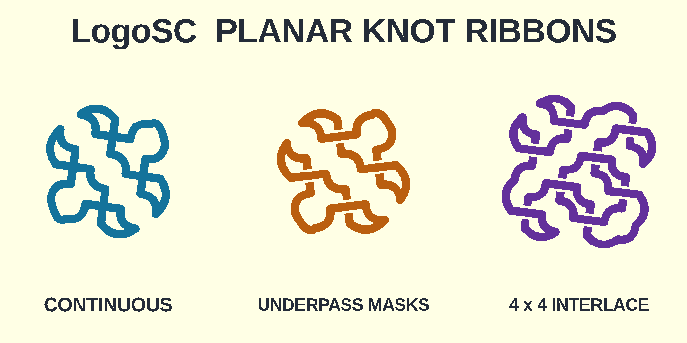

```powershell
$ribbonGalleryPath = Join-Path `
    (Get-Location) `
    'images\knot-ribbon-gallery.png'

& $openScadCli `
    -D 'KnotExample=\"RibbonGallery\"' `
    --imgsize '1400,700' `
    --camera '85,4,0,0,0,0,220' `
    --projection o `
    -o $ribbonGalleryPath `
    'LogoSC-Knots-Examples.scad'
```

Every segment, mask, and restored overpass is rendered through LogoSC Core's
`RenderRegion2D()`. The final union and difference are native OpenSCAD operations.

### Render the knot bas-relief gallery

The bas-relief gallery compares three base and overpass-height combinations:

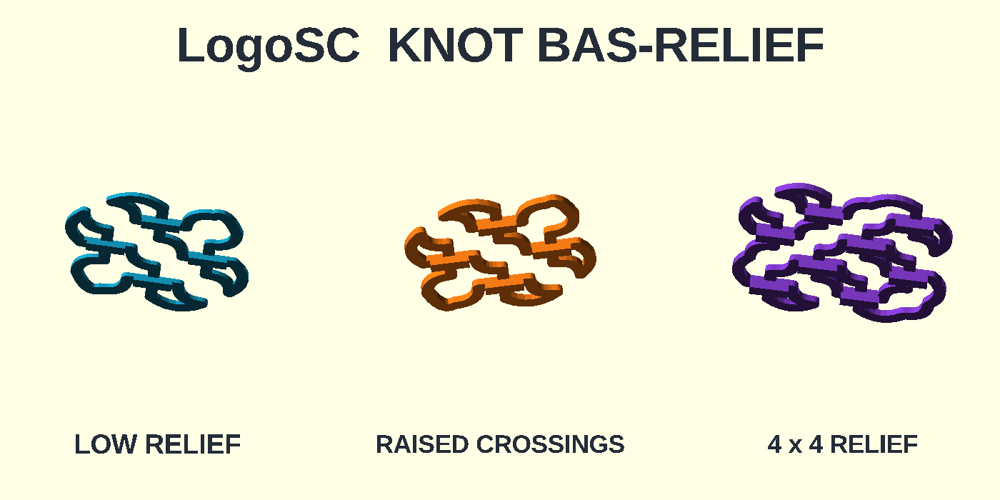

```powershell
$reliefGalleryPath = Join-Path `
    (Get-Location) `
    'images\knot-bas-relief-gallery.png'

& $openScadCli `
    -D 'KnotExample=\"ReliefGallery\"' `
    --imgsize '1400,700' `
    --camera '85,4,0,0,0,0,220' `
    --projection o `
    -o $reliefGalleryPath `
    'LogoSC-Knots-Examples.scad'
```

Use `KnotOutput = "Relief"` with a Planar individual example for direct STL export. The
Customizer exposes ribbon width, crossing clearance, base height, overpass height, and arc
resolution.

### Render the knot relief-plaque gallery

The plaque gallery demonstrates automatic margins and rounded plate corners:

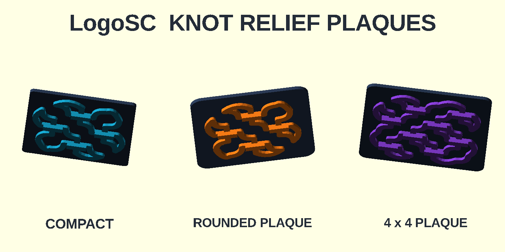

```powershell
$plaqueGalleryPath = Join-Path `
    (Get-Location) `
    'images\knot-relief-plaque-gallery.png'

& $openScadCli `
    -D 'KnotExample=\"PlaqueGallery\"' `
    --imgsize '1400,700' `
    --camera '85,4,0,0,0,0,220' `
    --projection o `
    -o $plaqueGalleryPath `
    'LogoSC-Knots-Examples.scad'
```

Use `KnotOutput = "Plaque"` with a Planar individual example for direct STL export. Plate
thickness, ribbon-edge margin, corner radius, edge style, bevel width, and bevel height are
independently configurable.

### Export knot print-quality presets

`KnotPrintPreset` applies to individual examples and galleries. For a fast draft CSG:

```powershell
& $openScadCli `
    -D 'KnotPrintPreset=\"Draft\"' `
    -o (Join-Path $env:TEMP 'LogoSC-knot-draft.csg') `
    'LogoSC-Knots-Examples.scad'
```

For a smooth final STL, select an individual example rather than the multi-object gallery:

```powershell
& $openScadCli `
    -D 'KnotExample=\"CelticGrid\"' `
    -D 'KnotOutput=\"Plaque\"' `
    -D 'KnotPrintPreset=\"Fine\"' `
    -o (Join-Path $env:TEMP 'LogoSC-knot-fine-plaque.stl') `
    'LogoSC-Knots-Examples.scad'
```

Use `Custom` with `KnotRouteSampleScale`, `KnotCordFragments`, and
`KnotRibbonArcFragments` when those costs need independent values. Fine exports can take
substantially longer than Standard because both route density and rounded-profile density rise.

## Example 2: export and inspect a debug PNG

The command line can render the same debug demo that is available through the OpenSCAD
Customizer. Debug mode defaults to the full gallery, so this focused example explicitly
selects the single-example layout:

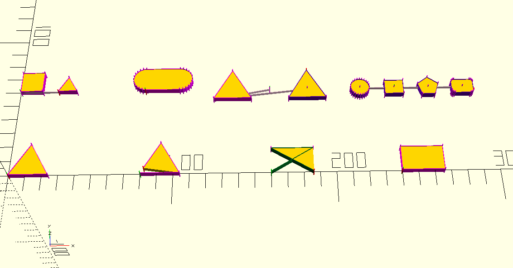

```powershell
$openScadCli = 'C:\Program Files\OpenSCAD\openscad.com'
$debugPngPath = Join-Path $env:TEMP 'LogoSC-debug.png'

& $openScadCli `
    -D 'LogoSCRunMode=\"Debug\"' `
    -D 'DebugDemoLayout=\"Selected\"' `
    -D 'DebugDemoExample=0' `
    -D 'TraceLevel=0' `
    --imgsize '800,600' `
    --autocenter `
    --viewall `
    --projection o `
    -o $debugPngPath `
    'LogoSC-Examples.scad'

if ($LASTEXITCODE -ne 0)
{
    throw "OpenSCAD PNG export failed with exit code $LASTEXITCODE."
}
```

This exact command was verified against OpenSCAD `2021.01`. It produced an `800` by `600`
orthographic preview of the filled closed triangle with its debug capsules and point markers.

PNG output uses preview rendering by default. Add `--render` when an exact full render is
required, accepting that it may be substantially slower. A generated PNG can be inspected by a
person, attached to a continuous-integration run, or loaded by an AI coding tool that supports
local image inspection.

## Example 3: generate a fastener documentation image

The fastener guide images are generated directly from `LogoSC-Nuts-And-Bolts.scad`; they are
not hand-drawn screenshots. Command-line `-D` options replace the same variables shown in the
OpenSCAD Customizer. PNG options then control output size and camera framing:

- `--imgsize 'width,height'` sets pixel dimensions;
- `--autocenter` and `--viewall` frame the generated object;
- `--projection o` selects an orthographic camera;
- `--camera` can select a repeatable viewing direction for individual head images; and
- a `.png` output path selects image export.

PNG export uses OpenSCAD preview rendering unless `--render` is present. Preview still uses the
requested `RadialSegments`, `ThreadSlicesPerTurn`, and `ProfileSamplesPerTurn` geometry, but it
does not perform the final CGAL boolean evaluation. Add `--render` for an F6-equivalent image,
with the expectation that complex threaded assemblies can take many minutes.

This PowerShell example reproduces the high-resolution M20 assembly in the fastener Quick Start.
Its three geometry resolutions are exactly four times the defaults, and the stopwatch reports
the local elapsed time:

```powershell
$openScadCli = 'C:\Program Files\OpenSCAD\openscad.com'
$assemblyPngPath = Join-Path `
    (Get-Location) `
    'images\fastener-assembly-high-resolution.png'
$renderTimer = [System.Diagnostics.Stopwatch]::StartNew()

& $openScadCli `
    -D 'Part=\"Assembly\"' `
    -D 'ScrewSize=\"M20\"' `
    -D 'Length=35' `
    -D 'NutThickness=10' `
    -D 'AssemblyNutPosition=8' `
    -D 'HeadType=\"Hex\"' `
    -D 'DriveType=\"None\"' `
    -D 'RadialSegments=240' `
    -D 'ThreadSlicesPerTurn=60' `
    -D 'ProfileSamplesPerTurn=100' `
    --imgsize '1600,1000' `
    --autocenter `
    --viewall `
    --projection o `
    -o $assemblyPngPath `
    'LogoSC-Nuts-And-Bolts.scad'

$renderTimer.Stop()

if ($LASTEXITCODE -ne 0)
{
    throw "OpenSCAD PNG export failed with exit code $LASTEXITCODE."
}

Write-Output (
    'Assembly preview seconds: {0:N1}' -f `
        $renderTimer.Elapsed.TotalSeconds
)
```

To generate a profile image instead, set `Part` to `Profile`, set `ThreadProfile` to one of the
six profile names, and use an `800,450` image. The head images use a short bolt and `--render`;
their drive-side view was selected with `--camera '0,0,0,235,0,25,50'`. The headless image uses
the opposite `55`-degree X rotation because its drive is at the free shaft end.

The fastener Customizer guide gives complete tested PowerShell commands for echoing the expanded
LogoSC profile command list, exporting an ordinary profile PNG, and reproducing the sampled
three-start algorithm figure. It also documents the polar mapping and exact sampling counts.
See [How the thread algorithm works][fastener-algorithm].

## Example 4: export a normal model

For a normal 3D OpenSCAD model that includes LogoSC, export an STL with:

```powershell
$openScadCli = 'C:\Program Files\OpenSCAD\openscad.com'

& $openScadCli `
    -D 'TraceLevel=0' `
    --export-format asciistl `
    -o 'MyLogoSCPart.stl' `
    'MyLogoSCPart.scad'

if ($LASTEXITCODE -ne 0)
{
    throw "OpenSCAD STL export failed with exit code $LASTEXITCODE."
}
```

The explicit `asciistl` format avoids depending on a version's default STL encoding. A 2D-only
model can instead be exported to a supported 2D format such as `.svg`.

## What command-line verification proves

Command-line execution can verify that:

- OpenSCAD parses and evaluates the files;
- LogoSC assertions and invariant checks execute;
- expected `echo()` diagnostics are produced;
- an export completes with a known process exit code;
- geometry or an image artifact is physically generated; and
- PNG output looks plausible during a first-pass visual review.

It does not by itself prove that:

- every warning is harmless;
- a mathematically valid mesh matches the intended design;
- interactive Customizer controls behave well in the GUI; or
- a PNG preview has the same guarantees as a full geometry render.

Use command-line checks as strong automated evidence, then retain interactive OpenSCAD review
for Customizer behavior and important visual or manufacturing decisions.

## Other platforms

Linux and similar systems normally invoke `openscad`. A standard macOS application install can
be invoked through `OpenSCAD.app/Contents/MacOS/OpenSCAD`. See the platform notes in the official
command-line manual for exact paths and setup.

## Official OpenSCAD documentation

- [OpenSCAD documentation portal][docs] — official entry
  point for the tutorial, User Manual, language reference, and cheat sheet.
- [Using OpenSCAD in a command-line environment][cli]
  — command syntax, `-o`, `-D`, quoting, PNG camera controls, dependency generation, and
  Windows/macOS notes. OpenSCAD's official documentation portal links to this manual.
- [OpenSCAD User Manual PDF][pdf]
  — downloadable full manual, including the command-line chapter.
- [OpenSCAD Customizer manual][customizer]
  — parameter files and sets used with command-line `-p` and `-P` options.
- [OpenSCAD `assert()` language reference][assert]
  — assertion messages, failed-render behavior, and file/line diagnostics.

For the installed executable's exact capabilities, always also run:

```powershell
& $openScadCli --version
& $openScadCli --help
```

[docs]: https://openscad.org/documentation.html
[cli]: https://en.wikibooks.org/wiki/OpenSCAD_User_Manual/Using_OpenSCAD_in_a_command_line_environment
[pdf]: https://files.openscad.org/documentation/manual/OpenSCAD_User_Manual.pdf
[customizer]: https://en.wikibooks.org/wiki/OpenSCAD_User_Manual/Customizer
[assert]: https://en.wikibooks.org/wiki/OpenSCAD_User_Manual/The_OpenSCAD_Language#assert
[fastener-algorithm]: LogoSC-Nuts-And-Bolts-Customizer.md#how-the-thread-algorithm-works
