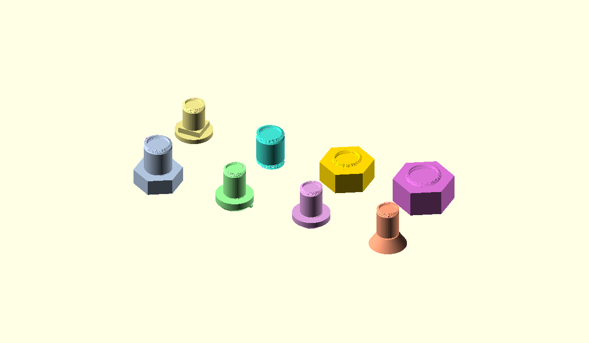

# LogoSC-Foundation

## Table of Contents

- [Current files](#current-files)
- [AI Engineering Kit](#ai-engineering-kit)
- [Developer notebook](#developer-notebook)
- [Workflow](#workflow)
- [Command-line verification](#command-line-verification)
- [Versioning](#versioning)
- [Public API quick reference](#public-api-quick-reference)
- [Current command format](#current-command-format)
- [Geometry commands](#geometry-commands)
- [Rendering model](#rendering-model)
- [Rendering API](#rendering-api)
- [Debug rendering](#debug-rendering)
- [Path analysis and validation](#path-analysis-and-validation)
- [Optional knot companion](#optional-knot-companion)
- [Future rendering work](#future-rendering-work)
- [Cheat sheet](#cheat-sheet)
- [Examples](#examples)
- [Contributing](#contributing)
- [License](#license)
- [Release history](#release-history)
- [Milestone roadmap](#milestone-roadmap)

## Current files

- `LogoSC-Foundation-Core.scad` — standalone core interpreter and renderer.
- `LogoSC-Foundation-Validation.scad` — optional explicit-path evaluator and validator.
- `LogoSC-Foundation-Tests.scad` — passive regression and failure-test definitions.
- `LogoSC-Foundation-Validation-Tests.scad` — passive focused validation tests.
- `LogoSC-Foundation-Test-Runner.scad` — direct entry point for the complete test suite.
- `LogoSC-OpenSCAD-Command-Line.md` — command-line testing, export, and PNG-preview guide.
- `LogoSC-README.md` — this overview.
- `CHANGELOG.md` — milestone release history.
- `LogoSC-ARC-Implementation.md` — design notes for ARC tessellation.
- `LogoSC-Holes-Implementation.md` — design notes for regions and holes.
- `LogoSC-Validation-Implementation.md` — validation algorithms, policies, complexity, and test matrix.
- `LogoSC-Transforms-Design.md` — preliminary local-transform design direction and open questions.
- `LogoSC-LSystems-Notes.md` — design notes for L-system examples.
- `LogoSC-Knots.scad` — optional knot records, torus/braid generators, cords, and bundles.
- `LogoSC-Knots-Examples.scad` — selectable diagnostics plus cord, bundle, and braid galleries.
- `LogoSC-Knots-Tests.scad` — passive knot record, generator, cord, bundle, and braid tests.
- `LogoSC-Knots-Test-Runner.scad` — direct entry point for the independent knot suite.
- `LogoSC-Knots-Design.md` — design and roadmap for parametric, braid, Celtic, ribbon, and
  rounded-cord knot generation.
- `LogoSC-User-Manual.md` — command reference and practical examples.
- `CONTRIBUTING.md` — contributor workflow, stability, testing, documentation, and packaging guidance.
- `AGENTS.md` — compact repository-specific operating guidance for Codex.
- `LogoSC-Developer-Notebook.md` — living engineering history and ChatGPT restart guide.
- `LogoSC-Future-Ideas.md` — longer-term feature concepts and possible future directions.
- `LogoSC-CheatSheet.md` — compact command and API reference.
- `LogoSC-Examples.scad` — runnable example gallery and 3D-printing demos.
- `LogoSC-Nuts-And-Bolts.scad` — customizable nuts, bolts, screw heads, and thread profiles.
- `LogoSC-Nuts-And-Bolts-Customizer.md` — fastener parameter, drive-size, and printing guide.
- `LICENSE` — MIT License text.
- `docs/ai-engineering-kit/` — maintainer-facing Codex/Git quick start, handoff, bootstrap,
  collaboration, engineering-preference, and retrospective documents.

## AI Engineering Kit

The six AI Engineering Kit files are stored under `docs/ai-engineering-kit/` by explicit
user request. They are maintainer-facing companion material, not LogoSC public API or
ordinary user documentation.

Read `docs/ai-engineering-kit/AI-Engineering-Kit-Handoff.md` first, then follow its order
through the quick start and other files in that directory. After the kit, read the LogoSC
project documents below. Explicit user instructions and project-specific LogoSC guidance
take precedence over generic kit preferences.

## Developer notebook

`LogoSC-Developer-Notebook.md` is the project's long-term engineering memory. It
preserves architecture decisions, historical context, non-goals, lessons
learned, workflow conventions, known regression risks, open questions, and
future plans.

Its primary operational use is to initialize ChatGPT after retiring an old chat
and beginning a new LogoSC development session. After reading the AI Engineering Kit,
read the project documents in this order:

1. `LogoSC-Developer-Notebook.md`
2. `README.md`
3. `CHANGELOG.md`
4. `CONTRIBUTING.md`
5. `LogoSC-User-Manual.md` and implementation notes as required

After reading, use the current Git working tree—or the latest uploaded repository snapshot
extracted into it—as the sole source of truth. Preserve dated history in the notebook rather
than repeatedly replacing it with short summaries.


## Workflow

1. Open `LogoSC-Examples.scad` in OpenSCAD for normal interactive use.
2. Use the top-level `LogoSCRunMode` Customizer selector:
   - `Examples` renders the example gallery.
   - `Debug` renders the indexed debug-visualization gallery.
   - `Tests` renders the regression-test grid.
   - `NoDemo` or a blank string explicitly suppresses automatic preview output.
3. For direct testing, open `LogoSC-Foundation-Test-Runner.scad`. Core does not load
   or execute test code.
4. Commit stable milestones to Git.

The complete runner collects immutable results for the Foundation and Validation suites.
It prints both suite totals and a final `LOGOSC_AUTOMATED_TEST_RESULT` line. The default
`LogoTestReportLevel = 1` reports summaries plus every failure; level `2` lists every test.
Keep `LogoTestFailFast = false` for complete runs. Temporarily set it to `true` to stop at
the first failed result with its test name, details, and OpenSCAD source trace. The Examples
file exposes this checkbox in its `LogoSC Run` Customizer section.
When an aggregate run fails, its final human-readable line is `*** Test Suite Failed ***`.
Automation should continue to inspect the preceding `LOGOSC_AUTOMATED_TEST_RESULT` record.

Visual regression tests are color-coded by grid index. Test geometry color follows
the X index, while small LogoSC marker icons to the left of the grid identify
the Y row. Colors cover indices 0 through 9; larger indices use `TestColorMax`.


The gallery makes geometry regressions visible across many cases at once. Automated success
still comes from the immutable test records and final `LOGOSC_AUTOMATED_TEST_RESULT` line.

## Command-line verification

`LogoSC-OpenSCAD-Command-Line.md` explains how to run the same test suite from
PowerShell, capture `echo()` diagnostics, check process status, export geometry,
and generate PNG previews for visual inspection. It also links to the complete
official OpenSCAD command-line documentation.

## Versioning

Current public API version: `2026.4`.

`LogoSC-Foundation-Core.scad` exposes:

```scad
LogoSCVersionMajor
LogoSCVersionMinor
LogoSCVersion
LogoSCVersionAtLeast(major, minor)
```

Version bumps are manual and intended for public API or feature milestones. Git
commit hashes track ordinary source history; the LogoSC version constants are for
user-model compatibility checks.

Example:

```scad
assert(LogoSCVersionAtLeast(2026, 4), "This model requires LogoSC 2026.4+");
```

## Public API quick reference

LogoSC's normal user-facing entry point is `RenderLogo2D()`. The lower-level
functions are available for tests, diagnostics, or advanced workflows where you
want to evaluate once and inspect or reuse the generated regions.

| API | Kind | Purpose |
|---|---|---|
| `RenderLogo2D(cmds, convexity = 10)` | module | Evaluate a LogoSC command list and render the resulting 2D regions. |
| `RenderLogoDebug(cmds, ...)` | module | Render preview-only 3D debug capsules and point markers for command-level path inspection. |
| `evalLogo(cmds)` | function | Evaluate commands into an `EvalResult` without rendering geometry. |
| `ResultContours(result)` | function | Return the evaluated region list from an `EvalResult`. |
| `ResultState(result)` | function | Return canonical `[x, y, heading, scaleX, scaleY, shear]` state. |
| `LogoStateToAffine(state)` | function | Convert canonical state to a standard 2x3 affine matrix. |
| `LogoAffineToState(matrix, headingReference = undef)` | function | Recanonicalize a nonsingular 2x3 affine matrix. |
| `RenderContours2D(regions, convexity = 10)` | module | Render an already-evaluated region list. |
| `RenderRegion2D(region, convexity = 10)` | module | Render one region: outer ring plus any holes. |
| `evalLogoPaths(cmds)` | function | Evaluate explicit paths. Requires Validation. |
| `ValidateLogoPaths(cmds, ...)` | function | Return paths and validation issues. |
| `ReportLogoValidation(cmds, ...)` | module | Echo issues and optionally assert. |

`ResultContours()` keeps its historical name, but the value it returns is now a
region list:

```text
[
    [outerContour, holeContour0, holeContour1],
    [outerContour]
]
```

Typical use:

```scad
part = [[ROUNDEDRECT, 40, 20, 3], [HOLE, [[CIRCLE, 4]]]];

linear_extrude(height = 4, convexity = 10)
{
    RenderLogo2D(part);
}
```

Advanced inspection:

```scad
result = evalLogo(part);
state = ResultState(result);
regions = ResultContours(result);

RenderContours2D(regions, convexity = 10);
```

See `LogoSC-CheatSheet.md` for a compact syntax summary and
`LogoSC-User-Manual.md` for full examples.

## Current command format

```scad
[MOVE,        len]
[TURN,        deltaHeading]
[DIR,         absoluteHeading]
[SCALE,       scaleMultiplier]
[GOTO,        x, y, heading]

[ARC,         radius, degrees[, segments]]

[CIRCLE,      radius[, segments]]
[REGPOLY,     sides, radius[, rotation]]
[RECT,        width, height]
[ROUNDEDRECT, width, height, radius[, segments]]

[HOLE,        cmds]

[RUN,         cmds[, scale[, maxRec]]]

[PUSH]
[POP]

[PENUP]
[PENDOWN]

[REPEAT,      count, cmds]
```

## Geometry commands

`ARC` follows a circular arc from the current Logo position and heading. Positive
angles turn left; negative angles turn right. The optional `segments` argument
sets the exact number of line segments used for the arc. When omitted, LogoSC uses
OpenSCAD-style `$fn`, `$fa`, and `$fs` controls to choose the segment count.

`CIRCLE`, `REGPOLY`, `RECT`, and `ROUNDEDRECT` are closed 2D shape commands for
3D-printing-oriented geometry. They create separate closed contours centered on
the current Logo position. They respect the current Logo scale; `REGPOLY`,
`RECT`, and `ROUNDEDRECT` also respect the current heading. They do not move the
Logo state or change the heading.

`CIRCLE` is intentionally not the classic Logo circle command. In LogoSC,
`[CIRCLE, r]` creates a closed filled circle centered at the current position. To
make the Logo cursor walk a full tangent loop instead, use `[ARC, r, 360]`.

`HOLE` evaluates its child command list as one or more closed contours and
attaches those contours as holes to the most recently emitted outer region. This
supports common 3D-printing shapes such as washers, mounting plates, and rounded
rectangles with screw holes.

## Rendering model

LogoSC evaluates command lists into regions. Each region is a list of closed
rings:

```text
[outerContour, holeContour0, holeContour1, ...]
```

Each region is rendered with one OpenSCAD `polygon(points=..., paths=...)` call.
The first path is the filled outer boundary; later paths become holes. Regions
with only one ring behave like the earlier independent-contour renderer.

`ARC` is tessellated into contour points before rendering. Closed-shape commands
emit separate outer-region contours before rendering. The debug renderer uses a
separate event-evaluation path so it can show command execution order, pen-up
moves, primitive-generated edges, and start/end markers independently of final
filled-region output.

## Rendering API

The main public API is summarized earlier under **Public API quick reference**.
The reusable renderer lives in `LogoSC-Foundation-Core.scad`; user models do not
need to duplicate the test renderer. LogoSC intentionally renders 2D regions only.
Use native OpenSCAD operations around `RenderLogo2D()` for 3D modeling.

```scad
plate =
[
    [ROUNDEDRECT, 60, 30, 4],
    [HOLE, [[GOTO, -20, 0, 0], [CIRCLE, 3]]],
    [HOLE, [[GOTO,  20, 0, 0], [CIRCLE, 3]]]
];

RenderLogo2D(plate, convexity = 10);

linear_extrude(height = 4, center = false, convexity = 10)
{
    RenderLogo2D(plate);
}

linear_extrude(
    height = 4,
    center = true,
    convexity = 10,
    twist = 30,
    slices = 24)
{
    RenderLogo2D(plate);
}
```

For rotational solids, create a 2D profile and wrap it with OpenSCAD's native
`rotate_extrude()`. Position the profile according to OpenSCAD's normal rotation
rules; in practice, keep the profile on the positive-X side of the rotation axis
unless you are intentionally using axis-touching behavior.

```scad
profile =
[
    [GOTO, 20, 0, 0],
    [RECT, 4, 12]
];

rotate_extrude(angle = 360, convexity = 10)
{
    RenderLogo2D(profile);
}
```

Lower-level renderers are also available if you want to evaluate once and render
the resulting regions yourself:

```scad
result = evalLogo(plate);
regions = ResultContours(result);

RenderContours2D(regions, convexity = 10);
```

Use OpenSCAD's `linear_extrude()`, `rotate_extrude()`, `difference()`, `union()`,
and transforms around `RenderLogo2D()` for final 3D parts.

## Debug rendering

`RenderLogoDebug(cmds, ...)` is a preview-only diagnostic renderer. It does not
create manufacturable stroke geometry. It draws z-centered 3D capsules for
command segments and cylinders for path points so the command stream can be
inspected visually.

Use it to diagnose:

- unexpected crossing or self-intersecting contours;
- contours that rely on `polygon()`'s implicit closing edge;
- pen-up movement and resumed drawing locations;
- primitive-generated geometry such as centered `REGPOLY`, `RECT`, and `CIRCLE`;
- differences between hand-drawn turtle paths and stamped primitives.

The examples file exposes this through `LogoSCRunMode = "Debug"`. It renders all
eight debug cases in a four-column by two-row indexed gallery by default. Set
`DebugDemoLayout = "Selected"` and choose `DebugDemoExample` to inspect one case.
Normal user models can overlay debug geometry with filled output by rendering
both `RenderLogo2D(cmds)` and `RenderLogoDebug(cmds)`.


## Path analysis and validation

Validation is an optional companion. Include Core first, then Validation:

```scad
include <LogoSC-Foundation-Core.scad>
include <LogoSC-Foundation-Validation.scad>

result = ValidateLogoPaths(cmds);
echo("valid", ValidationIsValid(result));
echo("issues", ValidationIssues(result));

ReportLogoValidation(cmds);                  // warnings only
ReportLogoValidation(cmds, strict = true);   // assert on issues
```

`evalLogoPaths()` preserves the starting point of each turtle path, explicit
`PENUP`/`PENDOWN` boundaries, primitive paths, and outer-versus-hole roles. That
information cannot be reconstructed reliably from the filled-region result.
`ValidateLogoPaths()` reports open paths, paths with fewer than three usable vertices,
zero-length segments, duplicate nonconsecutive points, tiny nonzero edges, proper
self-intersections, holes outside or touching their owning outer contour, and overlapping,
touching, coincident, or nested holes. Its tolerance defaults to `0.001`; the tiny-edge
threshold defaults to `0.01`. Set `tinyEdgeThreshold = 0`,
`checkSelfIntersections = false`, or `checkHoleTopology = false` to disable the corresponding
check.

Two-path issues append an optional related path index; inspect it with
`ValidationIssueRelatedPathIndex()`. Reusable relationship helpers include
`LogoSegmentRelation()`, `LogoContourIntersectionPairs()`, `LogoPointContourRelation()`,
`LogoPointRegionRelation()`, `LogoRegionBoundaryIntersections()`, `LogoRegionRelation()`, and
`LogoRegionsIntersect()`. `LogoContourIsConvex()`, `LogoPathIsConvex()`,
`LogoRegionIsConvex()`, and `LogoRegionsAreIndividuallyConvex()` provide Boolean convexity
queries; concavity remains valid geometry and is not a validation issue. The multiple-region
query checks members independently, not the convexity of their geometric union. Independent
filled regions may overlap; the API reports that relationship without treating it as a
validation error.

The validator is deliberately opt-in. `evalLogo()` and `RenderLogo2D()` retain
their established behavior, including OpenSCAD's implicit polygon-closing edge.
Basic models therefore still require only `LogoSC-Foundation-Core.scad`.

## Optional knot companion

`LogoSC-Knots.scad` remains independent of Core. It provides sampled strand and crossing records,
structural validation, a torus-knot/link generator, preview diagnostics, and manufacturable
rounded cords:

```scad
include <LogoSC-Knots.scad>

trefoil = MakeTorusKnot(2, 3, majorRadius = 20, minorRadius = 6);
ReportKnotValidation(trefoil, strict = true);
RenderKnotCords(trefoil, cordRadius = 1.2, fragments = 24);

RenderKnotCordBundle(
    trefoil,
    cordCount = 3,
    cordRadius = 0.8,
    cordGap = 0.35
);
```

`RenderKnotCords()` hulls equal-radius spheres at each adjacent sample pair. The caller controls
radius, route sampling, and sphere resolution. Adjacent cord bundles and signed braid words are
implemented; ribbons and bas-relief remain staged work described in `LogoSC-Knots-Design.md`.

The current torus implementation does not call LogoSC Core behind the scenes. Pure OpenSCAD
functions create and validate its sampled records, and native OpenSCAD creates the 3D solids.
Planned Core use begins with planar motifs, transforms, ribbons, and crossing masks; the complete
boundary is documented in `LogoSC-Knots-Design.md#how-logosc-is-used`.


The companion also expands each master route into stable, symmetric, untwisted adjacent lanes.
It supports explicit cord radius or automatic equal-radius fitting within a requested bundle
width. Recorded braid crossings expand to every lane pair, preserve branch ownership, inherit
the master crossing lift, and support a minimum surface-clearance check. Explicit bundle twist
remains deferred.


The examples' `KnotView` selector applies to diagnostics, cords, bundles, and both presentation
galleries. Planar projects a copy of the route before rendering or lane expansion and removes
the fixed 3D gallery tilt; Spatial preserves the generated height.

Signed braid words now generate explicit circular closures. The final lane permutation is traced
into independently closed knot or link components, with localized signed Z bumps and crossing
records for every generator. Self-crossings use an additive branch field while preserving the
established leading record fields.


## Future rendering work

LogoSC currently targets closed polygons because that maps cleanly to OpenSCAD and
3D printing. Open-stroke rendering is deferred to a later rendering milestone.

Optional path and hole-topology validation exists without changing filled-region behavior.
Further topology checks should remain opt-in and must not invent a synthetic turtle move.

A future stroke renderer should probably convert centerline paths into closed
outline polygons. That design needs explicit stroke width, end-cap style, join
style, and probably a miter limit. Common cap styles are butt, square, and round.
Common join styles are miter, bevel, and round.

Potential future geometry helpers include automatic path fillets and possibly a
`ROUNDEDREGPOLY` command. That should wait until the corner-rounding semantics
are clearer; for now `REGPOLY` plus explicit construction is less magical.

## Cheat sheet

`LogoSC-CheatSheet.md` provides a compact command, rendering API, and
OpenSCAD-wrapper reference. It is intended for quick lookup while writing
models; use the User Manual for detailed explanations.

## Examples

`LogoSC-Examples.scad` contains a runnable gallery of practical LogoSC models. It
shows 2D profiles, holes, recursive/fractal construction, L-system-generated
fractal outlines, native OpenSCAD `linear_extrude()` and `rotate_extrude()`
usage, and the LogoSC feature wordmark.

`LogoSC-Nuts-And-Bolts.scad` is a separate Customizer-driven manufacturing example. It uses
LogoSC for thread-tooth, head, and drive-recess profiles, then uses native OpenSCAD twisted
extrusion and booleans to create printable bolts, nuts, and assembled previews. Head shape,
drive type, and drive size are independent controls; `LogoSC-Nuts-And-Bolts-Customizer.md`
documents every parameter, the four-by-two fastener gallery, the print-calibration workflow,
and the printed-fastener safety warning.




See `LogoSC-LSystems-Notes.md` for the design rationale behind the L-system
helper examples.

Open the examples file directly in OpenSCAD. By default it renders the full
example gallery:

```scad
LogoSCRunMode = "Examples"; // [NoDemo, Examples, Debug, Tests]
```

To use one example in another model, include the core file and copy or reuse the
corresponding command list/module from `LogoSC-Examples.scad`. LogoSC itself still
renders only 2D regions; use ordinary OpenSCAD wrappers for final 3D parts.

## Contributing

Read [CONTRIBUTING.md](CONTRIBUTING.md) before preparing changes. It collects the
project's contribution philosophy, stable-API expectations, coding conventions,
documentation and testing responsibilities, versioning policy, direct-Git delivery,
and fallback ZIP requirements.

Use `LogoSC-Developer-Notebook.md` for significant decisions and historical rationale,
and use `LogoSC-Future-Ideas.md` for longer-term feature concepts.

For AI-assisted continuation, begin with
[AI-Engineering-Kit-Handoff.md](docs/ai-engineering-kit/AI-Engineering-Kit-Handoff.md).
The kit describes working style and process; LogoSC-specific repository guidance remains
authoritative.

## License

LogoSC is licensed under the MIT License. See `LICENSE`.

## Release history

See `CHANGELOG.md`.

## Milestone roadmap

- LogoSC-Foundation
- LogoSC-Geometry
- LogoSC-Language
- LogoSC-Rendering
- LogoSC-Fractals
- LogoSC-1.0
