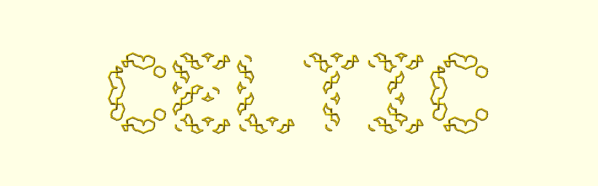

# LogoSC Suite Guide


LogoSC is a compact Logo-inspired drawing language embedded in OpenSCAD. It turns readable turtle
commands into closed 2D polygonal regions. OpenSCAD then supplies extrusion, rotation, boolean
composition, color, and the rest of the 3D model.

This illustrated guide introduces the complete LogoSC family and helps you choose the right
download. Every published suite includes this same guide. The authoritative source, current
development history, and bug-report location are the LogoSC Git repository from which the package
was built.


## Contents

- [Choose a suite](#choose-a-suite)
- [How LogoSC fits with OpenSCAD](#how-logosc-fits-with-openscad)
- [LogoSC Mini](#logosc-mini)
- [LogoSC Core](#logosc-core)
- [LogoSC Developer](#logosc-developer)
- [LogoSC Knots & Celtic Designs](#logosc-knots--celtic-designs)
- [LogoSC Nuts & Bolts](#logosc-nuts--bolts)
- [Installation and compatibility](#installation-and-compatibility)
- [Development provenance](#development-provenance)
- [Getting help and reporting bugs](#getting-help-and-reporting-bugs)

## Choose a suite

LogoSC has one authoritative codebase and several curated publications. They are not forks: all
packages with the same version were generated and tested together.

| Suite | Choose it when you want to... | Main contents |
|---|---|---|
| **Mini** | learn LogoSC | runtime, lessons, command card, and beginner examples |
| **Core** | write complete models | stable language, renderer, examples, and reference |
| **Developer** | validate, test, or extend | validation, tests, CLI workflow, and implementation guides |
| **Knots & Celtic Designs** | make knots and plaques | knot library, large grids, galleries, and focused guides |
| **Nuts & Bolts** | customize fasteners | fastener Customizer, examples, calibration, and verification |

There is no separate Full storefront package. The complete Git repository contains every
maintained suite, test, document, example, image, and project-history file.

The suites relate to one another like this:

```text
Mini teaching surface -> complete Core language -> Developer verification tools
                              |
                              +-> Knots & Celtic Designs
                              |
                              +-> Nuts & Bolts

Complete Git repository = all of the above plus project history and maintainer workflow
```

A Mini command list remains valid in Core. Core remains the common language underneath the two
specialized maker suites. The specialized suites are self-contained downloads, so users do not
need to locate a second matching package.

## How LogoSC fits with OpenSCAD

LogoSC is deliberately responsible for 2D regions rather than becoming a replacement for
OpenSCAD. A typical model has three stages:

1. Write a list of LogoSC movement, turn, primitive, repetition, and region commands.
2. Use `RenderLogo2D()` or another LogoSC renderer to produce a 2D region.
3. Use native OpenSCAD operations such as `linear_extrude()`, `rotate_extrude()`, `difference()`,
   `union()`, transforms, and color to build the finished object.

This division keeps command lists readable while leaving ordinary CAD composition in the tool
that already does it well.

## LogoSC Mini

Mini is the friendly starting point. It teaches a deliberately small surface of the same stable
language used by every larger suite:

- `MOVE`, `TURN`, and `ARC` for turtle motion;
- `REPEAT` and `RUN` for reusable patterns;
- `CIRCLE`, `REGPOLY`, `RECT`, and `ROUNDEDRECT` for common primitives;
- basic `HOLE` regions;
- `RenderLogo2D()` for filled output; and
- native `linear_extrude()` for a first printable solid.

Mini is not a separate dialect. Its examples are intentionally small, but its included Core
runtime preserves compatibility when a project grows.

### First triangle


A few movement and turn commands produce a closed triangular region. This is the shortest route
from readable Logo-style instructions to geometry that OpenSCAD can extrude or combine.


The expanded Quick Start view shows the same idea in the OpenSCAD environment where code,
Customizer controls, console messages, preview, and export work together.

### Regions with holes


LogoSC regions can contain holes without requiring a beginner to manually reverse contour
orientation. This plate demonstrates the basic filled-region model that later supports more
advanced signs, panels, profiles, and reliefs.

Mini is the best choice when the goal is to make something useful quickly and learn more only as
needed.

## LogoSC Core

Core is the complete stable drawing library for normal model authors. Basic use requires only
`LogoSC-Foundation-Core.scad`; validation, tests, knots, and fasteners remain optional.

Beyond the Mini teaching surface, Core provides:

- explicit positioning and heading control;
- multiple contours and regions with holes;
- reusable command lists and nested repetition;
- turtle-state stack and pen control;
- affine transform commands;
- result and region accessors;
- direct region and contour renderers; and
- preview-only diagnostic rendering.

### Example gallery


The gallery collects representative language and geometry examples in one OpenSCAD scene. It is
useful both as an introduction to the available vocabulary and as a visual regression reference.

### Running the examples


LogoSC example files expose their normal controls through OpenSCAD's Customizer. Select the
desired run mode or example, preview the result, and export through the ordinary OpenSCAD
workflow. The packaged README for each suite identifies its recommended first file.

Core is the right choice when you want LogoSC as a reusable library in your own `.scad` models.

## LogoSC Developer

Developer adds the tools needed to inspect, validate, test, and extend LogoSC while preserving
the standalone Core boundary.

Its public engineering surface includes:

- explicit path evaluation and validation;
- validation reports and strict assertion mode;
- Foundation and Validation regression suites;
- command-line evaluation and export procedures;
- diagnostic examples; and
- public implementation and contribution documentation.

AI handoff files, agent instructions, and the mixed historical/bootstrap Developer Notebook stay
in the complete Git repository rather than the Developer package.

### Debug rendering


`RenderLogoDebug()` overlays preview-only movement capsules, points, and direction cues. It helps
explain or diagnose a command list, but it is not a manufacturable stroke API.


The indexed gallery exercises filled output, movement, turns, pen-up travel, holes, primitives,
and overlapping paths. It makes command order and turtle motion visible without changing the
normal region renderer.

### Visual and automated regression coverage


The visual gallery complements deterministic console tests. Release acceptance uses the direct
test runners and requires their final automated result to be `PASS`; the gallery helps a person
notice visual changes that scalar test results cannot fully communicate.

Developer is the right package for library contributors, advanced diagnosis, and reproducible
command-line verification. The Git repository remains the authoritative place for complete
history, issues, and fixes.

## LogoSC Knots & Celtic Designs

The knot suite builds specialized topology and printable geometry on the stable Core renderer. It
supports explicit knot records, torus knots and links, circular braids, Celtic tile grids,
adjacent and crossing-aware cord bundles, planar ribbons, bas-relief, and plaques.

Colors in the galleries distinguish examples, components, or cords. Manufacturing geometry is
produced by the documented renderers rather than by the preview colors themselves.

### Rounded cords


The cord gallery renders sampled knot routes as overlapping rounded capsules. Recorded crossings
receive controlled over/under lift, while links retain their independent closed components.

### Adjacent cord bundles


Bundles place multiple printable cords alongside one master route. Width fitting, lane offsets,
closure, and component tracing are calculated by the knot companion rather than hand-positioned.

### Controlled bundle twists


Integer half-turns permute bundle lanes around a closed route. Odd half-turn counts reverse lane
order and can join apparent lanes into longer closed components; even counts return each lane to
itself.

### Circular braids


Signed adjacent braid generators produce deterministic circular closures. The same knot record
and renderer handle single-component knots and multi-component links.

### Crossing-aware braided bundles


Braided bundles remap each master crossing to the appropriate cord-lane pairs and check the
configured minimum surface clearance before emitting geometry.

### Celtic tile grids


Celtic grids use a compact tile vocabulary. The route tracer validates matching ports, closes
exposed boundaries, discovers independent cycles, assigns alternating crossings, and supports
blank `"."` cells for irregular regions, holes, and disconnected islands.

### Large CELTIC grid



The large-grid showcase demonstrates that blank cells can become deliberate negative space. Its
37-by-9 mask spells CELTIC while the occupied cells remain closed, alternating knot components.
Large scenes print an early scene/output-specific duration estimate rather than pretending that
OpenSCAD offers a trustworthy model-level percentage-complete callback.

The optional C++20 `logosc-knot-grid` preprocessor converts text into exact-size plain ASCII
tile grids and can emit the adapter needed by OpenSCAD 2021.01. The showcase's
`GeneratedPlaque **` scene turns the committed 128-by-32 adapter into a printable plaque; the
unquoted grid remains suitable input for the planned accelerated Celtic renderer.

### Planar ribbons


The planar renderer turns sampled knot segments into continuous LogoSC regions. Crossing masks
remove underpasses and restore overpasses to create readable interlace in flat output.

### Bas-relief


Bas-relief combines a base ribbon with raised overpasses, producing one printable object while
retaining the visual crossing structure.

### Relief plaques


Plaques add automatically calculated margins and a rounded backing plate. Plate thickness,
ribbon-edge margin, corner radius, edge style, bevel, and relief height remain configurable.

The knot suite is the best entry point for users attracted by Celtic ornament, mathematical
knots, braids, decorative plaques, or the underlying generative algorithms.

## LogoSC Nuts & Bolts

The fastener suite is a Customizer-driven application for printable bolts, screws, nuts,
assemblies, and selected thread profiles. It uses LogoSC for thread-profile regions while native
OpenSCAD performs the helical and 3D construction.

Printed polymers, printers, slicers, orientation, wear, and loading vary widely. These models and
their material examples are not structural ratings. Validate any safety-relevant use separately.

### Fastener gallery


The gallery presents representative heads, drives, lengths, and nuts from the same configurable
model used for individual exports.

### High-resolution assembly


The assembly view combines a generated threaded bolt and nut. Radial, axial thread-slice, and
profile sampling controls allow draft previews or smoother final output.

### Head and drive styles


Hex heads support ordinary wrench-driven fastener forms.


Pan heads provide a broad rounded top with configurable drive selection.


Round heads provide a domed alternative for visible or low-edge applications.


Carriage heads combine a rounded top with the under-head geometry required by that style.


Countersunk flat heads are intended to seat into a matching recess so the top can finish near the
surrounding surface.


The headless configuration places its drive at the free shaft end and supports set-screw-like
models.

### Thread profiles


The 60-degree V profile represents the familiar symmetric metric-style form.


The Whitworth-style option uses a 55-degree profile with its documented sampled geometry.


The square profile provides approximately perpendicular flanks and broad crest/root regions.


The trapezoidal option provides a symmetric power-screw-style profile.


The Acme-style option uses its named 29-degree included profile.


The buttress option uses asymmetric flanks for applications where one loading direction dominates;
printed results still require application-specific evaluation.

### Multi-start thread construction


The algorithm maps a sampled LogoSC thread profile around the shaft while advancing it axially.
Multiple starts use phase offsets rather than unrelated hand-built helices, making the construction
and its resolution controls deterministic.

Choose the fastener suite when the desired result is a configurable printable component rather
than a general introduction to the LogoSC language.

## Installation and compatibility

Each published suite is self-contained. Keep the files from one package together so OpenSCAD can
resolve its relative `include <>` and `use <>` dependencies.

For ordinary Core use:

```scad
include <LogoSC-Foundation-Core.scad>
```

For the optional knot companion:

```scad
include <LogoSC-Knots.scad>
```

Open the package-specific example or Customizer file identified by its README. Do not combine
same-named library files from different LogoSC versions. All packages carrying one release version
were built together, and every package records its source tag and commit.

The complete user and command-line manuals in the Git repository provide detailed setup,
Customizer, testing, export, and platform guidance.

## Development provenance

LogoSC was developed primarily through a long-running, human-directed collaboration between its
maintainer and OpenAI AI coding assistants. AI assistance contributed substantially to design
exploration, implementation, documentation, testing, and review.

Project direction, design acceptance, release decisions, and ongoing stewardship remain under
human control. Published behavior is supported by the repository's tests and verification records
rather than by claims about who or what wrote a particular line.

The Developer suite includes a fuller development-provenance statement. The authoritative Git
repository preserves the complete engineering history and AI-assisted workflow.

## Getting help and reporting bugs

The LogoSC Git repository is the authoritative development and issue location. Do not maintain a
private correction to a Thingiverse ZIP as the long-term fix. Report the problem against the
repository so it can receive regression coverage and appear in the next synchronized release.

A useful report includes:

- LogoSC release and suite name;
- OpenSCAD version and operating system;
- relevant `.scad` file and Customizer overrides;
- a minimal reproduction;
- console output; and
- a screenshot or generated artifact when geometry is involved.

See the package's generated version record for its exact source commit and current repository and
issue links.

## License and source

LogoSC packages include the repository's `LICENSE`. The complete corresponding source, project
history, issue tracker, and latest documentation are maintained in the authoritative Git
repository identified by the package metadata.

This guide is canonical repository documentation. Packaged copies are generated for a specific
LogoSC release and should not be edited as independent sources.
