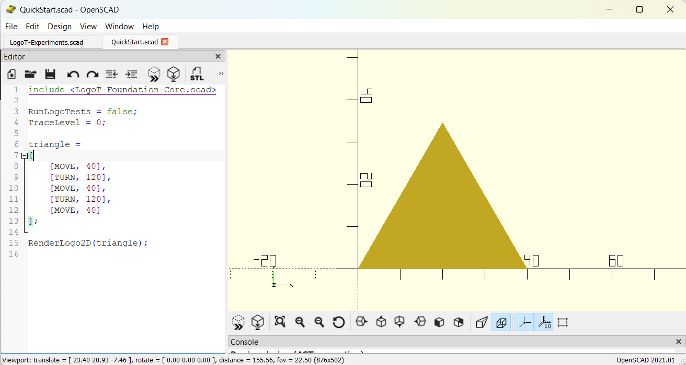
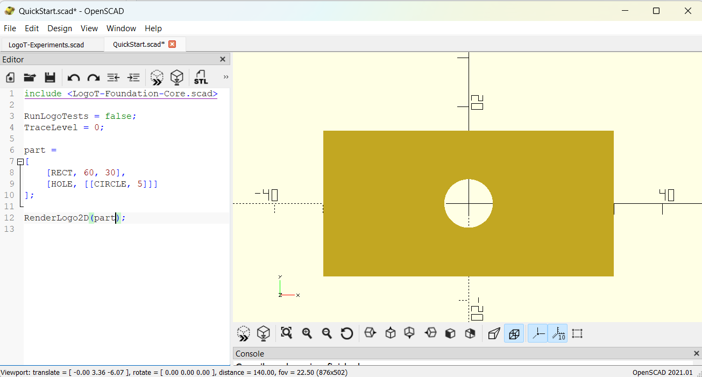

# LogoSC User Manual


LogoSC is a small Logo-style geometry language embedded in OpenSCAD. It evaluates
integer-opcode command lists into closed 2D regions that can be rendered with
OpenSCAD `polygon(points=..., paths=...)` and then used directly in ordinary
OpenSCAD modeling operations.

LogoSC is designed primarily for 3D-printable 2D profiles: plates, panels,
washers, outlines, rounded rectangles, decorative regions, and profiles that can
be passed to `linear_extrude()` or `rotate_extrude()`.

## Table of Contents

- [1. Files and setup](#1-files)
  - [Setup](#setup)
  - [Library version](#library-version)
- [2. Core idea](#2-core-idea)
  - [LogoSC and BOSL2 turtle](#logot-and-bosl2-turtle)
  - [Other Logo-like OpenSCAD turtle tools](#other-logo-like-openscad-turtle-tools)
- [3. Quick lookup cheat sheet](#3-quick-lookup-cheat-sheet)
- [4. Runnable examples](#4-runnable-examples)
- [5. Coordinate model](#5-coordinate-model)
- [6. Rendering model](#6-rendering-model)
- [7. Public rendering and evaluation API](#7-public-rendering-and-evaluation-api)
  - [Input command-list format](#71-input-command-list-format)
  - [Public data formats](#72-public-data-formats)
  - [`RenderLogo2D()`](#73-renderlogo2d)
  - [`evalLogo()`](#74-evallogo)
  - [Evaluator-result accessors](#75-evaluator-result-accessors)
  - [Region constructor and accessors](#76-region-constructor-and-accessors)
  - [`RenderContours2D()`](#77-rendercontours2d)
  - [`RenderRegion2D()`](#78-renderregion2d)
  - [Choosing an entry point](#79-choosing-an-entry-point)
- [8. 3D printing workflow](#8-3d-printing-workflow)
- [9. Segment-count controls](#9-segment-count-controls)
- [10. Command reference](#10-command-reference)
- [11. Recursion and recursive patterns](#11-recursion-and-recursive-patterns)
- [12. Practical examples](#12-practical-examples)
- [13. Error handling and tracing](#13-error-handling-and-tracing)
- [14. Limitations](#14-limitations)
- [15. Suggested style for LogoSC programs](#15-suggested-style-for-logot-programs)
- [Index](#index)

## 1. Files

Current project files:

```text
LogoSC-Foundation-Core.scad        Core interpreter, geometry, and 2D renderer.
LogoSC-Foundation-Tests.scad       Regression and visual tests.
LogoSC-README.md                   Project overview and roadmap.
CHANGELOG.md                      Release history.
LogoSC-ARC-Implementation.md        ARC tessellation design notes.
LogoSC-Holes-Implementation.md     Region/hole design notes.
LogoSC-LSystems-Notes.md           L-system design and example notes.
LogoSC-User-Manual.md              This manual.
LogoSC-Developer-Notebook.md       Engineering history, design rationale, workflow,
                                  lessons learned, and ChatGPT restart guide.
LogoSC-Future-Context.md           Compatibility pointer to the Developer Notebook.
LogoSC-CheatSheet.md               Compact command and API reference.
LogoSC-Examples.scad               Runnable example gallery.
.gitattributes                    LF line-ending policy for Git.
```

### Setup

For normal use, put the LogoSC core file next to your model and include it from
OpenSCAD:

```scad
include <LogoSC-Foundation-Core.scad>
RunLogoTests = false;
TraceLevel = 0; // [0:4]
```

The Developer Notebook is maintainer documentation rather than part of the
public API. Its main purpose is to preserve historical engineering context
and reinitialize ChatGPT when development resumes in a new conversation.
Maintainers should read it before changing the project; ordinary LogoSC users
can ignore it.

The `RunLogoTests` and `TraceLevel` assignments should come **after** the
`include`. OpenSCAD `include` behaves like textual insertion, so post-include
assignments override the core file's Customizer defaults without creating a
second Customizer block or accidentally enabling the regression-test gallery in
your model.

For ordinary 2D output, wrap a LogoSC command list with:

```scad
RenderLogo2D(cmds);
```

For 3D printing, use native OpenSCAD operations around the 2D output:

```scad
linear_extrude(height = 4, center = false, convexity = 10)
{
    RenderLogo2D(cmds);
}
```

To run the built-in tests, open `LogoSC-Foundation-Core.scad` directly in
OpenSCAD and leave:

```scad
RunLogoTests = true;
```

The runnable gallery in `LogoSC-Examples.scad` follows the same include pattern
and is a good starting point for user models.

### Library version

Current public API version: `2026.1`.

The core file exposes version constants and a helper for user-model compatibility
checks:

```scad
LogoSCVersionMajor
LogoSCVersionMinor
LogoSCVersion
LogoSCVersionAtLeast(major, minor)
```

Example:

```scad
assert(LogoSCVersionAtLeast(2026, 1), "This model requires LogoSC 2026.1+");
```

The version is bumped manually for public API or feature milestones. Git remains
the source of truth for ordinary commit-by-commit source history.

## 2. Quick Start

### Your First LogoSC Program

The simplest Logo programs are written using only forward movement and turns. The following program draws an equilateral triangle.

```scad
include <LogoSC-Foundation-Core.scad>

RunLogoTests = false;
TraceLevel = 0;

triangle =
[
    [MOVE, 40],
    [TURN, 120],
    [MOVE, 40],
    [TURN, 120],
    [MOVE, 40]
];

RenderLogo2D(triangle);
```

**Result**



*Figure 2-1. Three `MOVE` commands and two `TURN` commands produce a filled equilateral triangle. LogoSC generates closed 2D polygonal regions suitable for OpenSCAD modeling operations.*

Although the turtle walks only three line segments, **LogoSC produces a filled equilateral triangle**, not just three independent lines.

> **Note:** A future stroke-rendering API will primarily support debugging and educational visualization.
>
> **TODO:** Add a cross-reference to the future Stroke Rendering API.

### Beyond Classic Logo

Classic Logo approximates curves using many short line segments.

LogoSC also provides CAD-oriented primitives including circles, arcs, regular polygons, rectangles, rounded rectangles, and holes.

```scad
part =
[
    [RECT, 60, 30],
    [HOLE, [[CIRCLE, 5]]]
];

RenderLogo2D(part);
```

**Result**



*Figure 2-2. Two LogoSC commands generate a rectangular plate with a centered circular hole suitable for extrusion into a 3D-printable part.*


## 3. Core idea

A LogoSC program is an OpenSCAD vector of command vectors:

```scad
part =
[
    [RECT, 60, 30],
    [HOLE, [[CIRCLE, 5]]]
];
```

Render it as 2D geometry with:

```scad
RenderLogo2D(part);
```

Use normal OpenSCAD operations for 3D modeling:

```scad
linear_extrude(height = 4, center = false, convexity = 10)
{
    RenderLogo2D(part);
}
```

LogoSC intentionally renders **2D regions only**. It does not wrap
`linear_extrude()`, `rotate_extrude()`, `difference()`, or `union()`. Keeping
those operations outside LogoSC keeps the API small and lets OpenSCAD do normal
OpenSCAD work.

### LogoSC and BOSL2 turtle

LogoSC overlaps slightly with BOSL2's turtle/path tools, but the two projects
optimize for different jobs.

BOSL2 is a broad OpenSCAD utility library with extensive shape, path, region,
attachment, and 3D modeling tools, including turtle-style path helpers. Get
BOSL2 from the [BelfrySCAD/BOSL2 GitHub repository](https://github.com/BelfrySCAD/BOSL2),
or from the [OpenSCAD Libraries page](https://openscad.org/libraries.html).

LogoSC is deliberately narrower. It evaluates compact Logo-style command lists
into closed 2D regions suitable for `polygon(points=..., paths=...)`, holes,
`linear_extrude()`, `rotate_extrude()`, `offset()`, and ordinary OpenSCAD
composition.

Use BOSL2 when you want its large general-purpose modeling toolkit, attachment
system, path utilities, or 3D turtle workflows. Use LogoSC when you want a small,
self-contained 2D region generator for reusable plate, panel, washer, outline,
and profile geometry. They can coexist in the same OpenSCAD model because LogoSC
returns normal OpenSCAD 2D geometry rather than owning the whole modeling stack.

### Other Logo-like OpenSCAD turtle tools

The OpenSCAD ecosystem has several turtle-graphics or Logo-like experiments.
Most are path generators, drawing helpers, tutorials, or broader CAD libraries
rather than direct substitutes for LogoSC's small 2D-region-and-hole workflow.

| Tool | Where to find it | Plus, relative to LogoSC | Minus, relative to LogoSC |
|---|---|---|---|
| BOSL2 `turtle()` / `turtle3d()` | [BelfrySCAD/BOSL2](https://github.com/BelfrySCAD/BOSL2) | Mature, broad OpenSCAD toolkit; strong path, region, attachment, and 3D workflows. | Larger dependency; optimized for BOSL2 path/modeling workflows rather than a small standalone LogoSC region DSL. |
| StoneAgeLib `turtle.scad` | [Stone-Age-Sculptor/StoneAgeLib](https://github.com/Stone-Age-Sculptor/StoneAgeLib) | Practical 3D-printing library; public-domain/CC0 licensing; turtle usage is described as similar to Python Turtle. | Part of a broader evolving library; not focused on LogoSC's closed-region, hole, and compact command-list API. |
| `phildubach/openscad-turtle` | [phildubach/openscad-turtle](https://github.com/phildubach/openscad-turtle) | Interesting CAD-style commands for lines, arcs, elastic lines, and references to stored prior turtle states. | Small GPL-3.0 project; less evidence of adoption; path construction rather than LogoSC-style filled regions with holes. |
| JustinSDK TurtleSCAD | [JustinSDK/TurtleSCAD](https://github.com/JustinSDK/TurtleSCAD) | Pure OpenSCAD turtle-graphics implementation with example models; historically relevant. | Archived/read-only; no releases; not a current foundation for new LogoSC work. |
| Kit Wallace `turtle.scad` examples | [Turtle Graphics in OpenSCAD](https://www.tumblr.com/kitwallace/112087448494/turtle-graphics-in-openscad) | Compact classic-Logo flavor; useful educational example of recursive OpenSCAD turtle command lists. | Tutorial/demo scale; older and not framed as a maintained LogoSC-like CAD-region library. |
| OpenHome 2D/3D turtle articles | [2D turtle graphics](https://openhome.cc/eGossip/OpenSCAD/TurtleGraphics.html) and [3D turtle graphics](https://openhome.cc/eGossip/OpenSCAD/3DTurtleGraphics.html) | Good implementation notes for turtle state, immutability, and coordinate-frame reasoning in OpenSCAD. | Article/example code rather than a packaged library; not aimed at LogoSC's reusable region primitives. |
| TheHans L-system gist | [L-system implementation in OpenSCAD](https://gist.github.com/thehans/a1494db8046a58832e2ebb10a5908a66) | Useful example of turtle interpretation with stack-style `[` / `]` branching for fractals and plant-like forms. | Specialized L-system interpreter, not a general Logo-style CAD geometry API. |

The practical conclusion is that LogoSC does not need to become a general BOSL2
competitor or a complete Logo clone. Its useful niche is a small, readable,
Git-friendly OpenSCAD mini-language that produces printable 2D regions and
region holes, then gets out of OpenSCAD's way.


## 3. Quick lookup cheat sheet

`LogoSC-CheatSheet.md` is the compact reference for command syntax, rendering
API calls, and common OpenSCAD wrappers used around LogoSC output. Use it while
writing models; return to this manual for full explanations and examples.

## 4. Runnable examples

`LogoSC-Examples.scad` is the best place to see the library used as an OpenSCAD
modeling tool rather than as a test harness. It contains a gallery module plus
individual named examples for washers, mounting plates, radial holes, Koch
snowflake geometry, L-system-generated fractal outlines, rotate-extruded
profiles, twisted extrusions, a small spiral tower, and the LogoSC feature
wordmark.

Open `LogoSC-Examples.scad` directly in OpenSCAD. The default setting renders the
full gallery:

```scad
RunLogoExamples = true;
```

The examples file includes the core and suppresses test/tracing output with:

```scad
include <LogoSC-Foundation-Core.scad>
RunLogoTests = false;
TraceLevel = 0; // [0:4]
```

Use it as a cookbook: copy a command list such as `ExampleMountingPlate`, or use
one of the example rendering modules as a starting point for your own model.
For the L-system examples, see `LogoSC-LSystems-Notes.md` for design context
and limitations.

## 5. Coordinate model

LogoSC maintains a current state:

```text
[x, y, heading, scale]
```

- `x`, `y`: current 2D position.
- `heading`: direction in degrees.
- `scale`: current multiplicative scale factor.

The default starting state is:

```text
[0, 0, 0, 1]
```

By convention:

```text
heading 0   points along +X
heading 90  points along +Y
heading 180 points along -X
heading 270 points along -Y
```

LogoSC uses OpenSCAD's right-handed coordinate system. In the standard LogoSC
test/example view, +X appears to the left and +Y appears upward; avoid assuming
a left-handed screen-coordinate convention when reasoning about turns and arcs.
Positive relative turns are right-handed rotations about the +Z axis. Viewed
from +Z toward the XY plane, positive turns are counterclockwise.

Movement commands update the current state. Closed-shape commands stamp geometry
at the current state but do not move the state.

### 5.1 Relative drawing vs. absolute layout

Prefer relative commands inside reusable command lists. Use `MOVE`, `TURN`,
`ARC`, `RUN`, `REPEAT`, and `SCALE` when defining a shape that should inherit
the caller's position, heading, and scale. Use `GOTO` and `DIR` primarily for
layout, anchoring, and deterministic setup.

| Situation | Prefer | Reason |
|---|---|---|
| Drawing a reusable glyph, shape, or path | `MOVE`, `TURN`, `ARC` | The shape inherits caller position, heading, and scale. |
| Placing objects in a larger design | `GOTO`, sometimes `DIR` | Layout usually needs explicit positions. |
| Resetting known state at the start of an example | `GOTO`, `DIR` | The example is deterministic and easy to inspect. |
| Decorative turtle/path geometry | `MOVE`, `TURN` | This preserves Logo-style relative motion. |
| CAD-style stamped primitives | `GOTO`, then `CIRCLE`, `RECT`, or `ROUNDEDRECT` | Stamped objects are centered at the current position. |

A good default pattern is absolute setup followed by relative drawing:

```scad
shape =
[
    [GOTO, 0, 0, 0],     // anchor the shape
    [MOVE, 20],
    [TURN, 90],
    [MOVE, 10],
    [TURN, 90],
    [MOVE, 20]
];
```

## 6. Rendering model

LogoSC evaluates command lists into structured 2D data rather than emitting
OpenSCAD geometry while each command executes. The public data hierarchy is:

```text
EvalResult
└── regions
    ├── region
    │   ├── outer contour
    │   └── zero or more hole contours
    └── ...
```

Section 7 defines these formats precisely, documents the accessors, and explains
which rendering entry point to use. The essential distinction is:

- evaluation functions return OpenSCAD values that can be inspected or reused;
- rendering modules emit 2D OpenSCAD geometry and do not return a value.

LogoSC currently targets closed printable 2D polygons, not open strokes.
OpenSCAD `polygon()` closes drawable paths automatically. Stroke width, end caps,
joins, and miter limits are future work.

## 7. Public rendering and evaluation API

LogoSC separates evaluation from rendering:

```text
command list
    │
    ▼
evalLogo()
    │
    ▼
EvalResult = [state, regions, stack, pen]
                         │
                         ▼
              RenderContours2D()
```

`RenderLogo2D()` is the normal convenience entry point. It performs both stages:

```text
RenderLogo2D(cmds) = RenderContours2D(ResultContours(evalLogo(cmds)))
```

Use the lower-level functions when generated geometry must be inspected,
transformed as data, tested, cached in a variable, or rendered more than once.

### 7.1 Input command-list format

The input to `RenderLogo2D()` and `evalLogo()` is an OpenSCAD list of LogoSC
commands:

```scad
cmds =
[
    [GOTO, -20, -10, 0],
    [MOVE, 40],
    [TURN, 90],
    [MOVE, 20],
    [TURN, 90],
    [MOVE, 40],
    [TURN, 90],
    [MOVE, 20]
];
```

Each command is itself a list whose first field is an integer opcode constant.
Later fields are command arguments. The command reference in Section 10 defines
each command's exact shape and optional arguments.

An empty command list is legal and evaluates as a no-op:

```scad
result = evalLogo([]);
```

### 7.2 Public data formats

#### Point and contour

A point is a two-element coordinate vector:

```text
point = [x, y]
```

A contour is an ordered list of points:

```text
contour = [point0, point1, point2, ...]
```

A contour requires at least three points to render as a polygon path. The final
point does not need to repeat the first point; OpenSCAD closes the path.

#### Region

A region contains one outer contour followed by zero or more hole contours:

```text
region = [outerContour, holeContour0, holeContour1, ...]
```

Examples:

```scad
solidRegion =
[
    [[0, 0], [40, 0], [40, 20], [0, 20]]
];

regionWithHole =
[
    [[0, 0], [40, 0], [40, 20], [0, 20]],
    [[10, 5], [10, 15], [30, 15], [30, 5]]
];
```

Each region is rendered by one OpenSCAD `polygon()` call with a flattened point
list and one path per drawable contour. When constructing regions manually, the
contours must describe valid, non-self-intersecting polygon boundaries suitable
for OpenSCAD `polygon(points=..., paths=...)`.

#### Region list

The evaluator returns a list of regions:

```text
regions = [region0, region1, ...]
```

For example:

```scad
regions =
[
    [outerContour0, holeContour0, holeContour1],
    [outerContour1]
];
```

The evaluator may retain an empty working region such as `[[]]`, commonly at the
end of a result after a stamped closed shape. This is valid. Rendering modules
skip an empty outer contour. User code should therefore inspect drawable
contours rather than assuming every region contains geometry.

#### Logo state

A Logo state is:

```text
state = [x, y, heading, scale]
```

The public field-index constants are:

```scad
state[SX]  // x coordinate
state[SY]  // y coordinate
state[SH]  // heading in degrees
state[SS]  // cumulative movement scale
```

The default initial state is equivalent to:

```scad
stateGoto(0, 0, 0, 1)
```

Headings use the coordinate and turn conventions described in Section 5.

#### State stack

The stack is a list of saved Logo states used by `PUSH` and `POP`:

```text
stack = [savedState0, savedState1, ...]
```

The last element is the top of the stack. A normal, balanced command list
usually returns an empty stack. A nonempty final stack is legal and can be useful
for diagnostics, although it often indicates unmatched `PUSH` commands.

#### Pen state

The pen state is one of the public constants:

```scad
PEN_UP
PEN_DOWN
```

`PEN_DOWN` is the default. `ResultPen()` reports the state after the final
command.

#### Evaluator result

`evalLogo()` returns a four-element evaluator result:

```text
EvalResult = [finalState, regions, finalStack, finalPen]
```

Do not depend on the numeric field positions. Use the result accessors described
below.

### 7.3 `RenderLogo2D()`

Main user-facing rendering module:

```scad
RenderLogo2D(cmds, convexity = 10);
```

| Parameter | Format | Meaning |
|---|---|---|
| `cmds` | command list | Commands to evaluate from the default initial state. |
| `convexity` | integer | Preview hint passed unchanged to OpenSCAD `polygon()`. Does not alter LogoSC geometry. |

The module emits 2D OpenSCAD geometry. It does not return the `EvalResult`.
Multiple regions are emitted as sibling polygon objects and behave as their
geometric union when consumed by ordinary OpenSCAD modeling operations.

```scad
plate =
[
    [ROUNDEDRECT, 60, 30, 4],
    [HOLE, [[GOTO, -20, 0, 0], [CIRCLE, 3]]],
    [HOLE, [[GOTO,  20, 0, 0], [CIRCLE, 3]]]
];

linear_extrude(height = 4, convexity = 10)
{
    RenderLogo2D(plate);
}
```

Use `convexity` as an OpenSCAD preview aid; it does not change the evaluated
point data or the mathematical shape.

#### About the `convexity` parameter

The `convexity` parameter is passed unchanged to OpenSCAD's `polygon()` module.
It does **not** change the geometry generated by LogoSC. Instead, it is a preview
hint used by OpenSCAD's **Preview (F5)** renderer.

In OpenSCAD terminology, `convexity` is an upper bound on the number of
front-facing polygon surfaces that a viewing ray may intersect. This helps the
preview renderer determine visible surfaces for complex models. It does **not**
affect the final CGAL render (**F6**) or exported STL files.

For most LogoSC models, the default value:

```scad
convexity = 10;
```

is appropriate.

Increase it only if Preview (F5) shows missing faces or other display artifacts
for unusually complex geometry, such as deeply nested boolean operations,
multiple overlapping extrusions, or highly concave models.

Changing `convexity` does **not** affect:

- LogoSC-generated points
- Polygon topology
- Tessellation quality
- Exported STL files
- Final CGAL rendering (F6)

Unless you encounter Preview artifacts, simply leave the default at **10**.


### 7.4 `evalLogo()`

Evaluates a command list without emitting geometry:

```scad
result = evalLogo(cmds);
```

Normal user code should pass only `cmds`. The complete signature is exposed for
advanced continuation and evaluator testing:

```scad
evalLogo(
    cmds,
    state = stateGoto(0, 0, 0, 1),
    index = 0,
    maxRec = maxRunRecursions,
    contours = [MakeRegion([])],
    stack = [],
    pen = PEN_DOWN
);
```

| Parameter | Format | Meaning |
|---|---|---|
| `cmds` | command list | Command list being evaluated. |
| `state` | Logo state | Initial or continuation state. |
| `index` | integer | First command index to execute. Normally `0`. |
| `maxRec` | integer | Remaining `RUN` recursion allowance. |
| `contours` | region list | Existing geometry to append to. |
| `stack` | state list | Existing `PUSH`/`POP` stack. |
| `pen` | pen constant | Initial or continuation pen state. |

The returned value is:

```text
[finalState, regions, finalStack, finalPen]
```

The extended parameters are primarily evaluator plumbing. For ordinary staged
evaluation, pass the prior result through the accessors:

```scad
first = evalLogo(firstCmds);

second = evalLogo(
    secondCmds,
    ResultState(first),
    0,
    maxRunRecursions,
    ResultContours(first),
    ResultStack(first),
    ResultPen(first)
);
```

This continues position, heading, scale, regions, stack, and pen state. Starting
a fresh `evalLogo(secondCmds)` call would instead reset all of them to defaults.

### 7.5 Evaluator-result accessors

Use these functions instead of indexing an `EvalResult` directly:

```scad
finalState = ResultState(result);
regions    = ResultContours(result);
finalStack = ResultStack(result);
finalPen   = ResultPen(result);
```

| Accessor | Return format | Meaning |
|---|---|---|
| `ResultState(result)` | `[x, y, heading, scale]` | State after the last evaluated command. |
| `ResultContours(result)` | region list | All accumulated outer and hole contours. |
| `ResultStack(result)` | list of states | Remaining `PUSH`/`POP` stack. |
| `ResultPen(result)` | `PEN_UP` or `PEN_DOWN` | Final pen state. |

`ResultContours()` retains its historical name for source continuity. It returns
regions, not the older flat list of independent contours.

Example inspection:

```scad
result = evalLogo(part);
state = ResultState(result);

finalX       = state[SX];
finalY       = state[SY];
finalHeading = state[SH];
finalScale   = state[SS];

regions = ResultContours(result);
echo(finalX, finalY, finalHeading, finalScale, len(regions));
```

### 7.6 Region constructor and accessors

These functions are the supported way to construct or inspect a region without
assuming its internal indexing:

```scad
region = MakeRegion(outerContour, holeContours = []);
outer  = RegionOuter(region);
holes  = RegionHoles(region);
```

| Function | Return format | Meaning |
|---|---|---|
| `MakeRegion(outerContour, holeContours = [])` | region | Builds one region from an outer contour and a list of hole contours. |
| `RegionOuter(region)` | contour | Returns the first contour, or `[]` for an empty region. |
| `RegionHoles(region)` | list of contours | Returns all contours after the outer contour. |

Example:

```scad
outer = [[0, 0], [50, 0], [50, 30], [0, 30]];
hole  = [[10, 10], [10, 20], [40, 20], [40, 10]];

region = MakeRegion(outer, [hole]);
assert(RegionOuter(region) == outer);
assert(RegionHoles(region) == [hole]);
```

The lower-level mutation and polygon-path conversion helpers in the core file
are implementation details rather than stable public data-access APIs.

### 7.7 `RenderContours2D()`

Renders an already-evaluated region list:

```scad
RenderContours2D(regions, convexity = 10);
```

| Parameter | Format | Meaning |
|---|---|---|
| `regions` | region list | Evaluated or manually constructed regions. |
| `convexity` | number | Passed to each generated `polygon()` call. |

Typical evaluate-once use:

```scad
result = evalLogo(part);
regions = ResultContours(result);

translate([-50, 0])
{
    RenderContours2D(regions);
}

translate([50, 0])
{
    offset(r = 1)
    {
        RenderContours2D(regions);
    }
}
```

This avoids evaluating the same command list twice. It does not clone or alter
the input regions.

### 7.8 `RenderRegion2D()`

Renders exactly one region:

```scad
RenderRegion2D(region, convexity = 10);
```

The input must have the form:

```text
[outerContour, holeContour0, holeContour1, ...]
```

An empty outer contour emits no geometry. An outer contour containing one or two
points emits an error marker for diagnostics because it cannot form a polygon.
This module is mainly useful for tests, custom region filtering, and debugging.

```scad
result = evalLogo(part);
regions = ResultContours(result);

for (region = regions)
{
    if (len(RegionOuter(region)) >= 3)
    {
        RenderRegion2D(region);
    }
}
```

### 7.9 Choosing an entry point

| Need | Use |
|---|---|
| Evaluate and render a normal LogoSC model | `RenderLogo2D()` |
| Inspect final state, stack, pen, or point data | `evalLogo()` plus accessors |
| Evaluate once and render several times | `evalLogo()` then `RenderContours2D()` |
| Render manually generated region data | `RenderContours2D()` |
| Render or debug one selected region | `RenderRegion2D()` |
| Construct or inspect a region as data | `MakeRegion()`, `RegionOuter()`, `RegionHoles()` |

### 7.10 OpenSCAD wrapper pattern

LogoSC intentionally remains a 2D geometry generator. Wrap its output with native
OpenSCAD modules for final modeling:

```scad
color("cyan")
linear_extrude(height = 4, twist = 20, slices = 24)
{
    offset(r = 0.5)
    {
        RenderLogo2D(part);
    }
}
```

The old `RenderContours()` compatibility alias has been removed. Use
`RenderContours2D()` for an already-evaluated region list.

## 8. 3D printing workflow

### Linear extrusion

```scad
plate =
[
    [ROUNDEDRECT, 60, 30, 4],
    [HOLE, [[GOTO, -20, 0, 0], [CIRCLE, 3]]],
    [HOLE, [[GOTO,  20, 0, 0], [CIRCLE, 3]]]
];

linear_extrude(height = 4, center = false, convexity = 10)
{
    RenderLogo2D(plate);
}
```

### Twisted linear extrusion

```scad
linear_extrude(
    height = 10,
    center = true,
    convexity = 10,
    twist = 45,
    slices = 32)
{
    RenderLogo2D([[REGPOLY, 6, 8]]);
}
```

### Rotate extrusion

For `rotate_extrude()`, the 2D profile should normally live on the positive-X
side of the rotation axis.

```scad
profile =
[
    [GOTO, 20, 0, 0],
    [RECT, 4, 12]
];

rotate_extrude(angle = 360, convexity = 10)
{
    RenderLogo2D(profile);
}
```

## 9. Segment-count controls

Curved commands use tessellated line segments. If a command supplies an explicit
segment count, that value overrides OpenSCAD's `$fn`, `$fa`, and `$fs` controls.

```scad
[ARC, 10, 90, 8]      // exactly 8 segments along the arc
[CIRCLE, 10, 48]      // exactly 48 segments around the full circle
[ROUNDEDRECT, 40, 20, 4, 6]  // 6 segments per rounded corner
```

If the segment count is omitted, LogoSC uses OpenSCAD-style automatic fragment
selection:

- `$fn > 0` sets the full-circle fragment count.
- `$fn == 0` lets `$fa` and `$fs` choose the fragment count.
- Partial arcs scale the full-circle count by the arc angle.

`REGPOLY` uses its side count directly and does not consult `$fn`, `$fa`, or
`$fs`.

## 10. Command reference

### `MOVE`

Syntax:

```scad
[MOVE, len]
```

Moves forward by `len * scale` in the current heading. If the pen is down, the
new position is appended to the active contour. If the pen is up, only the state
moves.

Example:

```scad
triangle =
[
    [MOVE, 20],
    [TURN, 120],
    [MOVE, 20],
    [TURN, 120],
    [MOVE, 20]
];

RenderLogo2D(triangle);
```

Notes:

- `polygon()` closes the contour automatically.
- This is useful for hand-built closed paths.

### `TURN`

Syntax:

```scad
[TURN, deltaHeading]
```

Adds `deltaHeading` degrees to the current heading. Positive values rotate
counterclockwise in the XY plane, using the standard right-handed +Z-axis
rotation convention.

Example:

```scad
path =
[
    [MOVE, 20],
    [TURN, 90],
    [MOVE, 10]
];
```

### `DIR`

Syntax:

```scad
[DIR, absoluteHeading]
```

Sets the heading to an absolute angle in degrees.

Example:

```scad
path =
[
    [DIR, 90],
    [MOVE, 10]
];
```

### `SCALE`

Syntax:

```scad
[SCALE, scaleMultiplier]
```

Multiplies the current scale by `scaleMultiplier`.

Example:

```scad
part =
[
    [CIRCLE, 5],
    [GOTO, 20, 0, 0],
    [SCALE, 2],
    [CIRCLE, 5]
];
```

The second circle has effective radius `10`.

### `GOTO`

Syntax:

```scad
[GOTO, x, y, heading]
```

Sets absolute position and heading.

If the pen is down, the new position is appended to the active contour. If the
pen is up, this repositions without drawing.

Example:

```scad
part =
[
    [PENUP],
    [GOTO, 10, 5, 0],
    [PENDOWN],
    [CIRCLE, 3]
];
```

### `ARC`

Syntax:

```scad
[ARC, radius, degrees[, segments]]
```

Draws a circular arc from the current position, tangent to the current heading.
Positive angles turn left. Negative angles turn right.

State effects:

- Updates position to the end of the arc.
- Updates heading by `degrees`.
- Respects current scale.
- Emits tessellated points only when the pen is down.

Example: quarter turn from east to north.

```scad
curve =
[
    [ARC, 10, 90, 8]
];

RenderLogo2D(curve);
```

Example: classic Logo-style full circular walk.

```scad
loop =
[
    [ARC, 10, 360]
];
```

`ARC` is the command to use when you want the Logo cursor to walk around a
circle. `CIRCLE` means something different in LogoSC.

### `CIRCLE`

Syntax:

```scad
[CIRCLE, radius[, segments]]
```

Creates a closed filled circle centered at the current Logo position.

State effects:

- Does not move the current position.
- Does not change heading.
- Respects current scale.
- Obeys pen state.

Example:

```scad
washerOuter =
[
    [CIRCLE, 20]
];
```

Important: this is not the classic Logo circle behavior. In LogoSC,
`[CIRCLE, r]` is a CAD-style closed shape centered at the current position. To
walk a full tangent loop, use:

```scad
[ARC, r, 360]
```

### `REGPOLY`

Syntax:

```scad
[REGPOLY, sides, radius[, rotation]]
```

Creates a closed regular polygon centered at the current Logo position.

State effects:

- Does not move position.
- Does not change heading.
- Respects current scale.
- Respects current heading.
- Optional `rotation` is relative to the current heading.
- Obeys pen state.

Example:

```scad
hex =
[
    [REGPOLY, 6, 10]
];

RenderLogo2D(hex);
```

### `RECT`

Syntax:

```scad
[RECT, width, height]
```

Creates a closed rectangle centered at the current Logo position and oriented by
the current heading.

State effects:

- Does not move position.
- Does not change heading.
- Respects current scale.
- Obeys pen state.

Example:

```scad
plate =
[
    [RECT, 50, 20]
];
```

Rotated rectangle:

```scad
rotatedPlate =
[
    [DIR, 30],
    [RECT, 50, 20]
];
```

### `ROUNDEDRECT`

Syntax:

```scad
[ROUNDEDRECT, width, height, radius[, segments]]
```

Creates a closed rounded rectangle centered at the current Logo position and
oriented by the current heading.

State effects:

- Does not move position.
- Does not change heading.
- Respects current scale.
- Obeys pen state.

The optional `segments` argument controls the number of segments per rounded
corner.

Example:

```scad
panel =
[
    [ROUNDEDRECT, 60, 30, 4]
];
```

### `HOLE`

Syntax:

```scad
[HOLE, cmds]
```

Evaluates `cmds` as one or more closed contours and attaches those contours as
holes to the most recently emitted outer region.

State effects:

- Does not change the parent Logo position.
- Does not change the parent heading.
- Does not change the parent stack.
- Does not change the parent pen state.
- Child commands are evaluated with the pen down.

Example: washer.

```scad
washer =
[
    [CIRCLE, 20],
    [HOLE, [[CIRCLE, 8]]]
];

RenderLogo2D(washer);
```

Example: rounded plate with four screw holes.

```scad
mountingPlate =
[
    [ROUNDEDRECT, 60, 30, 4],

    [HOLE, [[GOTO, -20, -8, 0], [CIRCLE, 2.5]]],
    [HOLE, [[GOTO,  20, -8, 0], [CIRCLE, 2.5]]],
    [HOLE, [[GOTO, -20,  8, 0], [CIRCLE, 2.5]]],
    [HOLE, [[GOTO,  20,  8, 0], [CIRCLE, 2.5]]]
];
```

Multiple child contours can become multiple holes:

```scad
multiHolePlate =
[
    [RECT, 50, 20],
    [HOLE,
        [
            [GOTO, -15, 0, 0],
            [CIRCLE, 3],
            [GOTO,  15, 0, 0],
            [CIRCLE, 3]
        ]
    ]
];
```

LogoSC does not currently validate whether holes are fully inside the outer
region, whether holes overlap, or whether regions are self-intersecting. Keep
geometry sane; CGAL is not a therapist.

### `RUN`

Syntax:

```scad
[RUN, cmds[, scale[, maxRec]]]
```

Evaluates a child command list from the current state.

The optional `scale` multiplies the child execution scale. The optional `maxRec`
limits nested `RUN` recursion. See [Section 9](#9-recursion-and-recursive-patterns)
for details on `REPEAT`, `RUN`, recursive OpenSCAD command generators, and
Koch-style fractals.

Example:

```scad
holeShape = [[CIRCLE, 2.5]];

plate =
[
    [ROUNDEDRECT, 60, 30, 4],
    [HOLE, [[GOTO, -20, 0, 0], [RUN, holeShape]]],
    [HOLE, [[GOTO,  20, 0, 0], [RUN, holeShape]]]
];
```

### `REPEAT`

Syntax:

```scad
[REPEAT, count, cmds]
```

Runs `cmds` repeatedly.

Example: four mounting holes around the origin.

```scad
holePattern =
[
    [REPEAT, 4,
        [
            [PUSH],
                [MOVE, 20],
                [CIRCLE, 2],
            [POP],
            [TURN, 90]
        ]
    ]
];
```

Use this inside `HOLE` to cut repeated holes:

```scad
roundPlate =
[
    [CIRCLE, 30],
    [HOLE,
        [
            [REPEAT, 4,
                [
                    [PUSH],
                        [MOVE, 18],
                        [CIRCLE, 2],
                    [POP],
                    [TURN, 90]
                ]
            ]
        ]
    ]
];
```

### `PUSH` and `POP`

Syntax:

```scad
[PUSH]
[POP]
```

`PUSH` saves the current Logo state. `POP` restores the most recently saved
state.

The stack stores:

```text
[x, y, heading, scale]
```

It does not store the contour list or pen state.

Example:

```scad
part =
[
    [PUSH],
        [GOTO, -10, 0, 0],
        [CIRCLE, 3],
    [POP],

    [PUSH],
        [GOTO, 10, 0, 0],
        [CIRCLE, 3],
    [POP]
];
```

### `PENUP` and `PENDOWN`

Syntax:

```scad
[PENUP]
[PENDOWN]
```

`PENUP` stops movement commands from appending points to contours.

`PENDOWN` starts a new contour at the current position and resumes point
emission. If the pen is already down, `PENDOWN` still starts a new contour.

Example: two disconnected movement-built shapes.

```scad
part =
[
    [MOVE, 10],
    [TURN, 90],
    [MOVE, 10],

    [PENUP],
    [GOTO, 30, 0, 0],
    [PENDOWN],

    [MOVE, 10],
    [TURN, 90],
    [MOVE, 10]
];
```

Closed-shape commands also obey pen state. For example, `[PENUP], [CIRCLE, 5]`
does not emit a circle.

## 11. Recursion and recursive patterns

LogoSC uses the word "recursion" in a few related but distinct ways. They are
worth separating because they have different costs and different failure modes.

### 9.1 `REPEAT`: bounded repetition

`REPEAT` is the simplest form. It repeats a child command list a fixed number of
times:

```scad
square =
[
    [REPEAT, 4,
        [
            [MOVE, 10],
            [TURN, 90]
        ]
    ]
];
```

Use `REPEAT` when the number of copies is known and the body does not need to
change structurally from one copy to the next.

Common uses:

- regular polygons;
- repeated screw holes;
- decorative radial patterns;
- simple gear-like or flower-like outlines.

### 9.2 `RUN`: reusable child command lists

`RUN` evaluates another command list from the current Logo state:

```scad
slot =
[
    [ROUNDEDRECT, 12, 4, 2]
];

plate =
[
    [RECT, 50, 20],
    [HOLE, [[GOTO, -15, 0, 0], [RUN, slot]]],
    [HOLE, [[GOTO,  15, 0, 0], [RUN, slot]]]
];
```

This is not recursion by itself; it is subroutine-like reuse. The child list can
also be scaled:

```scad
[RUN, slot, 0.5]
```

That runs `slot` at half the current scale.

### 9.3 Nested `RUN`: runtime recursion with a limit

A `RUN` body can itself contain another `RUN`. LogoSC has a recursion limit so a
bad command list does not expand forever.

The syntax is:

```scad
[RUN, cmds, scale, maxRec]
```

Where:

- `cmds` is the child command list;
- `scale` multiplies the current scale while the child list runs;
- `maxRec` limits how deeply that `RUN` may recurse.

The default recursion limit is controlled by:

```scad
DefaultRunMaxRecursions = 2;
```

Use an explicit `maxRec` when writing recursive examples or tests. Otherwise the
example may stop earlier than expected.

### 9.4 Recursive OpenSCAD command generators

For most practical recursive geometry, use an OpenSCAD function that returns a
LogoSC command list. This is usually cleaner than trying to create
self-referential command vectors.

OpenSCAD self-referential variables are not a reliable foundation for LogoSC
programs. Prefer functions where the depth is an ordinary numeric argument:

```scad
function SpiralCmds(depth) =
    (depth <= 0)
        ? []
        :
        [
            [MOVE, 10],
            [TURN, 80],
            [RUN, SpiralCmds(depth - 1), 0.75, depth]
        ];

spiral =
[
    [RUN, SpiralCmds(4), 1.0, 4]
];
```

This combines two mechanisms:

1. The OpenSCAD function builds a finite command tree.
2. LogoSC `RUN` evaluates the nested command lists with a runtime recursion guard.

The explicit depth makes the generated command list predictable. The `RUN`
`maxRec` value is the seat belt. It is less dramatic than debugging infinite
recursion in OpenSCAD, which is traditionally how one converts coffee into
regret.

### 9.5 Koch snowflake example

The Koch snowflake is a good example of recursive command-list generation. One
line segment is replaced by four smaller segments:

```text
forward, left 60, forward, right 120, forward, left 60, forward
```

In LogoSC, write the segment generator as an OpenSCAD function:

```scad
function KochSegment(depth, len) =
    (depth <= 0)
        ? [[MOVE, len]]
        : concat(
            KochSegment(depth - 1, len / 3),
            [[TURN, 60]],
            KochSegment(depth - 1, len / 3),
            [[TURN, -120]],
            KochSegment(depth - 1, len / 3),
            [[TURN, 60]],
            KochSegment(depth - 1, len / 3)
        );
```

Then build the three sides of the snowflake:

```scad
kochSnowflake =
[
    [REPEAT, 3,
        concat(
            KochSegment(3, 36),
            [[TURN, -120]]
        )
    ]
];
```

Render it as a printable filled profile:

```scad
linear_extrude(height = 1.5, convexity = 10)
{
    RenderLogo2D(kochSnowflake);
}
```

Notes:

- The snowflake path returns to its starting point after the three repeated
  sides.
- `polygon()` closes the path automatically, so the result is a filled region.
- Depth grows quickly: one side has `4^depth` segments, so the full snowflake
  has `3 * 4^depth` segments.
- Depth `3` is already `192` segments. Depth `5` is `3072` segments. OpenSCAD
  will do it, but it may glare at you.

### 9.6 When to use each mechanism

| Mechanism | Use it for | Avoid it when |
|---|---|---|
| `REPEAT` | Fixed repetition with no structural growth | Each iteration needs a different generated body |
| `RUN` | Reusing a named command list at the current state | You only need a simple one-line command |
| `RUN` with scale | Reusing a shape at different sizes | You need nonuniform scaling; LogoSC scale is uniform |
| `RUN` with `maxRec` | Nested generated command lists | The same result is simpler with `REPEAT` |
| OpenSCAD recursive functions | Fractals and depth-controlled structures | Simpler explicit commands would be clearer |

For 3D-printing parts, keep recursion depth modest. Fractals are excellent test
cases and decorative features, but dense recursive outlines can generate large
polygons that are slow to preview, render, slice, and print.

## 12. Practical examples

### Example 1: simple extruded plate

```scad
include <LogoSC-Foundation-Core.scad>
RunLogoTests = false;

plate =
[
    [RECT, 60, 25]
];

linear_extrude(height = 3, convexity = 10)
{
    RenderLogo2D(plate);
}
```

### Example 2: rounded mounting plate

```scad
include <LogoSC-Foundation-Core.scad>
RunLogoTests = false;

mountingPlate =
[
    [ROUNDEDRECT, 70, 35, 5],

    [HOLE, [[GOTO, -25, -10, 0], [CIRCLE, 2.6]]],
    [HOLE, [[GOTO,  25, -10, 0], [CIRCLE, 2.6]]],
    [HOLE, [[GOTO, -25,  10, 0], [CIRCLE, 2.6]]],
    [HOLE, [[GOTO,  25,  10, 0], [CIRCLE, 2.6]]]
];

linear_extrude(height = 4, convexity = 10)
{
    RenderLogo2D(mountingPlate);
}
```

### Example 3: washer

```scad
washer =
[
    [CIRCLE, 18],
    [HOLE, [[CIRCLE, 8]]]
];

linear_extrude(height = 2.5, convexity = 10)
{
    RenderLogo2D(washer);
}
```

### Example 4: decorative hex plate

```scad
hexPlate =
[
    [REGPOLY, 6, 25],
    [HOLE, [[CIRCLE, 5]]],

    [HOLE,
        [
            [REPEAT, 6,
                [
                    [PUSH],
                        [MOVE, 14],
                        [CIRCLE, 1.8],
                    [POP],
                    [TURN, 60]
                ]
            ]
        ]
    ]
];

linear_extrude(height = 3, convexity = 10)
{
    RenderLogo2D(hexPlate);
}
```

### Example 5: rotate-extruded ring profile

```scad
profile =
[
    [GOTO, 20, 0, 0],
    [RECT, 4, 10]
];

rotate_extrude(angle = 360, convexity = 10)
{
    RenderLogo2D(profile);
}
```

## 13. Error handling and tracing

LogoSC defaults to soft errors:

```scad
HardErrors = false;
```

In soft-error mode, malformed commands emit `[ERROR]` messages and evaluation
continues. This is useful because OpenSCAD `assert()` stops the whole run.

Set:

```scad
HardErrors = true;
```

when you want invalid input to stop immediately.

Tracing is controlled by:

```scad
TraceLevel = 0; // quiet
TraceLevel = 2; // static command-list trace and summaries
TraceLevel = 4; // full execution trace
```

Higher levels include lower levels.

## 14. Limitations

Current limitations:

- LogoSC targets closed 2D regions, not open strokes.
- No stroke width, caps, joins, or miter limits yet.
- No automatic path filleting yet.
- No `ROUNDEDREGPOLY` yet.
- No variable/procedure system beyond OpenSCAD variables and `RUN` child lists.
- Holes are attached to the most recently emitted outer region.
- Hole containment and hole overlap are not validated by LogoSC.
- `polygon()` closes paths automatically.

For now, use closed shapes, `HOLE`, and native OpenSCAD boolean/modeling
operations to build printable parts.

## 15. Suggested style for LogoSC programs

Favor relative drawing inside reusable command lists. Use `GOTO` and `DIR` for
layout and setup; use `MOVE`, `TURN`, and `ARC` for the shape body when possible.
See [Relative drawing vs. absolute layout](#51-relative-drawing-vs-absolute-layout).

Use named OpenSCAD variables for repeated command lists:

```scad
screwHole = [[CIRCLE, 2.5]];

plate =
[
    [ROUNDEDRECT, 60, 30, 4],
    [HOLE, [[GOTO, -20, 0, 0], [RUN, screwHole]]],
    [HOLE, [[GOTO,  20, 0, 0], [RUN, screwHole]]]
];
```

Prefer explicit segment counts in tests and examples when point counts matter:

```scad
[CIRCLE, 10, 32]
[ARC, 5, 90, 8]
[ROUNDEDRECT, 40, 20, 4, 6]
```

Omit segment counts in real models when you want `$fn`, `$fa`, and `$fs` to
control smoothness globally.

## Index

- [`$fa`](#9-segment-count-controls), [`$fn`](#9-segment-count-controls), [`$fs`](#9-segment-count-controls)
- [`ARC`](#arc)
- [`CHANGELOG.md`](#1-files)
- [`CIRCLE`](#circle)
- [`DIR`](#dir)
- [`evalLogo()`](#74-evallogo)
- [`GOTO`](#goto)
- [`HOLE`](#hole)
- [`LogoSC-CheatSheet.md`](#3-quick-lookup-cheat-sheet)
- [`LogoSC-Examples.scad`](#4-runnable-examples)
- [`LogoSCVersion`](#library-version)
- [`LogoSCVersionAtLeast()`](#library-version)
- [`MOVE`](#move)
- [`PENDOWN`](#penup-and-pendown), [`PENUP`](#penup-and-pendown)
- [`POP`](#push-and-pop), [`PUSH`](#push-and-pop)
- [`RECT`](#rect)
- [Relative drawing vs. absolute layout](#51-relative-drawing-vs-absolute-layout)
- [`REGPOLY`](#regpoly)
- [`REPEAT`](#repeat)
- [`RenderContours2D()`](#77-rendercontours2d)
- [`RenderLogo2D()`](#73-renderlogo2d)
- [`RenderRegion2D()`](#78-renderregion2d)
- [`ResultContours()`](#75-evaluator-result-accessors)
- [`ResultPen()`](#75-evaluator-result-accessors)
- [`ResultStack()`](#75-evaluator-result-accessors)
- [`ResultState()`](#75-evaluator-result-accessors)
- [`ROUNDEDRECT`](#roundedrect)
- [`RUN`](#run)
- [`SCALE`](#scale)
- [`TURN`](#turn)
- [Coordinate system](#5-coordinate-model)
- [Error handling](#13-error-handling-and-tracing)
- [Holes and regions](#6-rendering-model)
- [Linear extrusion](#linear-extrusion)
- [OpenSCAD wrappers](#8-3d-printing-workflow)
- [Recursion](#11-recursion-and-recursive-patterns)
- [Rotate extrusion](#rotate-extrusion)
- [Setup](#setup)
- [Test grid and tracing](#13-error-handling-and-tracing)

