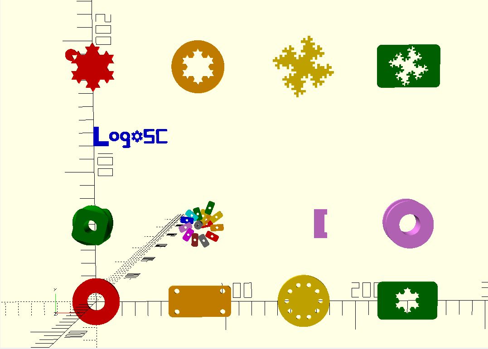
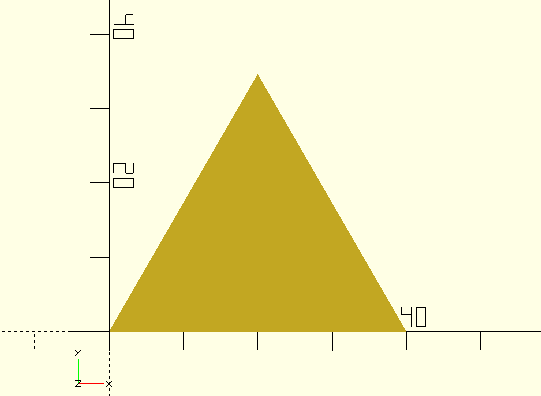
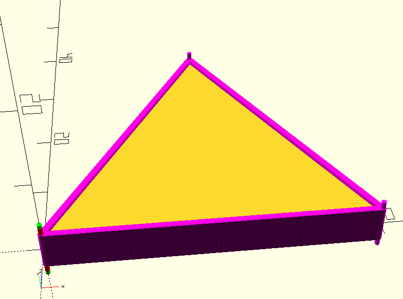

# LogoSC


LogoSC is a small Logo-inspired turtle geometry layer for OpenSCAD. It turns compact command lists into 2D printable regions that can be extruded, subtracted, combined, and otherwise composed with ordinary OpenSCAD code.

LogoSC is not trying to be a full Logo language. It is a lightweight OpenSCAD geometry DSL for making reusable 2D shapes, holes, ornaments, plaques, cutouts, and 3D-printing-friendly parts.

## What LogoSC does

- Evaluates turtle-style command lists such as `MOVE`, `TURN`, `ARC`, `RUN`, and `REPEAT`.
- Creates filled 2D regions using commands such as `CIRCLE`, `RECT`, `ROUNDEDRECT`, and `REGPOLY`.
- Supports region holes through `HOLE`.
- Supports reusable relative command lists through `RUN`.
- Provides a preview-only debug renderer for visualizing low-level path execution.
- Provides optional path analysis and validation without changing filled-region rendering.
- Leaves 3D composition to native OpenSCAD tools such as `linear_extrude()`, `difference()`, `union()`, and `translate()`.

## Engineering guidance and restart order

`LogoSC-Developer-Notebook.md` is the project's living engineering notebook. It
records design rationale, non-goals, lessons learned, historical milestones,
workflow rules, regression risks, and future plans that do not belong in the
public API documentation.

The repository also stores an AI Engineering Kit under `docs/ai-engineering-kit/` by
explicit user request. These files are maintainer-facing companion material, not LogoSC
public API or user documentation. For a fresh development session, read:

1. `docs/ai-engineering-kit/AI-Engineering-Kit-Handoff.md`
2. `docs/ai-engineering-kit/Codex-Git-Project-Quick-Start.md`
3. `docs/ai-engineering-kit/Generic-Project-Bootstrap.md`
4. `docs/ai-engineering-kit/ChatGPT-Project-Workflow.md`
5. `docs/ai-engineering-kit/Engineering-Preferences.md`
6. `docs/ai-engineering-kit/Project-Retrospective.md`
7. `LogoSC-Developer-Notebook.md`
8. `README.md`
9. `CHANGELOG.md`
10. `CONTRIBUTING.md`
11. `LogoSC-User-Manual.md` and implementation notes as needed

Root `AGENTS.md` provides the compact repository-specific operating rules for Codex and
points back to this detailed reading order.

Project-specific LogoSC guidance and the current Git working tree remain the sole authority
for current code, filenames, APIs, versions, and design decisions. When starting from an
uploaded repository ZIP, extract that current snapshot into the working tree first.

The notebook is intentionally historical. Add dated decisions and lessons rather
than replacing older reasoning with shorter summaries.

## Quick start

Open `LogoSC-Examples.scad` in OpenSCAD to see the example gallery. The top-level Customizer selector is:

```scad
LogoSCRunMode = "Examples"; // [NoDemo, Examples, Debug, Tests]
```

Use `Examples` for the normal gallery, `Debug` for the indexed debug-visualization gallery,
and `Tests` for the regression grid. In Debug mode, set `DebugDemoLayout` to `Selected`
to inspect one `DebugDemoExample`. `NoDemo` or a blank string explicitly suppresses
automatic output in the examples file. Ordinary user models can omit `LogoSCRunMode`;
tests do not run unless explicitly selected.

The default Examples view combines basic shapes, holes, linear and rotational extrusions,
and recursive L-system-inspired models in one gallery.



The Debug view overlays the filled models with movement capsules and point markers, exposing
open endpoints, crossing paths, pen-up travel, arc tessellation, and primitive-generated edges.


A complete test run ends with per-suite totals and one machine-readable result such as:

```text
LOGOSC_AUTOMATED_TEST_RESULT, PASS, suites, 2, failedSuites, 0, tests, 166, passed, 166, failed, 0
```

Set `LogoTestReportLevel = 2` to list every named automated test; the default level `1`
prints suite summaries and full details for every failure.

Tests normally continue so the final summary exposes the full regression pattern. Set
the `LogoTestFailFast` checkbox in the Examples file's `LogoSC Run` Customizer section only
while isolating a failure; OpenSCAD then stops at the first failed result and reports the shared
assertion location, caller trace, test name, and details.
An aggregate failing run also ends with `*** Test Suite Failed ***` as a prominent human cue;
the preceding `LOGOSC_AUTOMATED_TEST_RESULT` record remains the machine-readable authority.

The Tests view also renders a color-coded regression gallery for visual inspection. The image
complements the automated result records; it does not replace the final pass/fail summary.


For your own model, include the core file and call `RenderLogo2D()`. This first example intentionally uses only `MOVE` and `TURN`:

```scad
include <LogoSC-Foundation-Core.scad>
TraceLevel = 0;

triangle =
[
    [MOVE, 40],
    [TURN, 120],
    [MOVE, 40],
    [TURN, 120],
    [MOVE, 40]
];

linear_extrude(height = 4, center = true, convexity = 10)
{
    RenderLogo2D(triangle);
}
```

When run in OpenSCAD, the code above generates the following simple triangle.



### Debug the same path

When filled output looks wrong, render the same command list with `RenderLogoDebug()`. It draws preview-only capsules and point markers that show the actual turtle path, including command order, start/end markers, pen-up moves, crossing lines, and unclosed polygons.

```scad
linear_extrude(height = 4, center = true, convexity = 10)
{
    RenderLogo2D(triangle);
}

RenderLogoDebug(
    triangle,
    segmentRadius = 0.15,
    pointRadius = 0.30,
    segmentHeight = 5,
    pointHeight = 7
);
```

`RenderLogoDebug()` adds lines for the moves and cylinders for the points to the triangle from the first part of this example.



Use the debug view before assuming the filled polygon is broken. It is often showing you that the path crossed itself, the corners arrived in the wrong order, or the turtle endpoint did not return to the start point.

### Validate the same path

Validation is optional and remains outside the standalone Core file. To enable it, keep
`LogoSC-Foundation-Validation.scad` beside Core and add a second include near the top of your
model:

```scad
include <LogoSC-Foundation-Core.scad>
include <LogoSC-Foundation-Validation.scad>

validation = ValidateLogoPaths(triangle);
echo("LogoSC path is valid", ValidationIsValid(validation));
ReportLogoValidation(triangle); // Echo warnings and continue.

RenderLogo2D(triangle);
```

Basic models need only Core. The optional validator currently detects open paths, too few
usable vertices, zero-length segments, duplicate nonconsecutive points, tiny nonzero edges, and
proper self-intersections. Use `ReportLogoValidation(triangle, strict = true)` when any issue
should stop evaluation. Set `checkSelfIntersections = false` for highly tessellated paths when
the quadratic crossing scan is not wanted.

## Current public API

The main user-facing renderer is:

```scad
RenderLogo2D(cmds, convexity = 10);
```

Advanced helpers include:

```scad
RenderLogoDebug(cmds, ...);
evalLogo(cmds);
ResultContours(result);
ResultState(result);
RenderContours2D(regions, convexity = 10);
RenderRegion2D(region, convexity = 10);
```

Optional path-analysis helpers in `LogoSC-Foundation-Validation.scad` include:

```scad
evalLogoPaths(cmds);
ValidateLogoPaths(cmds, ..., tinyEdgeThreshold = 0.01, checkSelfIntersections = true);
ReportLogoValidation(cmds, ..., strict = false, checkSelfIntersections = true);
ValidationPaths(result);
ValidationIssues(result);
ValidationTinyEdgeThreshold(result);
ValidationChecksSelfIntersections(result);
ValidationIsValid(result);
```

The current public API version is `2026.3`.

## Command examples

```scad
[MOVE,        len]
[TURN,        deltaHeading]
[DIR,         absoluteHeading]
[GOTO,        x, y, heading]
[ARC,         radius, degrees]
[CIRCLE,      radius]
[RECT,        width, height]
[ROUNDEDRECT, width, height, radius]
[REGPOLY,     sides, radius]
[HOLE,        cmds]
[RUN,         cmds]
[REPEAT,      count, cmds]
[PUSH]
[POP]
[PENUP]
[PENDOWN]
```

See `LogoSC-CheatSheet.md` and `LogoSC-User-Manual.md` for the complete command reference.

## Repository files

- `AGENTS.md` — compact repository-specific guidance for Codex and other coding agents.
- `LogoSC-Foundation-Core.scad` — standalone core interpreter, 2D renderer, and debug renderer.
- `LogoSC-Foundation-Validation.scad` — optional explicit-path evaluator and validator.
- `LogoSC-Foundation-Tests.scad` — passive regression and failure-test definitions.
- `LogoSC-Foundation-Validation-Tests.scad` — passive focused validation tests.
- `LogoSC-Foundation-Test-Runner.scad` — direct entry point for the complete test suite.
- `LogoSC-OpenSCAD-Command-Line.md` — command-line testing, export, and PNG-preview guide.
- `LogoSC-Examples.scad` — runnable gallery and example models.
- `LogoSC-Nuts-And-Bolts.scad` — customizable printable fastener and thread-profile model.
- `LogoSC-Nuts-And-Bolts-Customizer.md` — detailed fastener parameter and calibration guide.
- `LogoSC-User-Manual.md` — practical user documentation.
- `CONTRIBUTING.md` — contribution philosophy, coding, testing, documentation, versioning, and packaging guidance.
- `LogoSC-Developer-Notebook.md` — engineering history, design rationale, workflow, and ChatGPT restart guide.
- `LogoSC-Future-Ideas.md` — longer-term feature concepts and possible future directions.
- `LogoSC-CheatSheet.md` — compact command/API reference.
- `LogoSC-README.md` — detailed project overview and roadmap.
- `LogoSC-ARC-Implementation.md` — arc tessellation design notes.
- `LogoSC-Holes-Implementation.md` — region and hole design notes.
- `LogoSC-LSystems-Notes.md` — L-system design/example notes.
- `CHANGELOG.md` — release history.
- `docs/ai-engineering-kit/` — maintainer-facing Codex/Git quick start plus AI handoff,
  bootstrap, collaboration, engineering-preference, and retrospective documents.

## Design philosophy

LogoSC keeps the core narrow:

- LogoSC generates 2D regions.
- OpenSCAD handles 3D composition.
- Command lists should stay readable and reusable.
- Relative movement is preferred inside reusable shapes.
- Color and material choices stay outside the LogoSC geometry core.

## Current status

LogoSC currently focuses on filled 2D region rendering for final geometry. It also includes
a preview-only debug renderer and an optional validator that detects open paths, paths with too
few vertices, zero-length segments, duplicate nonconsecutive points, tiny edges, and proper
self-intersections. Manufacturable stroke/open-path rendering and inter-contour topology checks
remain future work.

## Version history

| Version | Highlights |
| --- | --- |
| 2026.3 | Printable fastener application plus duplicate-point, tiny-edge, and proper self-intersection validation |
| 2026.2.1 | Optional path validation, automated suite aggregation, galleries, and command-line verification |
| 2026.2 | LogoSC identity, `RenderLogoDebug()`, unified run mode, licensing, branding, and documentation refresh |
| 2026.0 | Initial public foundation and filled-region geometry API |

## Near-term roadmap

- Expand optional validation with hole-containment and contour-overlap checks.
- Keep manufacturable stroke rendering as a separate API with explicit width, cap, and join semantics.

## Requirements

- OpenSCAD
- No external OpenSCAD library dependency; basic LogoSC use requires only
  `LogoSC-Foundation-Core.scad`.
- Optional validation additionally requires `LogoSC-Foundation-Validation.scad`.

Maintainers can use [LogoSC-OpenSCAD-Command-Line.md](LogoSC-OpenSCAD-Command-Line.md)
to run tests, capture diagnostics, and export geometry or PNG previews without opening the GUI.

## Contributing

See [CONTRIBUTING.md](CONTRIBUTING.md) before preparing a contribution. It summarizes
the project's API-stability expectations, coding style, documentation and testing
responsibilities, versioning policy, direct-Git delivery, and fallback ZIP workflow.

Significant design decisions and historical rationale belong in
`LogoSC-Developer-Notebook.md`; longer-term concepts belong in
`LogoSC-Future-Ideas.md`.

The companion AI Engineering Kit begins with
[AI-Engineering-Kit-Handoff.md](docs/ai-engineering-kit/AI-Engineering-Kit-Handoff.md).
It guides collaboration but does not override LogoSC-specific repository decisions.

## License

LogoSC is licensed under the MIT License. See [LICENSE](LICENSE).
